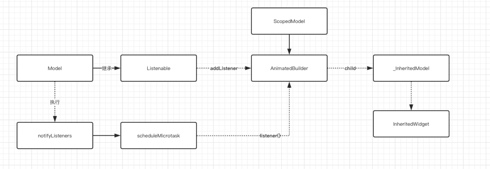
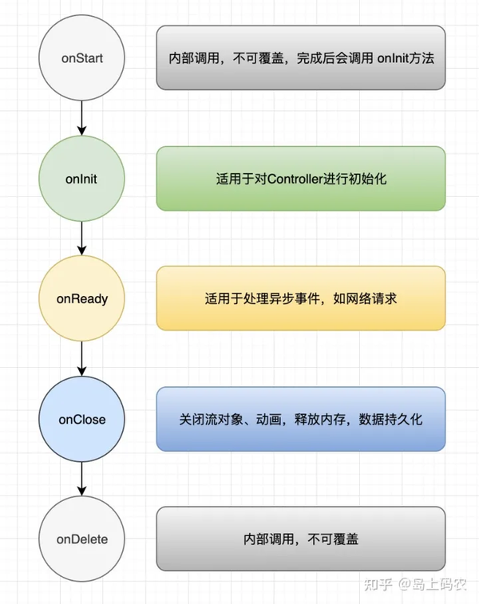
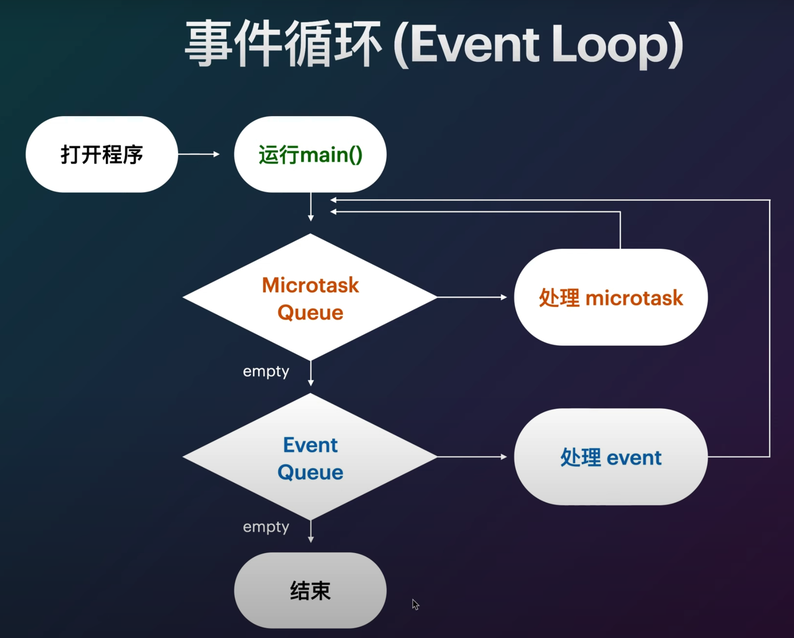
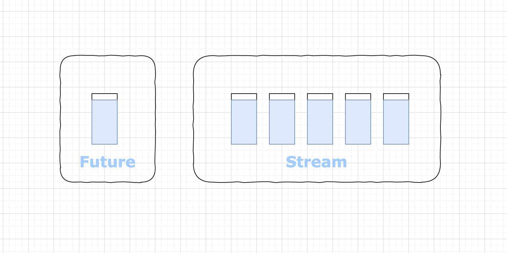

# Flutter 经验

- [Flutter 经验](#flutter-经验)
  - [相关资料](#相关资料)
  - [数据类型](#数据类型)
  - [***`var`***、***`dynamic`***、***`object`***](#vardynamicobject)
  - [***`const`***和***`final`***](#const和final)
  - [***Dart.factory***](#dartfactory)
  - [***Dart.方法的定义（写法）***](#dart方法的定义写法)
  - [***Dart.下划线***](#dart下划线)
  - [***Dart.级联操作符***](#dart级联操作符)
  - [***Dart.调用C***](#dart调用c)
  - [***Dart***.***`part`***](#dartpart)
  - [***Dart.范型***](#dart范型)
  - [***Dart.反射***](#dart反射)
  - [***Dart.mixin.with.on（混入）***](#dartmixinwithon混入)
  - [懒加载（Dart.Flutter vs Swift）](#懒加载dartflutter-vs-swift)GetxController
  - [***Dart.Flutter.Widget 树***](#dartflutterwidget-树)
  - [***Dart.Flutter.依赖注入***](#dartflutter依赖注入)
  - [***Dart***.***Context***（上下文）](#dartcontext上下文)
  - [***Dart.Flutter.State***](#dartflutterstate)
  - [***Dart.Flutter.`setState`***](#dartfluttersetstate)
  - [***❤️Dart.Flutter.状态管理*** ](#️dartflutter状态管理-)
    - [scoped\_model](#scoped_model)
    - [BloC：*B*usiness *Lo*gic *C*omponent](#blocbusiness-logic-component)
    - [flutter\_redux](#flutter_redux)
    - [fish\_redux](#fish_redux)
  - [***Dart.Flutter.对象间传值***](#dartflutter对象间传值)
  - [***Dart.Flutter.key***](#dartflutterkey)
  - [***Dart.Flutter.UI***](#dartflutterui)
    - [***Dart.Flutter.MaterialApp*** 和 ***Dart.Flutter.CupertinoApp*** 的生命周期方法](#dartfluttermaterialapp-和-dartfluttercupertinoapp-的生命周期方法)
    - [`MyHomePage`和`_MyHomePageState`的分离](#myhomepage和_myhomepagestate的分离)
    - [关于*`const`* *MyApp({Key? key})* : *`super`* *(key: key)*;](#关于const-myappkey-key--super-key-key)
    - [`Diff` 算法](#diff-算法)
    - [系统.其他](#系统其他)
    - [相对布局](#相对布局)
    - [一些常用的UI库](#一些常用的ui库)
    - [***Dart.Flutter.动画***](#dartflutter动画)
  - [***🪣Dart.Flutter.Database***](#dartflutterdatabase)
  - [***❤️Dart.Flutter***.*Provider*](#️dartflutterprovider)
  - [***Dart.Flutter.手势✋🏻***](#dartflutter手势)
    - [点击（轻触）手势（***Tap Gesture***）](#点击轻触手势tap-gesture)
    - [长按手势（***Long Press Gesture***）](#长按手势long-press-gesture)
    - [拖动手势（***Drag Gesture***）](#拖动手势drag-gesture)
    - [缩放手势（***Scale Gesture***）](#缩放手势scale-gesture)
    - [滑动手势（***Swipe Gesture***）](#滑动手势swipe-gesture)
    - [***❤️解决手势冲突（控制手势的响应范围以及触发条件）***](#️解决手势冲突控制手势的响应范围以及触发条件)
  - [***Dart.Flutter.GetX***](#dartfluttergetx)
    - [资料来源](#资料来源)
    - [作用](#作用)
    - [安装](#安装)
    - [***`Obx`***](#obx)
    - [***GetxController***](#getxcontroller)
  - [***Dart.Flutter.网络请求***](#dartflutter网络请求)
  - [***Dart.Flutter.数据解析***](#dartflutter数据解析)
  - [***Dart.事件循环（Event Loop）***](#dart事件循环event-loop)
  - [***Dart.线程处理***](#dart线程处理)
    - [***Dart.Isolate***](#dartisolate)
    - [***❤️Dart.Future***](#️dartfuture)
      - [快速入手：](#快速入手)
      - [异步操作的结果：](#异步操作的结果)
      - [代码执行优先级：](#代码执行优先级)
      - [`then()`方法](#then方法)
      - [***Dart.async***](#dartasync)
      - [***Dart***.*`await`* 和 ***Dart***.*`async`*](#dartawait-和-dartasync)
      - [***Dart.error***](#darterror)
      - [***❤️Dart.Flutter.FutureBuilder***](#️dartflutterfuturebuilder)
      - [***Dart.Flutter.AsyncSnapshot***](#dartflutterasyncsnapshot)
    - [***❤️Dart.Stream***](#️dartstream)
    - [资料来源](#资料来源-1)
      - [相关细节](#相关细节)
      - [***Dart.Flutter.Widget.StreamBuilder***](#dartflutterwidgetstreambuilder)
      - [*Dart.Flutter*.***StreamController***](#dartflutterstreamcontroller)
  - [***Dart.Flutter.Widget.InheritedWidget***](#dartflutterwidgetinheritedwidget)
  - [***Dart.Flutter.路由***](#dartflutter路由)
  - [***❤️Dart.Flutter.页面的销毁***](#️dartflutter页面的销毁)
  - [***Dart.Flutter.音视频***](#dartflutter音视频)
  - [***Dart.Flutter.原生Api调用交互***（未完）](#dartflutter原生api调用交互未完)
  - [***Dart.Flutter.其他功能***](#dartflutter其他功能)
    - [***返回按键监听***](#返回按键监听)
    - [***前后台监听***](#前后台监听)
    - [***键盘焦点处理***](#键盘焦点处理)
    - [***启动页***](#启动页)
    - [***Dart.Flutter.调取系统摄像头***（未完）](#dartflutter调取系统摄像头未完)
    - [***Dart.Flutter.调取系统相册***（未完）](#dartflutter调取系统相册未完)
    - [***Dart.Flutter.热更新***（未完）](#dartflutter热更新未完)
  - [其他](#其他)
    - [***Dart.Flutter.DevTools***](#dartflutterdevtools)
    - [***RESTful API***](#restful-api)
    - [***Retrofit***](#retrofit)
    - [***❤️Dart.Flutter.对象循环引用问题***](#️dartflutter对象循环引用问题)
    - [***Dart.其他用途***](#dart其他用途)

## 相关资料

[***Flutter 面试知识点集锦· GitBook***](https://guoshuyu.cn/home/wx/Flutter-msjj.html)
[***Dart/Flutter社区生态：Pub.dev***](https://pub.dev/)

## <font color="red">***`var`***</font>、<font color="red">***`dynamic`***</font>、<font color="red">***`object`***</font>

* <font color="red">***`var`***</font>定义的类型是不可变的；
* <font color="red">***`dynamic`***</font>和<font color="red">***`object`***</font>类型是可以变的，而<font color="red">***`dynamic`***</font>与<font color="red">***`object`***</font>的区别是在静态类型检查上；
  * <font color="red">***`dynamic`***</font>：编译时**不**进行静态类型检查的类型（更灵活），而是在运行期间进行类型检查。（被编译后，实际是一个<font color="red">***`object`***</font>类型）
  * <font color="red">***`object`***</font>：编译时会进行类型检查（更安全）
## 数据类型

* dart当中的基本数据类型没有Float，只有double

* Duration里面的数都是int

  ```dart
  const Duration(
      {int days = 0,
      int hours = 0,
      int minutes = 0,
      int seconds = 0,
      int milliseconds = 0,
      int microseconds = 0})
  ```

  那么表示0.5秒：

  ```dart
  Duration(milliseconds: 500);// 转换为500毫秒：
  Duration(microseconds: 500000);// 转换为500000微秒：
  ```

* 如果需要让Duration里面接受小数，那么需要用double来定义变量

  ```dart
  final double timeStep; // 改为 double 类型
  this.timeStep = 0.5,
  Duration(milliseconds: (widget.timeStep.abs() * 1000).toInt()), // 毫秒为单位
  ```

## <font color="red">***`const`***</font>和<font color="red">***`final`***</font>

* ***相同点***  
  * <font color="red">***`final`***</font>、<font color="red">***`const`***</font>必须初始化；
  *  <font color="red">***`final`***</font>、<font color="red">***`const`***</font>只能赋值一次；
  * 均表示不可被修改  
*  ***不同点***
  
  * <font color="red">***`final`***</font>可修饰实例变量、<font color="red">***`const`***</font>不可以修饰实例变量；
  * 访问类中<font color="red">***`const`***</font>修饰的变量需要<font color="red">***`static`***</font>修饰；
  ```dart
  import 'package:flutter/material.dart';
  
  class MyClass {
    // 如果要声明一个类中的静态变量，并且希望它是编译时常量，可以使用 static const：
    // 所以，这里的 static const 位置不能互换
    static const int myConstVar = 42;
  
    static void printConstVar() {
      debugPrint('My const variable: $myConstVar');
    }
  }
  
  void main() {
    // 直接访问静态方法
    MyClass.printConstVar();
    // 或者通过类名访问静态变量
    debugPrint('Accessing const variable via class: ${MyClass.myConstVar}');
  }
  ```
  * <font color="red">***const***</font>修饰的List集合任意索引不可修改，<font color="red">***final***</font>修饰的可以修改；
  ```dart
  import 'package:flutter/material.dart';
  
  void main() {
    // 使用 const 修饰的 List，其中的元素是编译时常量，不可修改
    const List<int> constList = [1, 2, 3];
    // 尝试修改元素，会导致编译时错误
    // constList[0] = 10;
  
    // 使用 final 修饰的 List 是一个运行时常量，其引用是不可变的，但可以添加、删除或修改元素
    final List<int> finalList = [1, 2, 3];
    // 修改元素
    finalList[0] = 10;
    // 添加元素
    finalList.add(4);
    // 删除元素
    finalList.removeAt(1);
  
    debugPrint('Final List: $finalList');
  }
  ```
  *  <font color="red">***`const`***</font>用来修饰变量 只能被赋值一次，在**编译**时赋值；**仅用于标识编译时常量**
     <font color="red">***`final`***</font>用来修饰变量 只能被赋值一次，在**运行**时赋值；
  *  <font color="red">***`final`***</font>**只可用来修饰变量**；
  * <font color="red">***`const`***</font>关键字即可修饰变量也可用来修饰常量构造函数；当<font color="red">***const***</font>修饰类的构造函数时，它要求该类的所有成员都必须是<font color="red">***final***</font>的；
   ```dart
   import 'package:flutter/material.dart';
   
   class MyClass {
     final int x;
     final int y;
   
     const MyClass(this.x, this.y); // 使用 const 修饰构造函数，并要求所有成员都是 final 的
   
     void printValues() {
       debugPrint('x: $x, y: $y');
     }
   }
   
   void main() {
     // 创建编译时常量对象
     const myConstObject = MyClass(10, 20);
   
     // 尝试修改对象的属性，会导致编译时错误
     // myConstObject.x = 30;
   
     // 调用对象的方法
     myConstObject.printValues();
   }
   ```

## <font color=red>***Dart.Lambda表达式(箭头函数)***</font>

* ```dart
  List<CurrencyBean> findCommonData(List<CurrencyBean> currencyList, List<CoinBean> availableList) {
    return currencyList
        .where((currency) =>
            availableList.any((availableCurrency) => currency.cur == availableCurrency.currencyId))
        .toList();
  }
  ```

  * 方法名：`findCommonData`

  * 方法入参列表：`(List<CurrencyBean> currencyList, List<CoinBean> availableList)`

    * 入参1：`List<CurrencyBean> currencyList`，参数名是`currencyList`，参数类型是`List`，这个`List`里面装的元素类型是`CurrencyBean`
    * 入参2：`List<CoinBean> availableList`，参数名是`availableList`，参数类型是`List`，这个`List`里面装的元素类型是`CoinBean`

  * 方法返回值：`List<CurrencyBean>`。返回值类型是List，List里面的元素是CurrencyBean类型

  * 条件函数：将满足 `currency.cur == availableCurrency.currencyId` 的元素进行返回

  * `toList()`：返回的元素形成List（List里面的元素是CurrencyBean类型）对外输出

  * **`currency`是一个迭代器中的元素，它代表了 `currencyList` 中的每个 `CurrencyBean` 对象**

  * ❤️这段方法都是意思是：对入参1的引用<font color=red>**currencyList**</font>：`List<CurrencyBean> currencyList`作为目标进行轮询操作（挨个取出里面`CurrencyBean`类型的元素对象，命名为`currency`）；对于入参2：`List<CoinBean> availableList`里面的每一个（any）元素引用<font color=red>**availableCurrency**</font>，将满足条件<font color=red>**currencyList**</font>.**cur** == <font color=red>**availableCurrency**</font>.**currencyId**❤️

  * `where`方法定义在`abstract class Iterable<E>`。`Iterable`是迭代器接口，**接口不定义具体实现（在外部具体调用的时候实现，因为不知道具体的条件过滤方法）**

  * ```dart
    abstract class List<E> implements EfficientLengthIterable<E> 
    ```

  * `currencyList`之所以能够调用`where`方法，是因为 `List<CurrencyBean> currencyList` ， `currencyList`的类型是`List`

## ***Dart.factory***

*根据传入的类型参数来创建不同的对象。*

```dart
import 'package:flutter/material.dart';

abstract class Animal {
  void makeSound();
}

class Dog implements Animal {
  @override
  void makeSound() {
    debugPrint('汪汪汪');
  }
}

class Cat implements Animal {
  @override
  void makeSound() {
    debugPrint('喵喵喵');
  }
}

class AnimalFactory {
  static Animal createAnimal(String type) {
    switch (type) {
      case 'dog':
        return Dog();
      case 'cat':
        return Cat();
      default:
        throw ArgumentError('Unknown animal type: $type');
    }
  }
}

void main() {
  var dog = AnimalFactory.createAnimal('dog');
  dog.makeSound(); // 输出：汪汪汪
  
  var cat = AnimalFactory.createAnimal('cat');
  cat.makeSound(); // 输出：喵喵喵
}
```

## ***Dart.Function***

* `Function`是一个类，而不是系统级别的关键字；

* `Function`类是一个抽象类，用于表示Dart中的函数类型；

* `Function`类是一个特殊的类，属于内置类，不像普通的 Dart 类那样可以被直接查看源代码

* 但是，可以通过 Dart API 文档来查看关于`Function`类的信息

* ```dart
  import 'dart:developer';
  
  typedef MyBlock<T, R> = R Function(T);
  
  // 一个接受整数并返回整数的函数
  int addOne(int x) {
    return x + 1;
  }
  
  // 一个接受字符串并返回其长度的函数
  int stringLength(String s) {
    return s.length;
  }
  
  void main() {
    // 使用 MyBlock<int, int> 类型的函数
    MyBlock<int, int> increment = addOne;
    log(increment(5).toString()); // 输出: 6
    
    // 使用 MyBlock<String, int> 类型的函数
    MyBlock<String, int> lengthGetter = stringLength;
    log(lengthGetter("Hello").toString()); // 输出: 5
  }
  ```

* `A() => B(C)`的含义：`A()`的**运算结果**就是`B(C)`

## ***Dart.方法的定义（写法）***

* ```dart
  import 'package:flutter/foundation.dart';
  
  class MyClass {
    // 定义一个实例方法
    void instanceMethod() {
      debugPrint('MyClass的实例方法');
    }
    // 定义一个类方法
    static void classMethod() {
      debugPrint('MyClass的类方法');
    }
  }
  
  void main() {
    // 调用实例方法
    MyClass myObject = MyClass();
    myObject.instanceMethod(); // 输出：MyClass的实例方法
    // 调用类方法，无需创建类的实例
    MyClass.classMethod(); // 输出：MyClass的类方法
  }
  ```

* ```dart
  import 'package:flutter/foundation.dart';
  
  class MyClass {
    String? senderId;
    String? type;
    String? senderName;
    String? content;
    dynamic receiveIds;
    dynamic gift;
    // 构造方法
    MyClass({this.senderId, this.type, this.senderName, this.content, this.receiveIds, this.gift});
    // 定义一个实例方法
    void instanceMethod() {
      debugPrint('This is an instance method');
    }
    // 定义一个类方法
    Message.fromJson(Map<String, dynamic>? json) {
      debugPrint('MyClass的类方法');
      return Message(
        senderId: json?['senderID'],
        type: json?['type'],
        senderName: json?['senderName'],
        content: json?['content'],
        receiveIds: json?['receiveIds'] ?? 0,
      );
    }
  }
  
  void main() {
    // 调用实例方法
    MyClass myObject = MyClass();
    myObject.instanceMethod(); // 输出：MyClass的实例方法
    // 调用类方法，无需创建类的实例
    MyClass.fromJson(); // 输出：MyClass的类方法
  }
  ```

## ***Dart.下划线***

* 可以提供更清晰的代码意图和保护
  * `_` 前缀表示这个构造函数是私有的，只能在当前的库（文件）中访问。其他文件无法访问以`_`开头的函数或者变量。
  * 这个构造函数被放置在 `AppColors` 类的内部，因此只有 `AppColors` 类内部可以调用这个构造函数。

  ```dart
  class AppColors {
    AppColors._();
    static const transparent = Color(0x00000000);
    static const primary = Color(0xFF22BB62);
    static const backgroundColor = Colors.black;
    var buttonColor = Colors.red[400];
    static const borderColor = Colors.grey;
  }
  ```

## ***Dart.级联操作符***

```dart
var person = Person()
  ..setName('Bob')
  ..setAge(25);
// 等价于
var person = Person();
person.setName('Bob');
person.setAge(25);
```
## ***Dart.调用C***
在Dart中，你可以通过使用`dart:ffi`库来调用C语言的函数。以下是一个简单的步骤概述：
* **定义C语言库的接口：** 在Dart中使用`dart:ffi`库，你需要定义C语言库的接口。这包括函数声明、结构体定义等。
```c
// example.c
#include <stdio.h>

void helloFromC() {
    printf("Hello from C!\n");
}
```
* **创建Dart库的接口：** 在Dart中，使用`dart:ffi`库创建与C语言接口对应的Dart接口。
```dart
// example.dart
import 'dart:ffi' as ffi;
import 'dart:io' show Platform;

final ffi.DynamicLibrary exampleLib = ffi.DynamicLibrary.process();

typedef HelloFromCFunc = ffi.Void Function();
final helloFromC = exampleLib
    .lookupFunction<HelloFromCFunc>("helloFromC");
```
* **调用C语言函数：** 现在你可以在Dart中调用C语言的函数。
```dart
void main() {
  helloFromC();
}
```
确保在编译C代码时生成共享库，例如：
```bash
gcc -shared -o libexample.so example.c
```
然后运行Dart代码，确保Dart可以找到并加载生成的共享库。

<font color="red">***请注意，这只是一个简单的示例，实际应用可能需要更复杂的接口定义和错误处理。***</font>

## ***Dart***.<font color="red">***`part`***</font>

* 用于将一个源文件分割成多个部分，每个部分被称为一个<font color="red">*`part`*</font>。通常情况下，一个库（库是Dart中代码组织的单元）可以由多个源文件组成，这些源文件通过<font color="red">*`part`*</font>关键字进行引入;
* 注意事项：
  * 一个库可以有多个部分文件，但是每个部分文件只能属于一个库；
  * <font color="red">*`part`*</font>关键字只能在源文件的最顶部使用，并且必须是文件的第一个非空白、非注释行；
* 使用<font color="red">*`part`*</font>关键字的两个关键点：
  * **主文件**：包含库的声明以及引入其他部分的声明。通常以`.dart`作为文件扩展名。主文件使用<font color="red">*library*</font>关键字声明库；
  ```dart
  // main.dart
  library my_library;
  
  import 'part1.dart';
  import 'part2.dart';
  
  // 主文件中的其他代码
  ```
  * **部分文件**：
    * 部分文件包含库的一部分代码，它们不包含库的声明，而是使用<font color="red">*`part of`*</font>关键字引入到主文件中。通常也以`.dart`作为文件扩展名；
    * 使用<font color="red">*`part of`*</font>关键字，将部分文件与主文件关联起来，形成一个完整的库；
    * 这种方式可以将大型代码库拆分成更小的模块，提高代码的可维护性和可读性；
  ```dart
  // part1.dart
  part of my_library;
  // 部分文件中的代码
  ```

## ***Dart.范型***

* `Future<T>` 确实是一个泛型类，其中 `T` 代表异步操作完成后返回的值的类型

  对于 `Future<void>`，`void` 表示异步操作完成后不返回任何值。

  这种用法在 Dart 中是被允许的，尽管 `void` 通常用于表示一个函数不返回值的类型

  ```dart
  Future<void> onLogout(
  	// TODO
  }
  ```

## ***Dart.注解***

注解是一种元数据，可以应用于类、方法、变量等。用于提供额外的信息以及指导代码的行为。

* `@override`: 用于标记方法重写了父类的方法。
* `@immutable`: 用于标记类是不可变的，其属性也应该是不可变的。
* `@required`: 用于标记方法参数是必需的，在调用时必须提供值。
* `@optionalTypeArgs`: 用于在使用泛型时，标记类型参数是可选的。
* `@factory`: 用于标记一个工厂构造函数。
* `@visibleForTesting`: 用于标记一个成员是供测试代码访问的，但不是公共API。
* `@mustCallSuper`：用于表示子类应该在覆盖父类中使用了 `@mustCallSuper` 注解的方法时，调用父类的相同方法。这通常用于确保在子类中重写方法时，仍然执行了父类的逻辑，以确保程序的正确性和完整性。
* `@protected`: 用于标记一个成员是受保护的，在定义类的库以及子类中可见。
* `@Deprecated`: 用于标记一个成员已经被弃用，在使用时应该考虑替代方案。
* `@internal`: 用于标记一个成员是内部的，不应该被外部使用。

## ***Dart.反射***

* 在Dart中，反射是指在***运行时***检查、访问和操作程序的结构，比如类、方法、字段等；
* Dart提供了一组反射API，允许你**在运行时动态地获取有关程序结构的信息并与之交互**。这包括获取类的信息、调用对象的方法、访问字段等；
* 反射在某些情况下非常有用，但在一般情况下，推荐**尽量避免使用反射**；
  * 因为它可能会导致性能损失；
  * 并且使代码更难以理解和维护；
* 很多编程语言都有反射的机制。比如：OC、Java
## ***Dart.Flutter.timer***

* ```dart
  import 'dart:async';
  
  void main() {
    print('Start of main');
  
    // 创建一个一次性定时器，3秒后触发关闭
    Timer(Duration(seconds: 3), () {
      timer.cancel();
      print('This message is printed after a 3-second delay');
    });
  
    print('End of main');
  }
  ```

* ```
  import 'dart:async';
  
  void main() {
    print('Start of main');
  
    // 创建一个周期性定时器，每秒触发一次
    Timer.periodic(Duration(seconds: 1), (Timer timer) {
      print('This message is printed every second');
    });
  
    print('End of main');
  }
  ```

* 相当于把timer封装在一个函数里面，调用这个函数，即启动定时器。和iOS不同，iOS.Timer的启动方法在Timer类里面定义。

##  <font color="red">***Dart.mixin.with.on（混入）***</font>

* <font color="red">*`Mixin`*</font>是一个广泛存在于各种编程语言中的概念，但在某些语言中可能会以不同的形式或名称出现；
* <font color="red">*`Mixin`*</font>是Dart 2.1 加入的特性，以前版本通常使用*abstract class*代替；
* 为了解决继承方面的问题而引入的机制，Dart为了支持多重继承；
* <font color="red">*`Mixin`*</font>的对象是类，<font color="red">*`Mixin`*</font>绝不是继承，也不是接口，而是一种全新的特性，可以<font color="red">*`Mixin`*</font>多个类，<font color="red">*`Mixin`*</font>的使用需要满足一定条件；
  * **不支持构造函数**（<font color="red">***最大的特殊处***</font>）：<font color="red">*`Mixin`*</font> 类***不能有构造函数***，因为它们**不能被实例化**（可以避免继承多个类而产生的父类构造方法冲突）。如果需要在 <font color="red">*`Mixin`*</font> 中初始化状态，则可以使用初始化列表或<font color="red">*`on`*</font>关键字来解决；
  * **可以有字段**：<font color="red">*`Mixin`*</font> 类可以有字段，但只能是**静态字段**；
  * **可以调用父类方法**：<font color="red">*`Mixin`*</font> 类可以调用目标类的父类的方法，这使得 <font color="red">*`Mixin`*</font> 更加灵活；
  * **可以组合多个** <font color="red">*`Mixin`*</font>：一个类可以同时使用多个 <font color="red">*`Mixin`*</font>，通过逗号分隔。<font color="red">*`Mixin`*</font> 的组合顺序很重要，因为如果多个 <font color="red">*`Mixin`*</font> 中有相同的方法或属性，那么最后一个 <font color="red">*`Mixin`*</font> 中的方法或属性会覆盖前面的；
```dart
import 'package:flutter/foundation.dart';

// 定义一个 Mixin
mixin Swimming {
  void swim() {
    debugPrint('Swimming...');
  }
}

// 定义一个类，同时使用 Mixin
class Duck with Swimming {
  void quack() {
    debugPrint('Quack!');
  }
}

void main() {
  var duck = Duck();
  duck.quack(); // 输出: Quack!
  duck.swim();  // 输出: Swimming...
}
```
* 知识扩充：**C++ 虚函数**
  * 是一种用于实现运行时多态性的机制；
  * 通过使用虚函数，可以在基类和派生类之间建立一个多态的关系，这意味着可以在运行时根据对象的实际类型来调用相应的函数；
  * 在 C++ 中，通过在基类中声明虚函数，并在派生类中进行覆盖（重写），可以实现多态；
  * 当基类指针或引用指向派生类对象时，调用虚函数时将根据对象的实际类型来确定要调用的函数；
* 知识扩充：**C++ 多继承**
  * 这意味着一个派生类可以从多个基类中继承属性和行为；
  * <font color="red">*多继承也可能导致一些复杂性和潜在的问题（[**菱形继承问题**](#Diamond_Inheritance_Problem)、命名冲突），因此在使用多继承时需要谨慎（Dart.Mixin.with）*</font>;
* 知识扩充：**C++ 虚继承**
  * 解决<font color="red">[***菱形继承问题***](#Diamond_Inheritance_Problem)</font>的一种机制；
  * 可以确保在多继承中共享的基类子对象<u>**只被继承一次**</u>，从而避免菱形继承问题所带来的二义性和不确定性；
  * 使用 <font color="red">*`virtual`*</font> 关键字；
```c++
#include <iostream>
// 基类 Animal
class Animal {
public:
    void eat() {
        std::cout << "Animal is eating\n";
    }
};
// 虚继承 Dog
class Dog : virtual public Animal {
public:
    void bark() {
        std::cout << "Dog is barking\n";
    }
};
// 虚继承 Cat
class Cat : virtual public Animal {
public:
    void meow() {
        std::cout << "Cat is meowing\n";
    }
};
// Pet 类虚继承 Dog 和 Cat
class Pet : public Dog, public Cat {
public:
    void play() {
        std::cout << "Pet is playing\n";
    }
};

int main() {
    Pet pet;

    pet.eat();  // 正确，由于虚继承，只有一份 Animal 对象
    pet.bark(); // 正确，Pet 继承自 Dog，因此可以调用 Dog 的成员函数
    pet.meow(); // 正确，Pet 继承自 Cat，因此可以调用 Cat 的成员函数
    pet.play(); // 正确，Pet 自身定义的成员函数

    return 0;
}
/**
  在这个例子中，Dog 和 Cat 类都使用了虚继承，而 Pet 类则继承自 Dog 和 Cat。
  通过使用虚继承，Pet 类只继承了一份 Animal 对象，因此可以确保在继承链中只有一份 Animal 对象，避免了菱形继承问题。

  虚继承在解决菱形继承问题时非常有用，但需要谨慎使用，因为它可能导致派生类的构造函数和析构函数变得更加复杂。
*/
```
* ### <font color="red" id="Diamond_Inheritance_Problem">***菱形继承问题（Diamond Inheritance Problem）***</font>

  在多继承中，如果一个类同时继承了两个类，而这两个类又分别继承自同一个基类，那么派生类将会拥有两份来自共同基类的成员变量和函数，这***可能导致二义性和不确定性***；
```c++
#include <iostream>

// 基类 Animal
class Animal {
public:
    void eat() {
        std::cout << "Animal is eating\n";
    }
};
// 中间类 Dog 继承自 Animal
class Dog : public Animal {
public:
    void bark() {
        std::cout << "Dog is barking\n";
    }
};
// 中间类 Cat 继承自 Animal
class Cat : public Animal {
public:
    void meow() {
        std::cout << "Cat is meowing\n";
    }
};
// 派生类 Pet 继承自 Dog 和 Cat
class Pet : public Dog, public Cat {
public:
    void play() {
        std::cout << "Pet is playing\n";
    }
};

int main() {
    Pet pet;
    
    // pet.eat();  // 这里会出现编译错误，因为不清楚是调用 Dog 的 eat 还是 Cat 的 eat
    pet.bark(); // 正确，由于 Pet 继承自 Dog，因此可以调用 Dog 的成员函数
    pet.meow(); // 正确，由于 Pet 继承自 Cat，因此可以调用 Cat 的成员函数
    pet.play(); // 正确，Pet 自身定义的成员函数
    
    return 0;
}
/**
这个例子中，Pet 类同时继承自 Dog 和 Cat，而 Dog 和 Cat 类都继承自 Animal 类。
当我们在 main() 函数中创建 Pet 类的对象 pet 时，我们会发现调用 pet.eat() 会出现编译错误;
因为编译器不知道应该调用 Dog 类的 eat() 函数还是 Cat 类的 eat() 函数。

这就是菱形继承问题，因为 Pet 类间接继承了两份 Animal 类的成员变量和函数，导致不确定性和二义性。解决这个问题的方法之一是使用虚继承。
*/
```
## 懒加载（Dart.Flutter vs Swift）
* Dart.Flutter懒加载关键字<font color="red">*`late`*</font>
```dart
import 'package:flutter/material.dart';

void main() {
  runApp(MyApp());
}

class MyApp extends StatelessWidget {
  late String _message; // 使用 late 关键字声明延迟加载的实例变量

  MyApp() {
    // 模拟耗时的初始化操作
    Future.delayed(Duration(seconds: 2), () {
      _message = 'Hello, World!'; // 在初始化方法中进行赋值
    });
  }

  @override
  Widget build(BuildContext context) {
    return MaterialApp(
      home: Scaffold(
        appBar: AppBar(
          title: Text('Lazy Loading Demo'),
        ),
        body: Center(
          child: FutureBuilder(
            future: Future.delayed(Duration(seconds: 2)), // 模拟耗时加载
            builder: (context, snapshot) {
              if (snapshot.connectionState == ConnectionState.waiting) {
                return CircularProgressIndicator(); // 显示加载指示器
              } else {
                return Text(_message); // 显示延迟加载的消息
              }
            },
          ),
        ),
      ),
    );
  }
}
```
* Swift懒加载关键字<font color="red">*`lazy`*</font>
```swift
import 'package:flutter/foundation.dart';

class MyClass {
    // 使用懒加载延迟初始化 x 变量
    // 使用闭包（匿名函数）来定义懒加载的属性。
    // ()这个小括号表示立即调用闭包
    lazy var x: Int = {
        return 10
    }()
}

let obj = MyClass()
// 在首次访问 x 变量时进行初始化
debugPrint(obj.x) // 输出: 10
```
## <font id="Widget树">***Dart.Flutter.Widget 树***</font>

* 有状态的*Widget*通常由两部分组成：
  * 一个是状态对象（State Object），用于存储和管理状态；
  * 另一个是小部件本身，用于构建UI；

* 在 Dart.Flutter 中，*Widget* 树是由各种 *Widget* 组成的**层次结构**，用于描述应用程序的用户界面；
* *Widget* 树是 Dart.Flutter 中**构建用户界面的基本概念**，它由 *Widget* 对象组成，**每个 *Widget* 对象代表一个 UI 元素**，比如文本、按钮、布局等；
* *Widget* 树是一个**不可变的树结构**，其中每个节点都是一个 *Widget* 对象，它们描述了应用程序界面的**布局、外观和交互**；
* *Widget* 树中的**每个节点都可以有一个或多个子节点**，这些子节点也是 *Widget* 对象；
* Dart.Flutter 使用 *Widget* 树来构建应用程序的用户界面，并在需要时重新构建部分或全部界面；
* 当 *Widget* 树中的任何一个节点发生变化时（比如属性变化、状态变化等），Dart.Flutter 会根据变化情况重新构建 *Widget* 树，并更新应用程序的用户界面。**重新构建不是在原有的基础上直接修改，而是重新创建整个（局部的） *Widget* 树**。这种重新构建的方式有以下几个特点：
  * **不可变性**：***Widget* 树中的节点是不可变的，一旦创建就不能被修改**。因此，当节点的属性变化时，Dart.Flutter 不会直接修改原有的节点，而是**创建一个新的节点来替换旧的节点**；
  * [***Diff 算法***](#Diff)：Dart.Flutter 使用一种称为 `Diff` 算法的技术来**比较新旧 *Widget* 树的差异**，并仅在**必要时更新** UI。`Diff` 算法会逐级比较新旧 *Widget* 树的节点，找出需要更新的部分，并仅重新构建和更新这部分节点，而不是重新构建整个 *Widget* 树；
  * **重建顶级节点**：虽然 *Widget* 树中的大部分节点可能保持不变，但在某些情况下，比如状态变化或路由导航等，顶级节点可能会发生变化。在这种情况下，Dart.Flutter 会重新构建整个 *Widget* 树，从根节点开始，而不是从变化的节点开始；
  * **重用已构建的部分**：为了提高性能，Dart.Flutter 会尽可能地重用已构建的部分 *Widget* 树。如果某些节点在新旧 *Widget* 树中是相同的（例如，它们具有相同的类型和属性），Dart.Flutter 将重用已构建的节点，而不是重新创建它们；
    *虽然重新构建 Widget 树看起来像是创建一个全新的树，但实际上 Flutter 会**尽可能地重用已有的节点**，并仅在必要时更新变化的部分，以提高性能和效率*
## ***Dart.Flutter.依赖注入***

* ***Dart.Flutter 框架本身没有内置的依赖注入机制***，但由于依赖注入在 Dart.Flutter 开发中非常常见，因此有许多第三方库提供了依赖注入的功能：
  * [***GetX***](#GetX)：[***GetX***](#GetX)的依赖注入功能通常与 [***GetxController***](#GetxController)、`GetxService` 和 `Get.put()` 方法一起使用：
    
    需要在 *pubspec.yaml* 文件中添加 [***GitHub.GetX***](https://github.com/jonataslaw/getx)  包的依赖：
    
    ```yaml
    dependencies:
      flutter:
        sdk: flutter
      get: ^4.1.4
    ```
    *使用以下示例：*
    
    ```dart
    import 'package:flutter/material.dart';
    import 'package:get/get.dart';
    // 依赖注入的服务类
    class MyService {
      void doSomething() {
        debugPrint('MyService is doing something');
      }
    }
    // 使用依赖注入的控制器
    class HomeController extends GetxController {
      final MyService myService;
    
      HomeController(this.myService);
    
      void callService() {
        myService.doSomething();
      }
    }
    
    void main() {
      // 注册 MyService 的实例
      Get.put(MyService());
    
      runApp(MyApp());
    }
    
    class MyApp extends StatelessWidget {
      @override
      Widget build(BuildContext context) {
        return GetMaterialApp(
          home: Scaffold(
            appBar: AppBar(
              title: Text('Dependency Injection with GetX'),
            ),
            body: Center(
              child: ElevatedButton(
                onPressed: () {
                  // 使用依赖注入的 HomeController
                  Get.find<HomeController>().callService();
                },
                child: Text('Call Service'),
              ),
            ),
          ),
        );
      }
    }
    ```
  * [***get_it***](https://github.com/fluttercommunity/get_it)：是其中一个流行的依赖注入库，它提供了一种简单的、易于使用的方式来管理依赖关系。虽然它不是官方的 Dart.Flutter 库，但由于其简洁和灵活的设计，以及在社区中的广泛应用；
    
    *在 **pubspec.yaml**文件中添加 `get_it` 依赖：*
    
    ```yaml
    dependencies:
      flutter:
        sdk: flutter
      get_it: ^7.0.0
    ```
    *使用以下示例：*
    
    ```dart
    import 'package:flutter/foundation.dart';
    import 'package:flutter/material.dart';
    import 'package:get_it/get_it.dart';
    
    // 依赖注入的服务接口
    abstract class Logger {
      void log(String message);
    }
    // 依赖注入的具体服务类
    class ConsoleLogger implements Logger {
      @override
      void log(String message) {
        debugPrint('ConsoleLogger: $message');
      }
    }
    // 注册服务实例
    void setupLocator() {
      GetIt.instance.registerLazySingleton<Logger>(() => ConsoleLogger());
    }
    // 使用依赖注入的组件
    class MyWidget extends StatelessWidget {
      final Logger logger = GetIt.instance<Logger>();
    
      @override
      Widget build(BuildContext context) {
        return Scaffold(
          appBar: AppBar(
            title: Text('Dependency Injection Example'),
          ),
          body: Center(
            child: ElevatedButton(
              onPressed: () {
                // 调用依赖注入的 Logger 对象记录日志
                logger.log('Button pressed');
              },
              child: Text('Press Me'),
            ),
          ),
        );
      }
    }
    
    void main() {
      setupLocator();
      runApp(MaterialApp(
        home: MyWidget(),
      ));
    }
    ```

## <font id="Context">***Dart***.<font color="red">***Context***</font>（上下文）</font>

* 在计算机科学中，上下文（*Context*）是指一个***程序运行时的环境信息***，其中包括了程序执行所需的各种条件（背景信息）、状态和设置，帮助程序正确地执行任务或处理事件；上下文可以包括但不限于以下内容：

  * **执行环境信息**：包括程序执行的硬件平台、操作系统、编程语言版本等；
  * **执行状态**：描述程序执行时的当前状态，例如变量的值、对象的状态等；
  * **调用堆栈**：描述程序执行过程中函数或方法的调用关系和状态；
  * **资源管理信息**：描述程序使用的资源，如文件句柄、网络连接、内存分配等；
  * **权限和安全信息**：描述程序执行所需的权限和安全策略；

* 服务器端的Dart应用程序中，可能会有一些上下文对象来描述请求、响应、会话状态等；

* ***BuildContext***这种特定形式的上下文主要在Dart.Flutter中使用，但上下文的概念本身在其他框架和编程环境中也存在；

* 通常用于构建UI的过程中：提供了对当前*Widget*在树中位置的访问以及其他功能。比如：

  * 查找父级*Widget*；
  * 查找最近的指定类型的父级*Widget*；

* ***BuildContext***存在于：

  * **构造函数**.**`build`**方法里

  ```dart
  class MyWidget extends StatelessWidget {
    final BuildContext context;
    MyWidget(this.context);
    @override
    Widget build(BuildContext context) {
      // 可以在这里使用构造函数中的 context
    }
  }
  ```

  * **生命周期方法**.**`build`**方法里

  ```dart
  class MyWidget extends StatefulWidget {
    @override
    _MyWidgetState createState() => _MyWidgetState();
  }
  
  class _MyWidgetState extends State<MyWidget> {
    @override
    void initState() {
      super.initState();
      // 可以在这里使用 context
    }
    @override
    Widget build(BuildContext context) {
      // 可以在这里使用 context
    }
  }
  ```

  * **回调函数**.**`build`**方法里

  ```dart
  class MyParentWidget extends StatelessWidget {
    @override
    Widget build(BuildContext context) {
      return MyChildWidget(
        onPressed: () {
          // 可以在这里使用 context
        },
      );
    }
  }
  ```

  * **`Navigator`**方法里：

  ```dart
  Navigator.push(
    context,
    MaterialPageRoute(builder: (context) => NextScreen()),
  );
  ```

## <font color="red">***Dart.Flutter.State***</font>

* 状态（<font color="red">***State***</font>）是指在应用程序生命周期内<font color="red">***可能发生变化的数据***</font>（**可以是任意数据类型**，包括布尔值、整数、字符串、列表、对象等等）；
* ***Widget***=> ***Element***（[***BuildContext***](#Context)）=>***RenderObject*** =>***Layer***=>***Layer Tree***（首字母简称：Werl）
* ***Layer***的组成由*RenderObject*中的 `isRepaintBoundary` 标志位决定；
* 相关的*RenderObject*在一起组成了***Layer***，而由***Layer***构成的***Layer Tree***最后会被提交到 Flutter Engine 绘制出画面；
* 用于管理*Widget*状态的类（实例对象）；
* 每个*Widget*状态都代表了一帧。在每次*Widget*重绘的时候，通过*State*重新赋予*Widget*需要的绘制信息；
* [***BuildContext***](#Context)：有关当前*Widget（*及其祖先*Widget*）的一些元数据（比如位置信息）；
  * ***Element***：是构建*Widget*树的基本单位（具体部件实例）。它负责管理该部件及其子部件的生命周期、布局、绘制等操作；
    * *RenderObject*：通过*Element*转化为*RenderObject*去实现*Widget*绘制；
    * *Widget*：每个*Widget*对应一个*Element*；
    * *Element*是不可变的。当*Widget*需要更新时，Dart.Flutter 会销毁旧的*Element*，并创建一个新的*Element*来代表更新后的部件；
    * *Element* 是**BuildContext**的实现类，同时*Element*持有*RenderObject*和*Widget*；
    * `Widget build(BuildContext context) {}` ，就是被 `Element` 调用的；
  * ***RenderObjectElement***：管理渲染对象的*Element*类型；
* 事实上*State*实现跨帧共享，就是将*State*保存在*Element*中；
  * 这样*Element*每次调用 `Widget build()` 时，是通过 `state.build(this)`； 
  * 得到的新*Widget* ，所以写在*State*的数据就得以复用了；
* ***StatefulWidget* 的 `createState` 是在*StatefulElement*的构建方法里创建的**。这就保证了只要*Element*不被重新创建，*State*就一直被复用；
* [***`setState`***](#setState) ，其实是调用了 `markNeedsBuild` 。**`markNeedsBuild` 内部会标记 `element` 为 `diry`，然后在下一帧 `WidgetsBinding.drawFrame` 才会被绘制，这可以也看出**<font color="red">**`setState` 并不是立即生效的**</font>；
* 要避免每次进入数据时都刷新`build`，可以使用`StatefulWidget`来保存状态，并在需要更新时手动调用[***`setState`***](#setState) 方法来触发更新。另外，还可以使用一些状态管理库（如[***Provider***](#Provider)、[***GetX***]( #GetX)、[***Bloc***](#BloC)等）来帮助管理状态，以便在需要时更新UI而不必刷新整个`build`。❤️
* <font color=red>**项目里的应用**</font>：
  * 一个应用模块下可能对应不止一个View，那么要求：一个State至少对应一个View。便于管理；
  * 建议一个模块用一个State进行统一管理；
  * View没有呈现（压栈）的时候，最好不要让其对应的State先进栈（不要先数据后UI）。因为State层有自己的生命周期，如果先进栈，就不会走他自己的一些只走一次的生命周期方法，导致业务出问题；
  * 目前一般在用GetX这个框架进行全局的状态管理。如果没有注册某控制器（数据层），而直接找。会造成崩溃
```dart
import 'package:flutter/material.dart';

void main() {
  runApp(MaterialApp(
    home: CounterWidget(),
  ));
}

class CounterWidget extends StatefulWidget {
  @override
  _CounterWidgetState createState() => _CounterWidgetState();
}

class _CounterWidgetState extends State<CounterWidget> {
  int _counter = 0;

  void _incrementCounter() {
    setState(() {
      _counter++;
    });
  }

  @override
  Widget build(BuildContext context) {
    return Scaffold(
      appBar: AppBar(
        title: Text('Counter Demo'),
      ),
      body: Center(
        child: Column(
          mainAxisAlignment: MainAxisAlignment.center,
          children: <Widget>[
            Text(
              'Counter Value:',
            ),
            Text(
              '$_counter',
              style: Theme.of(context).textTheme.headline4,
            ),
          ],
        ),
      ),
      floatingActionButton: FloatingActionButton(
        onPressed: _incrementCounter,
        tooltip: 'Increment',
        child: Icon(Icons.add),
      ),
    );
  }
}
/**
  每次点击按钮时，都会更新计数器的值，并且 UI 会更新以显示新的计数器值，但整个 build 方法不会被重新执行
  因为状态被保存在 StatefulWidget 中，而不是每次重新创建
*/
```
* ### <font id="UI.生命周期">***Dart.Flutter.State***的生命周期（8个）</font>

<font color="red">**是指 *StatefulWidget* 对象的状态变化和生命周期方法调用的过程**</font>

  * `createState()`
    - 调用时机：在 *StatefulWidget* 首次被创建时调用。
    - 作用：用于创建 *StatefulWidget* 的关联 *State* 对象。这个方法在小部件第一次被创建时调用，通常用于初始化状态；
  * `initState()`
    - 调用时机：在与 *State*对象关联的 *StatefulWidget* 被**插入到树中**时调用，即在 *Widget* 的生命周期中只会被调用一次。
    - 作用：通常用于执行一次性的初始化操作，比如订阅流、初始化变量等。
  * `didChangeDependencies()`
    - 调用时机：在 *State*对象依赖的对象发生变化时被调用，例如在 `initState()` 之后，*Widget* 的依赖关系发生变化时调用。
    - 作用：通常用于获取依赖关系的变化，并执行相应的操作。
  * `build()`
    - 调用时机：每次 *State* 对象的状态发生变化时都会被调用，用于构建 *Widget* 树。
    - 作用：用于构建当前 *State* 对象所对应的 *Widget* 树。
  * `didUpdateWidget()`
    - 调用时机：在 *Widget* 树中的一个已存在的子树，发生变化时，会调用旧的 *Widget* 的 `didUpdateWidget` 方法。
    - 作用：通常用于在 *Widget* 重新构建时执行一些操作。当小部件的配置发生变化时调用。***通常用于处理小部件的状态变化***。例如对比新旧 *Widget* 的属性值，并做相应的处理；
  * `setState()`
    - 调用时机：当调用此方法时，Dart.Flutter 会重新调用 `build()` 方法，从而更新 *Widget* 树。
    - 作用：用于通知 Dart.Flutter 框架，*State* 对象的状态发生了变化，需要重新构建 *Widget* 树。
  * `deactivate()`
    * 当小部件被移除时调用。通常用于释放资源或取消订阅；
  * `dispose()`
    - 调用时机：在 *State* 对象从 *Widget* 树中被永久移除时调用。
    - 作用：通常用于执行一些清理操作，比如取消订阅、释放资源等。通常来说，`super.dispose()` 应该放在最后调用，因为这是 Dart.Flutter 框架设计的推荐做法，以确保在小部件的生命周期结束时执行所有必要的清理操作。（区别于OC）
* [***InheritedWidget***](#InheritedWidget)

## <font id="setState">***Dart.Flutter.`setState`***</font>

* 是 Flutter 的单向数据流模型。当调用一个 *Widget* 的 `setState` 方法时，Flutter 将会标记该 *Widget* 为***dirty***，表示该 *Widget* 及其子树需要被重新构建；
* 重新构建时，Flutter 会调用该 *Widget* 的 `build` 方法来生成新的 UI 树，从而实现 UI 的更新；
* `setState` 方法只会重新构建其调用的 *Widget* 及其子树，并不会影响到其他部分的 UI；
* 如果需要**更新全局状态**或者**在不同*Widget*之间共享状态**，可能需要使用一些状态管理工具。比如：[***Provider***](#Provider)、[***GetX***]( #GetX)、[***Bloc***](#Bloc) 、***Riverpod***等；
##  <font color="red">***❤️Dart.Flutter.状态管理*** </font>

* 在所有 **响应式编程** 中，状态管理一直老生常谈的话题，而在 Flutter 中，目前主流的有[***scope_mode***](#scoped_model) 、[***BloC 设计模式***](# BloC：<font color="red">*B*</font>usiness <font color="red">*Lo*</font>gic <font color="red">*C*</font>omponent) 、[***flutter_redux***](#flutter_redux) 、[***fish_redux***](#fish_redux) 等四种设计；
* 它们的 *复杂度* 和 *上手难度* 是逐步递增的，但同时 **可拓展性** 、**解耦度** 和 **复用能力** 也逐步提升。

### <font id="scoped_model">scoped_model</font>

* 是 Dart.Flutter 最为简单的状态管理框架，它充分利用了 Dart.Flutter 中的一些特性，只有一个 `.dart` 文件的它，极简的实现了一般场景下的状态管理；<font color="red">***（观察模型，发送/接受通知）***</font>
* 内部实现借助***AnimatedBuildler***利用了[***InheritedWidget***](#InheritedWidget)：
  * 在 `scoped_model` 中，可以通过 `ScopedModel.of<CountModel>(context)` 获取我们的 Model 。其中最主要是因为其内部的 `build` 的时候，包裹了一个 `_InheritedModel` 控件，而它继承了 `InheritedWidget` 
  * 业务处理流程总结：
    * `AnimatedBuildler` 继承了 `AnimatedWidget` ，在 `AnimatedWidget` 的生命周期中会对 `Listenable` 接口添加监听，而 `Model` 恰好就实现了 `Listenable` 接口；
    * `Model` 实现了 `Listenable` 接口，内部维护一个 `Set<VoidCallback> _listeners` ；
    * 当 `Model` 设置给 `AnimatedBuildler` 时， `Listenable` 的 `addListener` 会被调用，然后添加一个 `_handleChange` 监听到 `_listeners` 这个 Set 中；
    * 当 `Model` 调用 `notifyListeners` 时，会通过异步方法 `scheduleMicrotask` 去从头到尾执行一遍 `_listeners` 中的 `_handleChange`；
    * `_handleChange` 监听被调用，执行了 `setState({})` ；



* 利用 `scoped_model` 实现状态管理只需要三步:
  * 定义 `Model` 的实现，如 `CountModel` ，并且在状态改变时执行 `notifyListeners()` 方法；
  * 使用 `ScopedModel` *Widget* 加载 `Model` ；
  * 使用 `ScopedModelDescendant` 或者 `ScopedModel.of<CountModel>(context)` 加载 `Model` 内状态数据；
```dart
class ScopedPage extends StatelessWidget {
  final CountModel _model = new CountModel();
  @override
  Widget build(BuildContext context) {
    return Scaffold(
        appBar: AppBar(
          title: new Text("scoped"),
        ),
        body: Container(
          child: new ScopedModel<CountModel>(
            model: _model,
            child: CountWidget(),
          ),
        ));
  }
}

class CountWidget extends StatelessWidget {
  @override
  Widget build(BuildContext context) {
    return new ScopedModelDescendant<CountModel>(
        builder: (context, child, model) {
        return new Column(
          children: <Widget>[
            new Expanded(child: new Center(child: new Text(model.count.toString()))),
            new Center(
              child: new FlatButton(
                  onPressed: () {
                    model.add();
                  },
                  color: Colors.blue,
                  child: new Text("+")),
            ),
          ],
        );
      });
  }
}

class CountModel extends Model {
  /// ❤️关键代码❤️
  static CountModel of(BuildContext context) =>
      ScopedModel.of<CountModel>(context);
  int _count = 0;
  int get count => _count;
  void add() {
    _count++;
    /// ❤️关键代码❤️
    notifyListeners();
  }
}
```
### <font id="BloC">BloC：<font color="red">*B*</font>usiness <font color="red">*Lo*</font>gic <font color="red">*C*</font>omponent</font>

* 它属于一种设计模式，在 Dart.Flutter 中它主要是通过 [***Stream***](#Stream) 与 [***SteamBuilder***](#SteamBuilder) 来实现设计的，所以 ***BloC*** 实现起来也相对简单；
* 当然，如果和 `rxdart` 结合可以简化 [***StreamController***](#StreamController)  的一些操作，同时如果你需要利用 `BloC` 模式实现状态共享，那么自己也可以封装多一层 [***InheritedWidgets***](#InheritedWidget) 的嵌套；
* **BloC**没实现路由管理；
* **BloC** 是 Flutter 中组织代码的起点，它将业务逻辑与可视化分开；
* 业务处理流程总结：
  * 定义一个 ***PageBloc*** 对象，利用 [***StreamController***](#StreamController) 创建 ***Sink*** 与 [***Stream***](#Stream)；
  * ***PageBloc*** 对外暴露 ***Stream*** 用来与 [***SteamBuilder***](#SteamBuilder)   结合；暴露 `add` 方法提供外部调用，内部通过 ***Sink*** 更新 ***Stream***；
  * 利用 [***SteamBuilder***](#SteamBuilder)   加载监听 [***Stream***](#Stream) 数据流，通过 [***snapShot***](#AsyncSnapshot) 中的 `data` 更新控件；
```dart
class _BlocPageState extends State<BlocPage> {
  final PageBloc _pageBloc = new PageBloc();
  @override
  void dispose() {
    _pageBloc.dispose();
    super.dispose();
  }
  @override
  Widget build(BuildContext context) {
    return Scaffold(
      body: Container(
        child: new StreamBuilder(
            initialData: 0,
            stream: _pageBloc.stream,
            builder: (context, snapShot) {
              return new Column(
                children: <Widget>[
                  new Expanded(
                      child: new Center(
                          child: new Text(snapShot.data.toString()))),
                  new Center(
                    child: new FlatButton(
                        onPressed: () {
                          _pageBloc.add();
                        },
                        color: Colors.blue,
                        child: new Text("+")),
                  ),
                  new SizedBox(
                    height: 100,
                  )
                ],
              );
            }),
      ),
    );
  }
}
class PageBloc {
  int _count = 0;
  ///StreamController
  StreamController<int> _countController = StreamController<int>();
  ///对外提供入口
  StreamSink<int> get _countSink => _countController.sink;
  ///提供 stream StreamBuilder 订阅
  Stream<int> get stream => _countController.stream;
  void dispose() {
    _countController.close();
  }
  void add() {
    _count++;
    _countSink.add(_count);
  }
}
```
### <font id="flutter_redux">flutter_redux</font>

*redux：【adj.】被带回的；复活的*
*reducer：【n.】[助剂] 还原剂；减径管*

```yaml
dependencies:
  flutter:
    sdk: flutter
  redux: ^5.0.0
  flutter_redux: ^0.8.2
```

*  可以看做是利用了 ***Stream*** 特性的 ***scope_model*** 升级版，通过 ***redux*** 设计模式来完成解耦和拓展；
* 在 *Redux* 架构中，***Store***、***Action*** 、***Reducer***以及 ***Middleware***。它们分别承担着不同的角色，协同工作**以实现状态管理和数据流控制**；
  * ***Store***
    - ***Store***是整个 **Redux 应用程序的核心**。<font color="red">*它负责存储应用程序的状态，并提供了一种方式来访问和更新这个状态*</font>；
    - ***Store*** 保存了应用程序的状态树，并通过 `getState()` 方法提供对当前状态的访问。它还提供了 `dispatch(action)` 方法来分发（*dispatch*）操作（*Action*）到 ***Reducer*** 中进行处理，并更新状态；
    - 在 *Redux* 中，只能有一个全局的 ***Store*** 存在，这使得整个应用程序的状态变得易于管理和追踪；
  
  *在创建 Redux store 时，可以将 Middleware 添加到 Middleware 链中👇🏻*
  
  ```dart
  final store = Store<AppState>(
    reducer,
    initialState: AppState.initial(),
    middleware: [loggingMiddleware],
  );
  ```
  
  * ***Action***
    - 一个**普通的 JavaScript 对象，描述了发生了什么事情**。<font color="red">*它是改变应用程序状态的唯一途径*</font>；
    - ***Action*** 对象必须包含一个 `type` 属性，用来表示操作类型，通常以***字符串***的形式表示。除了 `type` 属性外，***Action*** 对象还可以携带一些附加数据，这些数据会传递给 ***`Reducer`*** 来更新状态。
  
  ```dart
  // Action:表示操作类型
  enum ActionType { increment, decrement }
  ```
  
  * ***Action***.***`Reducer`*** 
    - ***`Reducer`***  是一个**纯函数**， <font color="blue">负责处理来自 ***Action*** 的操作</font>，<font color="red">*更新应用程序的状态，并返回一个新的状态*</font>；
    - ***`Reducer`***  接收当前的状态和一个操作（***Action***）作为参数，并根据操作的类型来决定如何更新状态。它应该返回一个全新的状态对象，而不是修改原始的状态对象；
    - 在 *Redux* 中，可能有多个***`Reducer`*** ，但每个 ***`Reducer`***  只负责管理状态树的一部分，它们一起构成了应用程序的整体状态管理；
  
  ```dart
  // Reducer:处理不同的操作类型，并更新状态。
  AppState reducer(AppState state, dynamic action) {
    if (action == ActionType.increment) {
      return AppState(counter: state.counter + 1);
    } else if (action == ActionType.decrement) {
      return AppState(counter: state.counter - 1);
    }return state;
  }
  ```
  
  * ***Middleware***
    * 中间件（ 是一个函数链），允许你在发送一个 ***Action*** 到 ***`Reducer`*** 之前，对 ***Action*** 进行一些处理。***Middleware*** 提供了一个扩展 *Redux* 功能的机制，例如日志记录、异步操作、路由导航等；
    * 它接收 *Redux* ***Store*** 的 `dispatch` 和 `getState` 函数作为参数，并返回一个函数，这个函数接收 `next`（下一个 ***Middleware*** 的 `dispatch` 方法）和 ***Action*** 作为参数，并返回一个函数，这个函数接收 ***Action*** 作为参数；
    * 通过使用 ***Middleware***，可以轻松地添加各种功能到 *Redux* 应用程序中，而不需要修改 ***`Reducer`***  或者组件代码，
    *用于在每次分派（dispatch）action 时打印日志👇🏻*
  
  ```dart
  import 'package:flutter/foundation.dart';
  
  void loggingMiddleware(Store<AppState> store, action, NextDispatcher next) {
    debugPrint('Action: $action');
    debugPrint('Current State: ${store.state}');
    // 调用下一个 Middleware 或者 reducer
    next(action);
    debugPrint('Next State: ${store.state}');
  }
  ```
  

*完整调用*

```dart
import 'package:flutter/material.dart';
import 'package:flutter_redux/flutter_redux.dart';
import 'package:redux/redux.dart';

// Action:表示操作类型
enum ActionType { increment, decrement }
// 来保存应用程序的状态，这里只有一个计数器
class AppState {
  final int counter;
  AppState({required this.counter});
  factory AppState.initial() => AppState(counter: 0);
}
// Reducer:处理不同的操作类型，并更新状态。
AppState reducer(AppState state, dynamic action) {
  if (action == ActionType.increment) {
    return AppState(counter: state.counter + 1);
  } else if (action == ActionType.decrement) {
    return AppState(counter: state.counter - 1);
  }return state;
}

void main() {
  final Store<AppState> store = Store<AppState>(
    reducer,
    initialState: AppState.initial(),
  );

  runApp(MyApp(store: store));
}

class MyApp extends StatelessWidget {
  final Store<AppState> store;

  MyApp({required this.store});

  @override
  Widget build(BuildContext context) {
    return StoreProvider(
      store: store,
      child: MaterialApp(
        title: 'Flutter Redux Demo',
        home: MyHomePage(),
      ),
    );
  }
}

class MyHomePage extends StatelessWidget {
  @override
  Widget build(BuildContext context) {
    return Scaffold(
      appBar: AppBar(
        title: Text('Flutter Redux Demo'),
      ),
      body: Center(
        child: Column(
          mainAxisAlignment: MainAxisAlignment.center,
          children: <Widget>[
            Text(
              'Counter:',
              style: TextStyle(fontSize: 24),
            ),
            // 关键代码:使用 StoreConnector 将 Redux store 和 UI 连接起来
            StoreConnector<AppState, int>(
              converter: (store) => store.state.counter,
              builder: (context, counter) {
                return Text(
                  '$counter',
                  style: TextStyle(fontSize: 36, fontWeight: FontWeight.bold),
                );
              },
            ),
          ],
        ),
      ),
      floatingActionButton: Column(
        mainAxisAlignment: MainAxisAlignment.end,
        crossAxisAlignment: CrossAxisAlignment.end,
        children: <Widget>[
          FloatingActionButton(
            onPressed: () {
              StoreProvider.of<AppState>(context).dispatch(ActionType.increment);// 关键代码：分派不同的操作类型到 Redux store
            },
            tooltip: 'Increment',
            child: Icon(Icons.add),
          ),
          SizedBox(height: 10),
          FloatingActionButton(
            onPressed: () {
              StoreProvider.of<AppState>(context).dispatch(ActionType.decrement);// 关键代码：分派不同的操作类型到 Redux store
            },
            tooltip: 'Decrement',
            child: Icon(Icons.remove),
          ),
        ],
      ),
    );
  }
}
```
### <font id="fish_redux">fish_redux</font>

* 基于*Redux*架构，旨在简化复杂应用程序的状态管理和 UI 构建过程；
* 支持插件化架构：持久化插件、路由插件、国际化插件等；
* 提供异步支持：Effect 的机制。可以在 ***Action***的生命周期中执行异步操作，并将结果发送回***`Reducer`*** 进行状态更新
```yaml
dependencies:
  flutter:
    sdk: flutter
  fish_redux: ^0.5.4
```
***创建一个名为 `counter_page` 的文件夹，并在其中创建以下文件*** <font color="red">*简单的计数器应用程序*</font>
*`state.dart`：定义页面状态*
```dart
import 'package:fish_redux/fish_redux.dart';

class CounterState implements Cloneable<CounterState> {
  int count;

  CounterState({this.count = 0});

  @override
  CounterState clone() {
    return CounterState()..count = count;
  }
}
```
*`action.dart`：定义页面操作（**Action**）*

```dart
import 'package:fish_redux/fish_redux.dart';

enum CounterAction { increment, decrement }

class CounterActionCreator {
  static Action increment() {
    return const Action(CounterAction.increment);
  }

  static Action decrement() {
    return const Action(CounterAction.decrement);
  }
}
```
*`reducer.dart`：定义状态更新函数（`Reducer` ）*

```dart
import 'package:fish_redux/fish_redux.dart';
import 'action.dart';
import 'state.dart';

Reducer<CounterState> buildReducer() {
  return asReducer(
    <Object, Reducer<CounterState>>{
      CounterAction.increment: _onIncrement,
      CounterAction.decrement: _onDecrement,
    },
  );
}

CounterState _onIncrement(CounterState state, Action action) {
  final newState = state.clone();
  newState.count += 1;
  return newState;
}

CounterState _onDecrement(CounterState state, Action action) {
  final newState = state.clone();
  newState.count -= 1;
  return newState;
}
```
*`view.dart`：定义页面视图*
```dart
import 'package:fish_redux/fish_redux.dart';
import 'state.dart';

Widget buildView(CounterState state, Dispatch dispatch, ViewService viewService) {
  return Scaffold(
    appBar: AppBar(title: Text('Counter')),
    body: Center(
      child: Column(
        mainAxisAlignment: MainAxisAlignment.center,
        children: <Widget>[
          Text(
            'Counter:',
            style: TextStyle(fontSize: 24),
          ),
          Text(
            '${state.count}',
            style: TextStyle(fontSize: 36, fontWeight: FontWeight.bold),
          ),
        ],
      ),
    ),
    floatingActionButton: Column(
      mainAxisAlignment: MainAxisAlignment.end,
      crossAxisAlignment: CrossAxisAlignment.end,
      children: <Widget>[
        FloatingActionButton(
          // 关键代码
          onPressed: () => dispatch(CounterActionCreator.increment()),
          tooltip: 'Increment',
          child: Icon(Icons.add),
        ),
        SizedBox(height: 10),
        FloatingActionButton(
          // 关键代码
          onPressed: () => dispatch(CounterActionCreator.decrement()),
          tooltip: 'Decrement',
          child: Icon(Icons.remove),
        ),
      ],
    ),
  );
}
```
*`page.dart`：将状态、操作和视图整合在一起*
```dart
import 'package:fish_redux/fish_redux.dart';
import 'action.dart';
import 'state.dart';
import 'view.dart';

class CounterPage extends Page<CounterState, Map<String, dynamic>> {
  CounterPage()
      : super(
          initState: initState,
          reducer: buildReducer(),
          view: buildView,
          dependencies: Dependencies<CounterState>(
              adapter: null, slots: <String, Dependent<CounterState>>{}),
          middleware: <Middleware<CounterState>>[],
        );
}

void initState(CounterState state, Context<CounterState> ctx) {
  // 初始化状态
  state.count = 0;
}
```
## ***Dart.Flutter.对象间传值***

* **构造函数参数传值：**在创建对象时，通过构造函数参数将数据传递给新对象。这是一种简单直接的方式，适用于需要传递初始数据的情况。
* **`Setter` 方法传值：**在创建对象后，通过调用对象的 `setter` 方法来设置数据。这种方式允许您在对象创建后随时更新数据;
```dart
class MyWidget extends StatelessWidget {
  String data;

  void setData(String newData) {
    data = newData;
  }

  @override
  Widget build(BuildContext context) {
    return Text(data ?? '');
  }
}
```
* **全局状态管理：** 使用一些全局状态管理工具，如 [***Provider***](#Provider)、[***GetX***](#GetX)、***Riverpod*** 等，来管理数据的全局状态，以便在应用程序的不同部分共享数据。
* <font color="red">**传递回调函数**</font>：在创建子组件时，通过传递回调函数来实现父组件向子组件传递数据。子组件可以调用回调函数来更新父组件的状态。
```dart
class ParentWidget extends StatefulWidget {
  @override
  _ParentWidgetState createState() => _ParentWidgetState();
}

class _ParentWidgetState extends State<ParentWidget> {
  String data = '';

  void updateData(String newData) {
    setState(() {
      data = newData;
    });
  }

  @override
  Widget build(BuildContext context) {
    return ChildWidget(updateData);
  }
}

class ChildWidget extends StatelessWidget {
  final Function(String) callback;

  ChildWidget(this.callback);

  @override
  Widget build(BuildContext context) {
    // Some UI to trigger callback
    return ElevatedButton(
      onPressed: () {
        callback('New Data');
      },
      child: Text('Update Parent Data'),
    );
  }
}
```
## ***Dart.Flutter.key***
* key是***Widgets***，***Elements***和***SemanticsNodes***的标识符；
* key有**`LocalKey`** 和 **`GlobalKey`**两种；
  * **`LocalKey`**  是一个*抽象类*，用于标识和区分[***Widget树***](#Widget树)中的不同节点。它是***所有用于本地（局部）标识的关键类的基类***。常见的用法是在需要在同一父级下修改控件顺序或数量时使用 `LocalKey`
    *演示了如何使用 `LocalKey` 来标识 `Container` 和 `Text` Widget，并在它们之间交换位置👇🏻*
  ```dart
  import 'package:flutter/material.dart';
  
  void main() {
    runApp(MyApp());
  }
  
  class MyApp extends StatelessWidget {
    @override
    Widget build(BuildContext context) {
      return MaterialApp(
        home: MyHomePage(),
      );
    }
  }
  
  class MyHomePage extends StatefulWidget {
    @override
    _MyHomePageState createState() => _MyHomePageState();
  }
  
  class _MyHomePageState extends State<MyHomePage> {
    GlobalKey<_ContainerState> containerKey = GlobalKey();
  
    void _swapWidgets() {
      containerKey.currentState.swapWidgets();
    }
  
    @override
    Widget build(BuildContext context) {
      return Scaffold(
        appBar: AppBar(
          title: Text('LocalKey Demo'),
        ),
        body: Column(
          children: [
            ContainerWithKey(key: containerKey),
            SizedBox(height: 20),
            ElevatedButton(
              onPressed: _swapWidgets,
              child: Text('Swap Widgets'),
            ),
          ],
        ),
      );
    }
  }
  
  class ContainerWithKey extends StatefulWidget {
    const ContainerWithKey({Key? key}) : super(key: key);
  
    @override
    _ContainerState createState() => _ContainerState();
  }
  
  class _ContainerState extends State<ContainerWithKey> {
    bool _showText = true;
  
    void swapWidgets() {
      setState(() {
        _showText = !_showText;
      });
    }
  
    @override
    Widget build(BuildContext context) {
      return Container(
        color: Colors.blue,
        width: 200,
        height: 200,
        child: _showText ? Text('Text Widget') : Container(color: Colors.red),
      );
    }
  }
  ```
  * **`GlobalKey`**是一个通用的全局标识符，**用于标识 ** *Widget* **树中的单个元素**； 
    * 与 `LocalKey` 不同，`GlobalKey` 不仅能够**在同一父级下修改控件顺序或数量**，还可以在**整个应用程序中引用一个** *Widget* **的状态**；
    * 允许 *Widget* 在应用中的**任何位置更改父级而不会丢失 ** *State*；
    *演示了如何使用 `GlobalKey` 来引用 `TextField` 控件的状态，并在按下按钮时清除文本框中的文本*
    
    <font color="red">*核心思想：将数据进行📌标记，而非对控件进行📌标记*</font>
    
    ```dart
    import 'package:flutter/material.dart';
    
    void main() {
      runApp(MyApp());
    }
    
    class MyApp extends StatelessWidget {
      // 创建一个 GlobalKey 用于引用 TextField 的状态
      final GlobalKey<TextFieldState> textFieldKey = GlobalKey();
    
      @override
      Widget build(BuildContext context) {
        return MaterialApp(
          home: Scaffold(
            appBar: AppBar(
              title: Text('GlobalKey Demo'),
            ),
            body: Center(
              child: Column(
                mainAxisAlignment: MainAxisAlignment.center,
                children: [
                  // 使用 GlobalKey 引用的 TextField
                  TextField(key: textFieldKey),
                  SizedBox(height: 20),
                  ElevatedButton(
                    onPressed: () {
                      // 清除 TextField 中的文本
                      textFieldKey.currentState!.clear();
                    },
                    child: Text('Clear Text'),
                  ),
                ],
              ),
            ),
          ),
        );
      }
    }
    /**
    	实际上我通过textFieldKey就拿到了textField的一个（状态）引用，可以对textField做一些操作;
    	GlobalKey 提供了一种方便的机制来跨 Widget 访问和管理 Widget 的状态，同时也可以提高代码的灵活性和可维护性。
    */
    ```
    * 使用 `GlobalKey` 相比直接持有对象的引用，有一些区别和优势：
      * **跨 *Widget* 访问**：`GlobalKey` 允许你在整个应用程序中引用特定的 *Widget* 实例。这意味着你可以在任何地方访问这个 *Widget* 的状态并对其进行操作，而不受 *Widget* 树结构的限制。**而直接持有对象的引用通常限制在同一** *Widget* **树中**；
      * **无需传递引用**：通过 `GlobalKey`，你可以直接通过键来访问 *Widget* 的状态，而不需要手动将对象引用传递到需要的地方。这样可以**减少代码的耦合度**，使代码更加清晰简洁；
      * **组件状态管理**：`GlobalKey` 还可以用于管理 *Widget* 的状态。例如，你可以使用 `GlobalKey` 来保存和恢复 *Widget* 的状态，或者在需要时重新构建 *Widget*；
      * **重建 Widget**：使用 `GlobalKey` 可以在需要时重新构建整个 *Widget*，而不必手动保存和重新创建 *Widget* 的状态。这在一些场景下可能会更加方便；
## ***Dart.Flutter.UI***
### ***Dart.Flutter.MaterialApp*** 和 ***Dart.Flutter.CupertinoApp*** 的生命周期方法

* ***MaterialApp*** 和 ***CupertinoApp*** 都有各自的生命周期方法，它们继承自 ***WidgetsApp***，因此具有相似的[**生命周期**](#UI.生命周期)

### `MyHomePage`和`_MyHomePageState`的分离

* **MyHomePage**类(*StatefulWidget*)：这个类负责定义页面的外观结构，例如页面的布局、UI元素等。它是一个不可变的*Widget*，一旦创建就不能修改，因此通常用于定义页面的静态部分；
* **MyHomePageState**类(*State*)：这个类负责管理页面的状态和动态部分。它包含了在页面生命周期内可能会变化的数据和逻辑。*_MyHomePageState*，类是可变的，并且可以通过调用`setState`方法来触发页面的重建；
```
在 Flutter 中，将 StatefulWidget 的 Widget 部分和其关联的 State 部分分开定义的主要原因是为了分离 UI 描述和状态管理，以便更好地组织代码、提高可读性，并遵循 Flutter 的设计模式。
```
虽然理论上你可以将 *Widget* 和其关联的 *State* 写在同一个类中，但是将它们分开的做法有以下几个优点：
* **分离关注点**：将 UI 描述和状态管理分开放置，可以让代码更加清晰明了。*Widget* 类负责描述 UI 的外观和布局，而 *State* 类负责管理 *Widget* 的状态。这样做使得代码结构更加清晰，每个类都专注于自己的职责；
* **代码重用**：通过将状态提取到单独的 *State* 类中，可以方便地将同一份状态在多个 *Widget* 之间共享，从而实现代码的重用。如果 *Widget* 和 *State* 写在同一个类中，可能会导致代码重复或难以重用；
* **状态管理**：将状态和 UI 描述分离可以更好地管理状态的生命周期。*StatefulWidget* 和 *State* 之间的分离允许状态在 UI 生命周期中保持一致，并在需要时通知框架更新 UI；
* **框架要求**：***Dart.Flutter 框架本身也要求 StatefulWidget 和其关联的 State 必须是分开的，这是 Dart.Flutter 设计的一部分。***Dart.Flutter 的设计哲学是将 UI 描述和状态管理分开，以便更好地实现代码的组织和管理；
  <font color="red">**综上所述，尽管在某些情况下将 *Widget* 和其关联的 *State* 写在同一个类中是可行的，但是将它们分开定义通常更利于代码的组织、可读性和维护性。**</font>
### 关于<font color="red">*`const`*</font> *MyApp({Key? key})* : <font color="red">*`super`*</font> *(key: key)*;

* 最新的Api已经改为 <font color="red">*`const`*</font> **MyApp**({<font color="red">*`super`*</font> .**key**});
* 是一个常量构造函数，用于创建一个名为*MyApp*的小部件，并将一个可选的`Key`作为参数传递给父类的构造函数；
* 在某些情况下，可以省略<font color="red">*`const`*</font> ***MyApp({Key? key})*** : <font color="red">*`super`*</font> ***(key: key)***，具体取决于你的需求和代码结构。这取决于以下几个因素：
  * **默认行为：** 如果你的 *MyApp* 小部件不需要任何特殊的构造函数行为，并且不需要传递`key`参数给父类构造函数，那么你可以省略这个构造函数，因为Dart会提供一个默认构造函数；
  * **Key的需要：** 如果你的小部件需要在小部件树中唯一标识自己，那么你通常需要传递一个`Key`给父类构造函数。在这种情况下，你可能需要保留这个构造函数，并传递`key`参数给父类；
  * **const构造函数的需求：** 如果你的小部件需要作为常量构造函数使用（例如，当你希望在编译时计算小部件时），那么你需要保留<font color="red">*`const`*</font>关键字并保留该构造函数；
* <font color="red">*`const`*</font> ***MyApp({Key? key})***：这是构造函数的名称，表示创建一个名为 *MyApp* 的*Widget*；
  * <font color="red">*const*</font>关键字表示此构造函数是一个**常量**构造函数，即在编译时将其计算为常量；
  * 这意味着如果 *MyApp*的实例在代码中的多个位置都是相同的，那么Dart.Flutter**只会创建一个实例**，并在需要时重复使用它。
* ***({Key? key})***：这是构造函数的**参数列表**；
  * 在这种情况下，它只有一个参数`key`，它是一个`Key`类型的可选参数；
  * `Key`是Dart.Flutter中**用于识别小部件的一种方式**；
  * `key`参数通常用于在小部件树中唯一标识小部件，以便在更新小部件树时进行识别和比较。在这里，`Key?`表示`key`参数可以是空值。
* <font color="red">*`super`*</font> ***({Key: key})***：这表示调用父类构造函数，并将`key`参数传递给父类构造函数；
  * 在这里，<font color="red">*super*</font>关键字用于调用父类的构造函数；
  * 这里的父类可能是*StatefulWidget*或其子类。这是因为通常在Dart.中，自定义小部件会继承自*StatefulWidget*或其子类以便管理状态；
  * 传递`key`参数给父类构造函数是为了让父类能够正确地处理此小部件的唯一标识符；
  <font color="red">*使用`key`的demo*</font>
```dart
import 'package:flutter/material.dart';

void main() {
	runApp(MyApp());
}

class MyApp extends StatelessWidget {
  
  const MyApp({Key? key}) : super(key: key);
  @override
  Widget build(BuildContext context) {
    return MaterialApp(
      home: Scaffold(
        appBar: AppBar(
          title: Text('Demo'),
        ),
        body: MyWidget(
          
/**
  UniqueKey是一个自动生成的用于在小部件树中唯一标识小部件的特殊Key子类;
  在这种情况下，我们确保了每次MyWidget实例化时都会得到一个不同的key，这对于确保在小部件树中的每个小部件都是唯一标识的非常重要。
*/
          key: UniqueKey(), // 使用UniqueKey作为MyWidget的key
        ),
      ),
    );
  }
}

class MyWidget extends StatefulWidget {
  MyWidget({Key? key}) : super(key: key);

  @override
  _MyWidgetState createState() => _MyWidgetState();
}

class _MyWidgetState extends State<MyWidget> {
  @override
  Widget build(BuildContext context) {
    return Center(
      child: Text('Hello, World!'),
    );
  }
}
```
### <font id="Diff">`Diff` 算法</font>

* 在 Dart.Flutter 中，`Diff` 算法指的是用于**比较新旧 *Widget* 树的差异，并确定哪些部分需要更新**的算法。这个算法被称为 "Diff" 是因为它会找出两个树之间的差异，并尽可能地最小化更新的成本，**只更新必要的部分**。
* `Diff` 算法的基本思想是递归地比较新旧 *Widget* 树的每个节点，找出它们之间的差异。这个比较是根据节点的类型、属性、以及子节点的情况来进行的。当发现节点之间存在差异时，`Diff` 算法会尝试**尽可能地复用已有的节点，并更新其属性**，而不是直接销毁和重建节点。
* 以下是 `Diff` 算法的基本步骤：
  * **比较节点类型**：首先比较新旧节点的类型。如果它们的类型不同，则说明节点需要被替换；
  * **比较属性**：如果节点的类型相同，那么就比较它们的属性。如果属性有变化，则需要更新节点的属性；
  * **比较子节点**：如果节点是容器类节点（比如 `Row`、`Column`、`ListView` 等），则需要递归地比较它们的子节点。如果子节点有变化，则需要更新子节点；
  * **更新差异部分**：根据比较的结果，确定哪些部分需要更新，并执行相应的更新操作；
  通过这种方式，`Diff` 算法可以高效地找出新旧 *Widget* 树之间的差异，并尽可能地减少更新的成本。这种优化可以帮助 Flutter 在处理复杂 UI 结构时保持良好的性能。
### 系统.其他

* 键盘的弹出和收起都会触发页面 `build`
* 获取手机可视化区域
```dart
// 获取屏幕宽高
double screenWidth = MediaQuery.of(context).size.width;
double screenHeight = MediaQuery.of(context).size.height;
// 顶部和底部的安全区域高度
MediaQuery.of(context).padding.top
MediaQuery.of(context).padding.bottom
// 键盘高度
WidgetsBinding.instance!.addPostFrameCallback((_) {
  MediaQuery.of(context).viewInsets.addListener(() {
    setState(() {
      keyboardHeight = MediaQuery.of(context).viewInsets.bottom;
    });
  });
});
// 默认的工具栏高度
kToolbarHeight 是 Dart.Flutter 中提供的一个常量，用于表示默认的工具栏高度
```
* 获取手机型号
```yaml
dependencies:
  flutter:
    sdk: flutter
  device_info: ^2.0.0
```
```dart
import 'package:flutter/material.dart';
import 'package:device_info/device_info.dart';

void main() {
  runApp(MyApp());
}

class MyApp extends StatelessWidget {
  @override
  Widget build(BuildContext context) {
    return MaterialApp(
      home: Scaffold(
        appBar: AppBar(
          title: Text('Device Model Demo'),
        ),
        body: Center(
          child: FutureBuilder<String>(
            future: getDeviceModel(),
            builder: (BuildContext context, AsyncSnapshot<String> snapshot) {
              if (snapshot.connectionState == ConnectionState.waiting) {
                return CircularProgressIndicator();
              } else if (snapshot.hasError) {
                return Text('Error: ${snapshot.error}');
              } else {
                return Text('Device Model: ${snapshot.data}');
              }
            },
          ),
        ),
      ),
    );
  }

  Future<String> getDeviceModel() async {
    DeviceInfoPlugin deviceInfo = DeviceInfoPlugin();
    if (Theme.of(context).platform == TargetPlatform.iOS) {
      IosDeviceInfo iosInfo = await deviceInfo.iosInfo;
      return iosInfo.model;
    } else {
      AndroidDeviceInfo androidInfo = await deviceInfo.androidInfo;
      return androidInfo.model;
    }
  }
}
```
* 改变*FloatingActionButton*的位置：

  * 可以使用 *Scaffold* 的 `floatingActionButtonLocation`属性；

  ```dart
  import 'package:flutter/material.dart';
  
  void main() {
    runApp(MyApp());
  }
  
  class MyApp extends StatelessWidget {
    @override
    Widget build(BuildContext context) {
      return MaterialApp(
        home: Scaffold(
          appBar: AppBar(
            title: Text('FloatingActionButton 示例'),
          ),
          body: Center(
            child: Text('这是一个示例页面'),
          ),
          floatingActionButton: FloatingActionButton(
            onPressed: () {
              // 点击按钮时的操作
            },
            child: Icon(Icons.add),
          ),
          // ❤️关键代码❤️
          floatingActionButtonLocation: FloatingActionButtonLocation.endFloat, // 设置 FloatingActionButton 的位置
        ),
      );
    }
  }
  /**
    FloatingActionButtonLocation.endFloat：右下角
    FloatingActionButtonLocation.centerFloat：屏幕中间
    FloatingActionButtonLocation.startFloat：左下角
  */
  ```

  *  你完全控制*FloatingActionButton*的位置（自定义位置）；

  ```dart
  import 'package:flutter/material.dart';
  
  class CustomFloatingActionButtonLocation extends FloatingActionButtonLocation {
    final double offsetX;
    final double offsetY;
  
    CustomFloatingActionButtonLocation(this.offsetX, this.offsetY);
  
    @override
    Offset getOffset(ScaffoldPrelayoutGeometry scaffoldGeometry) {
      // 返回一个偏移量，以控制 FloatingActionButton 的位置
      return Offset(
        scaffoldGeometry.scaffoldSize.width - offsetX,
        scaffoldGeometry.scaffoldSize.height - offsetY,
      );
    }
  
    @override
    String toString() => 'CustomFloatingActionButtonLocation';
  }
  /**
    在这个示例中，我们创建了一个名为 CustomFloatingActionButtonLocation 的自定义位置类。
    它接受两个参数：offsetX 和 offsetY，用于指定 FloatingActionButton 相对于屏幕右下角的偏移量。
    然后，我们重写了 getOffset 方法，该方法返回一个 Offset 对象，指定 FloatingActionButton 的位置。
  */
  ```

  ```dart
  import 'package:flutter/material.dart';
  
  void main() {
    runApp(MyApp());
  }
  
  class MyApp extends StatelessWidget {
    @override
    Widget build(BuildContext context) {
      return MaterialApp(
        home: Scaffold(
          appBar: AppBar(
            title: Text('FloatingActionButton 示例'),
          ),
          body: Center(
            child: Text('这是一个示例页面'),
          ),
          floatingActionButton: FloatingActionButton(
            onPressed: () {
              // 点击按钮时的操作
            },
            child: Icon(Icons.add),
          ),
          floatingActionButtonLocation: CustomFloatingActionButtonLocation(50, 100), // 使用自定义位置
        ),
      );
    }
  }
  /**
    在这个示例中，我们创建了一个 CustomFloatingActionButtonLocation 实例，并将其作为 floatingActionButtonLocation 属性的值。
    通过调整 offsetX 和 offsetY 的值，你可以控制 FloatingActionButton 的位置。
  */
  ```

### 相对布局

* 相对布局可以通过 ***Positioned*** 小部件结合 ***Stack*** 小部件来实现；
* ***Positioned*** 小部件允许您根据父部件的四个角来定位子部件，而 ***Stack*** 小部件则允许子部件堆叠在一起；
```dart
import 'package:flutter/material.dart';

void main() {
  runApp(MyApp());
}

class MyApp extends StatelessWidget {
  @override
  Widget build(BuildContext context) {
    return MaterialApp(
      home: Scaffold(
        appBar: AppBar(
          title: Text('Relative Layout Demo'),
        ),
        body: Stack(
          children: [
            // 背景图片
            Image.asset(
              'assets/background.jpg',
              fit: BoxFit.cover,
              width: double.infinity,
              height: double.infinity,
            ),
            // 位于左上角的按钮
            Positioned(
              left: 20,
              top: 20,
              child: ElevatedButton(
                onPressed: () {},
                child: Text('Button 1'),
              ),
            ),
            // 位于右上角的按钮
            Positioned(
              right: 20,
              top: 20,
              child: ElevatedButton(
                onPressed: () {},
                child: Text('Button 2'),
              ),
            ),
            // 位于底部的文本
            Positioned(
              left: 20,
              bottom: 20,
              child: Text(
                'Bottom Text',
                style: TextStyle(
                  color: Colors.white,
                  fontSize: 20,
                ),
              ),
            ),
          ],
        ),
      ),
    );
  }
}
/**
  使用 Stack 小部件作为父部件，并在其中放置了一个背景图片和三个子部件：两个按钮和一个文本;
  通过使用 Positioned 小部件，我们可以将子部件相对于父部件进行定位;
  在这个示例中，我们将按钮放置在左上角和右上角，将文本放置在底部;
*/
```
```dart
import 'package:flutter/material.dart';
import 'package:flutter/foundation.dart';

void main() {
  runApp(MyApp());
}

class MyApp extends StatelessWidget {
  @override
  Widget build(BuildContext context) {
    return MaterialApp(
      home: Scaffold(
        appBar: AppBar(
          title: Text('Label and Button Demo'),
        ),
        body: Center(
          child: Row(
            mainAxisAlignment: MainAxisAlignment.center,
            children: <Widget>[
              SizedBox(width: 80),
              Text(
                'Label',
                style: TextStyle(fontSize: 18),
              ),
              SizedBox(width: 80),
              ElevatedButton(
                onPressed: () {
                  // 按钮点击时执行的操作
                  debugPrint('Button pressed');
                },
                child: Text('Button'),
              ),
            ],
          ),
        ),
      ),
    );
  }
}
/**
  在这个示例中，我们使用 Row 组件将 label 和 button 放置在一行中，并使用 SizedBox 组件来创建一个水平间距为 80 的空白区域。
  通过在 label 和 button 之间插入两个宽度为 80 的 SizedBox，可以实现 label 和 button 的水平间距为 80。
*/
```
### 一些常用的UI库
* [***flutter_staggered_grid_view***](https://github.com/letsar/flutter_staggered_grid_view): 这个库提供了一个瀑布流布局的实现，可以让您以不规则的方式显示列表项。它允许您指定列数和每个列表项的高度，并自动适应布局。
* [***flutter_layout_grid***](https://github.com/shyndman/flutter_layout_grid): 这是一个类似于 `CSS Grid` 的库，允许您使用网格布局来排列子部件。您可以定义网格中的行和列，并使用简单的属性来指定子部件的位置和大小。
* [***flutter_flow***](https://github.com/Darren-chenchen/flutter_flowermusic): 这个库提供了一种基于流式布局（Flow Layout）的方式来排列子部件。它允许您在水平和垂直方向上动态调整子部件的位置和大小，以适应不同的屏幕尺寸和方向。
* [***flutter_sliver_grid***](https://github.com/himdeve/flutter-tutorials-1-9-gridview-slivergrid-gallery): 这是一个用于实现网格布局的库，可以与 ***SliverAppBar*** 和 ***CustomScrollView*** 一起使用，以创建具有自定义滚动效果的网格布局。
### ***Dart.Flutter.动画***
* 隐式动画（*Implicit Animations*）：
  * Dart.Flutter提供了一系列的隐式动画组件，如*AnimatedContainer*、*AnimatedOpacity*、*AnimatedAlign*等；
  * 当这些***组件的属性发生变化***时，它们会自动执行动画效果，而不需要开发者显式地控制动画过程；
  ***使用了`AnimatedContainer`组件来实现一个简单的颜色和大小变化的动画效果***

```dart
import 'package:flutter/material.dart';

void main() {
  runApp(MyApp());
}

class MyApp extends StatelessWidget {
  @override
  Widget build(BuildContext context) {
    return MaterialApp(
      home: Scaffold(
        appBar: AppBar(
          title: Text('Implicit Animation Demo'),
        ),
        body: ImplicitAnimationDemo(),
      ),
    );
  }
}

class ImplicitAnimationDemo extends StatefulWidget {
  @override
  _ImplicitAnimationDemoState createState() => _ImplicitAnimationDemoState();
}

class _ImplicitAnimationDemoState extends State<ImplicitAnimationDemo> {
  bool _isBig = false;
  Color _color = Colors.blue;

  void _toggleSizeAndColor() {
    setState(() {
      _isBig = !_isBig;
      _color = _isBig ? Colors.red : Colors.blue;
    });
  }

  @override
  Widget build(BuildContext context) {
    return Center(
      child: GestureDetector(
        onTap: _toggleSizeAndColor,
        child: AnimatedContainer(
          duration: Duration(seconds: 1),
          width: _isBig ? 200.0 : 100.0,
          height: _isBig ? 200.0 : 100.0,
          color: _color,
          child: Center(
            child: Text(
              _isBig ? 'Big Box' : 'Small Box',
              style: TextStyle(
                fontSize: 20.0,
                color: Colors.white,
              ),
            ),
          ),
        ),
      ),
    );
  }
}
/**
  在这个示例中，通过点击屏幕，可以触发_toggleSizeAndColor函数，该函数会修改_isBig和_color变量的值。
  AnimatedContainer组件会根据这些值的变化，自动执行动画效果，使容器的大小和颜色在1秒内平滑地过渡。
*/
```
***使用了`AnimatedOpacity`组件来实现透明度变化的动画效果***
```dart
import 'package:flutter/material.dart';

void main() {
  runApp(MyApp());
}

class MyApp extends StatelessWidget {
  @override
  Widget build(BuildContext context) {
    return MaterialApp(
      home: Scaffold(
        appBar: AppBar(
          title: Text('Implicit Animation Demo'),
        ),
        body: ExplicitAnimationDemo(),
      ),
    );
  }
}

class ExplicitAnimationDemo extends StatefulWidget {
  @override
  _ExplicitAnimationDemoState createState() => _ExplicitAnimationDemoState();
}

class _ExplicitAnimationDemoState extends State<ExplicitAnimationDemo> {
  bool _visible = true;

  void _toggleVisibility() {
    setState(() {
      _visible = !_visible;
    });
  }

  @override
  Widget build(BuildContext context) {
    return Center(
      child: Column(
        mainAxisAlignment: MainAxisAlignment.center,
        children: [
          GestureDetector(
            onTap: _toggleVisibility,
            child: Text(
              'Toggle Visibility',
              style: TextStyle(fontSize: 20),
            ),
          ),
          SizedBox(height: 20),
          AnimatedOpacity(
            opacity: _visible ? 1.0 : 0.0,
            duration: Duration(seconds: 1),
            child: Container(
              width: 200,
              height: 200,
              color: Colors.blue,
              child: Center(
                child: Text(
                  'Animated Text',
                  style: TextStyle(fontSize: 20, color: Colors.white),
                ),
              ),
            ),
          ),
        ],
      ),
    );
  }
}
/**
  在这个示例中，点击屏幕上的文字会触发_toggleVisibility函数，该函数会修改_visible变量的值。
  AnimatedOpacity组件根据_visible的值变化，自动执行动画效果，使容器的透明度在1秒内平滑地过渡。
*/
```
* 显式动画（*Explicit Animations*）：
  * 需要开发者***显式地控制动画的开始、结束和中间状态***；
  * Dart.Flutter提供了一些显式动画的类，如*Animation*、*AnimationController*等；
  * 开发者可以使用这些类来创建自定义的动画效果，并通过控制动画的进度来实现各种复杂的动画效果；

***使用了`AnimationController`和`Tween`来实现一个简单的显式动画，使一个方形在屏幕上左右移动：***

```dart
import 'package:flutter/material.dart';

void main() {
  runApp(MyApp());
}

class MyApp extends StatelessWidget {
  @override
  Widget build(BuildContext context) {
    return MaterialApp(
      home: Scaffold(
        appBar: AppBar(
          title: Text('Explicit Animation Demo'),
        ),
        body: ExplicitAnimationDemo(),
      ),
    );
  }
}

class ExplicitAnimationDemo extends StatefulWidget {
  @override
  _ExplicitAnimationDemoState createState() => _ExplicitAnimationDemoState();
}

class _ExplicitAnimationDemoState extends State<ExplicitAnimationDemo> with SingleTickerProviderStateMixin {
  late AnimationController _controller;
  late Animation<double> _animation;

  @override
  void initState() {
    super.initState();
    _controller = AnimationController(
      vsync: this,
      duration: Duration(seconds: 2),
    );

    _animation = Tween(begin: 0.0, end: 200.0).animate(_controller);
    _controller.repeat(reverse: true);
  }

  @override
  void dispose() {
    _controller.dispose();
    super.dispose();
  }

  @override
  Widget build(BuildContext context) {
    return Center(
      child: AnimatedBuilder(
        animation: _animation,
        builder: (context, child) {
          return Transform.translate(
            offset: Offset(_animation.value, 0),
            child: Container(
              width: 100,
              height: 100,
              color: Colors.blue,
            ),
          );
        },
      ),
    );
  }
}
/**
  在这个示例中，通过AnimationController和Tween创建了一个动画，该动画会在水平方向上移动一个方形。
  _controller.repeat(reverse: true)指定了动画会循环播放，并在每次播放完成后反向播放，从而使方形在屏幕上来回移动。
*/
```
* 物理动画（*Physics-based Animations*）：
  * 物理动画是一种模拟物理效果的动画，可以使动画看起来更加真实和自然；
  * Dart.Flutter提供了一些物理动画的类，如*SpringSimulation*、*ScrollSimulation*等；
  * 可以使用这些类来创建具有物理效果的动画，如弹簧动画、滚动动画等；

***通过手势操作来实现一个简单的拖拽效果：***

```dart
import 'package:flutter/material.dart';
import 'package:flutter/physics.dart';

void main() {
  runApp(MyApp());
}

class MyApp extends StatelessWidget {
  @override
  Widget build(BuildContext context) {
    return MaterialApp(
      home: Scaffold(
        appBar: AppBar(
          title: Text('Physics-based Animation Demo'),
        ),
        body: PhysicsAnimationDemo(),
      ),
    );
  }
}

class PhysicsAnimationDemo extends StatefulWidget {
  @override
  _PhysicsAnimationDemoState createState() => _PhysicsAnimationDemoState();
}

class _PhysicsAnimationDemoState extends State<PhysicsAnimationDemo> with SingleTickerProviderStateMixin {
  late AnimationController _controller;
  late Animation<double> _animation;
  late SpringSimulation _simulation;

  @override
  void initState() {
    super.initState();
    _controller = AnimationController(
      vsync: this,
      lowerBound: -100.0,
      upperBound: 100.0,
    );

    _simulation = SpringSimulation(
      SpringDescription(
        mass: 1.0,
        stiffness: 100.0,
        damping: 10.0,
      ),
      _controller.value,
      0.0,
      0.0,
    );

    _animation = _controller.drive(Tween(begin: 0.0, end: 0.0)).drive(CurveTween(curve: Curves.linear));

    _controller.addListener(() {
      setState(() {});
    });
  }

  @override
  void dispose() {
    _controller.dispose();
    super.dispose();
  }

  void _onPanUpdate(DragUpdateDetails details) {
    _controller.animateWith(_simulation);
    _controller.value += details.delta.dx / 100;
  }

  @override
  Widget build(BuildContext context) {
    return GestureDetector(
      onPanUpdate: _onPanUpdate,
      onPanEnd: (_) {
        _controller.animateWith(SpringSimulation(
          SpringDescription(
            mass: 1.0,
            stiffness: 100.0,
            damping: 10.0,
          ),
          _controller.value,
          0.0,
          0.0,
        ));
      },
      child: Center(
        child: Transform.translate(
          offset: Offset(_animation.value, 0),
          child: Container(
            width: 100,
            height: 100,
            color: Colors.blue,
          ),
        ),
      ),
    );
  }
}
/**
  在这个示例中，使用SpringSimulation创建了一个物理动画模拟，模拟了一个弹簧效果。
  当用户在屏幕上拖动时，方块会跟随手指移动，同时应用物理模拟来实现弹簧效果。
*/
```
* Hero动画（*Hero Animations*）：
  * 用于在页面间实现元素的平滑过渡效果；
  * 当一个元素从一个页面过渡到另一个页面时，可以使用Hero动画使元素的位置、大小和外观平滑地过渡，从而提升用户体验；

***包含两个页面，一个页面上有一个小部件，另一个页面上有相同的小部件，但用Hero动画将它们连接起来，以实现平滑的过渡效果：***

```dart
import 'package:flutter/material.dart';

void main() {
  runApp(MyApp());
}

class MyApp extends StatelessWidget {
  @override
  Widget build(BuildContext context) {
    return MaterialApp(
      home: FirstPage(),
    );
  }
}

class FirstPage extends StatelessWidget {
  @override
  Widget build(BuildContext context) {
    return Scaffold(
      appBar: AppBar(
        title: Text('First Page'),
      ),
      body: Center(
        child: GestureDetector(
          onTap: () {
            Navigator.push(
              context,
              MaterialPageRoute(builder: (_) => SecondPage()),
            );
          },
          child: Hero(
            tag: 'hero-tag',
            child: Container(
              width: 100,
              height: 100,
              color: Colors.blue,
            ),
          ),
        ),
      ),
    );
  }
}

class SecondPage extends StatelessWidget {
  @override
  Widget build(BuildContext context) {
    return Scaffold(
      appBar: AppBar(
        title: Text('Second Page'),
      ),
      body: Center(
        child: Hero(
          tag: 'hero-tag',
          child: Container(
            width: 200,
            height: 200,
            color: Colors.blue,
          ),
        ),
      ),
    );
  }
}
/**
  在这个示例中，当用户点击第一个页面上的蓝色方块时，会跳转到第二个页面，并且通过Hero动画将方块平滑地过渡到第二个页面上，并且自动调整大小以适应目标大小。
*/
```
* Flare动画（*Flare Animations*）：
  * Flare是一种***矢量动画格式***，可以在Dart.Flutter应用中使用；
  * Dart.Flutter提供了一个`flare_flutter`包，可以使用该包来加载和播放Flare动画，从而实现更加复杂和生动的动画效果；
  * 需要将Flare文件导入到项目中
```yaml
dependencies:
  flutter:
    sdk: flutter
  flare_flutter: ^3.0.0
```
**将Flare文件（例如`animation.flr`）放置在项目的`assets`目录中**

```dart
import 'package:flutter/material.dart';
import 'package:flare_flutter/flare_actor.dart';

void main() {
  runApp(MyApp());
}

class MyApp extends StatelessWidget {
  @override
  Widget build(BuildContext context) {
    return MaterialApp(
      home: FlareAnimationDemo(),
    );
  }
}

class FlareAnimationDemo extends StatelessWidget {
  @override
  Widget build(BuildContext context) {
    return Scaffold(
      appBar: AppBar(
        title: Text('Flare Animation Demo'),
      ),
      body: Center(
        child: FlareActor(
          'assets/animation.flr', // Flare动画文件的路径
          animation: 'idle', // 指定要播放的动画名称
          fit: BoxFit.contain,
        ),
      ),
    );
  }
}
/**
  在这个示例中，FlareActor小部件用于加载和显示Flare动画。
  通过animation属性指定要播放的动画名称，并使用fit属性控制动画的适应方式。

  确保将Flare文件的路径正确地指定为您项目中的实际路径，并将动画名称设置为您要播放的实际动画名称。
*/
```
## ***🪣Dart.Flutter.Database***

<font color="red">**Dart.Flutter 官方目前没有提供一个 Dart.Flutter 原生自带的数据库解决方案。**</font>Dart.Flutter 团队的重点是提供一个灵活、高性能的 UI 框架，以便开发人员可以构建跨平台的用户界面。对于数据存储和管理，Dart.Flutter 官方更多地依赖于第三方库和平台特定的解决方案
```
SQLite 是一种跨平台的关系型数据库管理系统 (RDBMS)，它是由 D. Richard Hipp 在 2000 年开发的，最初是为了满足其他项目的需求。
SQLite 是一个开源项目，它的代码被放在公共域中，允许任何人免费使用、修改和分发。
SQLite 广泛应用于各种操作系统和平台，包括 Android、iOS、Windows、macOS、Linux 等。它是一个嵌入式数据库引擎，可以被轻松地集成到应用程序中，并且不需要单独的服务器进程，数据以文件的形式存储在主机文件系统中。

虽然 SQLite 可以在 iOS 平台上使用，并且通常用于 iOS 应用程序中的本地数据存储，但它并不是 Apple 公司开发的产品。
Apple 公司提供的本地数据存储解决方案是 Core Data 框架，它是一个对象图管理框架，用于在 iOS 和 macOS 应用程序中管理对象图和持久化存储。
Core Data 提供了比 SQLite 更高级和更复杂的功能，但与 SQLite 相比，使用起来更加复杂一些。

可以使用 Android 提供的 SQLiteOpenHelper 类或者第三方库（如 Room Persistence Library）来简化 SQLite 数据库的管理和操作。
```
* [***Dart.Flutter.GetStorage***](https://pub.dev/packages/get_storage)
  * [***GetStorage***](https://pub.dev/packages/get_storage)，是 Dart.Flutter 生态中的一个**轻量级**的本地（数据持久化方案）存储解决方案；
  * 它是一个简单易用的 key-value 存储库，用于在 Flutter 应用程序中持久化存储简单的数据；
  * 使用单例模式：整个应用程序生命周期内，只有一个 [***GetStorage()***](https://pub.dev/packages/get_storage) 实例存在，而且这个实例可以在应用程序的任何地方被访问和使用；
  * 主要特性：
    * **简单易用**：[***GetStorage***](https://pub.dev/packages/get_storage)提供了简单的 API，使得存储和读取数据变得非常容易；
    * **轻量级**： [***GetStorage***](https://pub.dev/packages/get_storage) 是一个轻量级的解决方案，不需要依赖复杂的数据库引擎或第三方库；
    * **跨平台**： [***GetStorage***](https://pub.dev/packages/get_storage) 适用于 *Android*、*iOS*、*Web*、*Linux*、*Mac* 以及 *Fuchsia* 和 *Windows* 的持久键/值存储，使得在不同平台之间共享数据变得更加方便；
    * **高性能**： [***GetStorage***](https://pub.dev/packages/get_storage)设计用于高性能，适用于存储小规模数据。如：**偏好设置、临时状态等、应用程序的主题设置、认证令牌、http请求的缓存、简单的地图存储**等；
    * **无需序列化**：[***GetStorage***](https://pub.dev/packages/get_storage) 可以存储各种基本数据类型（如整数、字符串、布尔值等），而**不需要进行序列化**操作；
  * 不需要使用[***GetStorage***](https://pub.dev/packages/get_storage)的情况：
    * 需要数据库索引的时候；
    * 当需要在开始另一个操作之前始终检查文件是否已写入存储磁盘时。（内存中的存储是立即完成的，并且可以使用 `box.read()` 立即读取，并且**备份到磁盘是在后台完成的**。<u>确保备份完成，可以使用`await`，但如果需要一直调用`await`，那么使用内存存储就没有意义了</u>）。
* [***SQFlite***](https://github.com/tekartik/sqflite)
  * 这是一个用于 Dart.Flutter 的 ***SQLite*** **数据库封装**；
  * ***SQLite*** 是一种轻量级的关系型数据库，非常适合移动应用程序；
  * [***SQFlite***](https://github.com/tekartik/sqflite) 提供了一个简单的 API 来执行 SQL 查询和操作，使您可以在 Dart.Flutter 应用程序中使用 ***SQLite*** 数据库；

```yaml
dependencies:
  flutter:
    sdk: flutter
  sqflite: ^2.0.0
```
```dart
import 'package:flutter/material.dart';
import 'package:sqflite/sqflite.dart';
import 'package:path/path.dart';

void main() {
  runApp(MyApp());
}

class MyApp extends StatelessWidget {
  @override
  Widget build(BuildContext context) {
    return MaterialApp(
      home: Scaffold(
        appBar: AppBar(
          title: Text('SQFlite Demo'),
        ),
        body: Center(
          child: ElevatedButton(
            onPressed: () async {
              // 打开或创建数据库
              var database = await openDatabase(
                join(await getDatabasesPath(), 'my_database.db'),
                onCreate: (db, version) {
                  // 创建表
                  return db.execute(
                    'CREATE TABLE users(id INTEGER PRIMARY KEY, name TEXT, age INTEGER)',
                  );
                },
                version: 1,
              );

              // 插入数据
              await database.insert(
                'users',
                {
                  'id': 1,
                  'name': 'John',
                  'age': 30,
                },
                conflictAlgorithm: ConflictAlgorithm.replace,
              );

              // 查询数据
              List<Map<String, dynamic>> users = await database.query('users');

              // 打印查询结果
              debugPrint(users);
            },
            child: Text('Insert Data'),
          ),
        ),
      ),
    );
  }
}
```
* [***Hive***](https://github.com/isar/hive):
  * [***Hive***](https://github.com/isar/hive)是一个专为 Dart.Flutter 设计的键值存储数据库。它提供了一种快速、轻量级的持久化解决方案，适用于***存储少量结构化数据***。[***Hive***](https://github.com/isar/hive)使用自定义的二进制文件格式来存储数据，具有很高的性能和灵活性；
```yaml
dependencies:
  flutter:
    sdk: flutter
  hive: ^2.0.0
```
```dart
import 'dart:io';

import 'package:flutter/material.dart';
import 'package:hive/hive.dart';
import 'package:path_provider/path_provider.dart';
import 'package:flutter/foundation.dart';

void main() async {
  // 初始化 Hive，并设置应用程序的本地存储路径
  WidgetsFlutterBinding.ensureInitialized();
  final directory = await getApplicationDocumentsDirectory();
  Hive.init(directory.path);

  runApp(MyApp());
}

class MyApp extends StatelessWidget {
  @override
  Widget build(BuildContext context) {
    return MaterialApp(
      home: Scaffold(
        appBar: AppBar(
          title: Text('Hive Demo'),
        ),
        body: Center(
          child: ElevatedButton(
            onPressed: () async {
              // 打开或创建名为 'my_box' 的 Hive Box
              final box = await Hive.openBox('my_box');

              // 将数据插入 Hive Box 中
              await box.put('name', 'John');
              await box.put('age', 30);

              // 从 Hive Box 中读取数据
              String name = box.get('name', defaultValue: 'Unknown');
              int age = box.get('age', defaultValue: 0);

              // 打印读取的数据
              debugPrint('Name: $name, Age: $age');

              // 关闭 Hive Box
              await box.close();
            },
            child: Text('Insert Data'),
          ),
        ),
      ),
    );
  }
}
```
* **Firebase Firestore:**这是 Google 提供的一种 ***NoSQL*** 云数据库服务，适用于移动应用程序和 Web 应用程序。***Firestore*** 支持实时同步数据、文档查询、数据安全性等功能，***非常适合构建需要实时数据同步功能的应用程序***；
```yaml
dependencies:
  flutter:
    sdk: flutter
  cloud_firestore: ^3.1.0
```
```dart
import 'package:flutter/material.dart';
import 'package:cloud_firestore/cloud_firestore.dart';


void main() {
  runApp(MyApp());
}

class MyApp extends StatelessWidget {
  @override
  Widget build(BuildContext context) {
    return MaterialApp(
      home: Scaffold(
        appBar: AppBar(
          title: Text('Firebase Firestore Demo'),
        ),
        body: Center(
          child: ElevatedButton(
            onPressed: () async {
              // 连接到 Firestore 数据库
              FirebaseFirestore firestore = FirebaseFirestore.instance;

              // 添加数据到 "users" 集合中
              await firestore.collection('users').add({
                'name': 'John',
                'age': 30,
              });

              // 从 "users" 集合中读取数据
              QuerySnapshot querySnapshot = await firestore.collection('users').get();

              // 遍历查询结果并打印数据
              querySnapshot.docs.forEach((doc) {
                debugPrint('Name: ${doc['name']}, Age: ${doc['age']}');
              });
            },
            child: Text('Insert Data'),
          ),
        ),
      ),
    );
  }
}
```
* **Firebase Realtime Database:**与 Firestore 类似，***Firebase Realtime Database*** 也是 Google 提供的一种 ***NoSQL*** 云数据库服务。它提供了实时数据同步功能，但与 Firestore 不同的是，Realtime Database ***使用 JSON 数据结构来存储数据***；
```yaml
dependencies:
  flutter:
    sdk: flutter
  firebase_core: ^1.10.6
  firebase_database: ^12.1.0
```
```dart
import 'package:flutter/material.dart';
import 'package:firebase_core/firebase_core.dart';
import 'package:firebase_database/firebase_database.dart';

void main() async {
  WidgetsFlutterBinding.ensureInitialized();
  await Firebase.initializeApp();
  runApp(MyApp());
}

class MyApp extends StatelessWidget {
  @override
  Widget build(BuildContext context) {
    return MaterialApp(
      home: Scaffold(
        appBar: AppBar(
          title: Text('Firebase Realtime Database Demo'),
        ),
        body: Center(
          child: ElevatedButton(
            onPressed: () async {
              // 获取 Firebase Realtime Database 的引用
              final reference = FirebaseDatabase.instance.reference();

              // 向 "users" 节点添加数据
              await reference.child('users').push().set({
                'name': 'John',
                'age': 30,
              });

              // 从 "users" 节点读取数据
              DataSnapshot dataSnapshot = await reference.child('users').once();

              // 遍历查询结果并打印数据
              Map<dynamic, dynamic> users = dataSnapshot.value;
              users.forEach((key, value) {
                debugPrint('Key: $key, Name: ${value['name']}, Age: ${value['age']}');
              });
            },
            child: Text('Insert Data'),
          ),
        ),
      ),
    );
  }
}
```
* **Moor:**这是一个用于 Dart.Flutter 的本地数据库库，类似于 Room（Android）和 CoreData（iOS）。它提供了一种类型安全的 ***SQL*** 查询方式，并且与 Dart 语言紧密集成，使得在 Dart.Flutter 应用程序中使用数据库变得更加方便和灵活；
```yaml
dependencies:
  flutter:
    sdk: flutter
  moor_flutter: ^4.5.0
```
```dart
import 'package:flutter/material.dart';
import 'package:moor_flutter/moor_flutter.dart';
import 'package:provider/provider.dart';

// 定义数据表
@DataClassName('User')
class Users extends Table {
  IntColumn get id => integer().autoIncrement()();
  TextColumn get name => text().withLength(min: 1, max: 50)();
  IntColumn get age => integer()();
}

// 定义数据库
@UseMoor(tables: [Users])
class MyDatabase extends _$MyDatabase {
  MyDatabase(QueryExecutor e) : super(e);

  @override
  int get schemaVersion => 1;

  // 查询所有用户
  Future<List<User>> getAllUsers() => select(users).get();

  // 插入用户
  Future<int> insertUser(UsersCompanion user) => into(users).insert(user);
}

void main() {
  runApp(MyApp());
}

class MyApp extends StatelessWidget {
  @override
  Widget build(BuildContext context) {
    // 创建数据库
    final database = MyDatabase(FlutterQueryExecutor.inDatabaseFolder(path: 'db.sqlite'));

    return MaterialApp(
      home: Scaffold(
        appBar: AppBar(
          title: Text('Moor Demo'),
        ),
        body: Center(
          child: ElevatedButton(
            onPressed: () async {
              // 插入用户
              await database.insertUser(UsersCompanion.insert(name: 'John', age: 30));

              // 查询所有用户
              List<User> users = await database.getAllUsers();

              // 打印查询结果
              users.forEach((user) {
                debugPrint('Name: ${user.name}, Age: ${user.age}');
              });
            },
            child: Text('Insert Data'),
          ),
        ),
      ),
    );
  }
}
```
## ***❤️Dart.Flutter***.<font color="red" id="Provider">*Provider*</font>
* 主要用于解决 Dart.Flutter 应用程序中的***数据共享和管理***问题；

* *第三方，需要引入包*

  ```yaml
  dependencies:
    flutter:
      sdk: flutter
    provider: ^5.0.0
  ```
* *Dart.Flutter.Provider* 提供了一种称为 [***Scoped Model***](#scoped_model) 的模式，允许开发者将状态和逻辑组织成**可重用**的模块，并将其嵌入到应用程序的组件树中；
* *Dart.Flutter.Provider*.<font color="red">*ChangeNotifierProvider*</font>：用于向子部件传递一个继承自 *ChangeNotifier* 类的状态，并在该对象发生更改时*重新构建依赖于它的子部件*；（**用于包裹目标*Widget***）
  * *Dart.Flutter.Provider*.<font color="red">*ChangeNotifier*</font>： *ChangeNotifier*是一个Dart.Flutter提供的**用于管理状态并通知侦听器的类**；
  * 通常用于管理可变状态，是一个轻量级的状态管理工具；
  * **自动更新 UI**：当状态发生变化时，*ChangeNotifierProvider* 会自动重新构建其子部件树，以反映状态的最新值；
  * 遵循了**提供者模式**：它将状态提供给 *Widget* 树中的子部件，并且在状态发生变化时自动通知相关的部件进行更新；
  * **依赖注入**：*ChangeNotifierProvider* 使用依赖注入的方式将状态提供给 *Widget* 树中的子部件。通过调用 `Provider.of<MyModel>(context)`，子部件可以获取与其关联的状态，并在需要时订阅其变化；
  * **性能优化**：<font color="red">*ChangeNotifierProvider* 使用了*Dart.Flutter.Provider*包中的 `listen: false` 参数来避免不必要的重建。从而提高性能</font>；
```dart
import 'package:flutter/material.dart';
import 'package:provider/provider.dart';

void main() {
  runApp(MyApp());
}
// ❤️关键代码❤️
class Counter with ChangeNotifier {
  int _count = 0;
  int get count => _count;
  void increment() {
    _count++;
    notifyListeners();
  }
}

class MyApp extends StatelessWidget {
  @override
  Widget build(BuildContext context) {
    // ❤️关键代码❤️
    return ChangeNotifierProvider.value(
      value: Counter(), // 提供 Counter 实例
      child: MaterialApp(
        title: 'Flutter Demo',
        home: MyHomePage(),
      ),
    );
  }
}

class MyHomePage extends StatelessWidget {
  @override
  Widget build(BuildContext context) {
    // ❤️关键代码❤️
    final counter = Provider.of<Counter>(context); // 使用 Provider.of 获取 Counter 实例

    return Scaffold(
      appBar: AppBar(
        title: Text('Flutter Provider Demo'),
      ),
      body: Center(
        child: Column(
          mainAxisAlignment: MainAxisAlignment.center,
          children: <Widget>[
            Text(
              'Count:',
            ),
            Text(
              '${counter.count}', // 显示当前计数器值
              style: Theme.of(context).textTheme.headline4,
            ),
          ],
        ),
      ),
      floatingActionButton: FloatingActionButton(
        onPressed: () {
          counter.increment(); // 按下按钮时增加计数器值
        },
        tooltip: 'Increment',
        child: Icon(Icons.add),
      ),
    );
  }
}
/**
  在这个示例中，我们创建了一个简单的 Counter 类，它包含一个整型 _count 和一个 increment 方法来增加计数器的值。
  Counter 类扩展了 ChangeNotifier，这使得我们可以在值发生变化时通知监听器。

  在 MyApp 中，我们使用 ChangeNotifierProvider.value 来提供 Counter 实例，并将它作为应用的根组件。
  然后，在 MyHomePage 中，我们使用 Provider.of<Counter>(context) 来获取 Counter 实例，并在 UI 中使用它来显示计数器的当前值。
  每当按下 FloatingActionButton 时，会调用 counter.increment() 来增加计数器的值，这将触发 UI 的更新。
*/
```
* *Dart.Flutter.Provider*.<font color="red">*value*</font>：提供不变的值、提供构建开销低的数据；
  * **提供单个值**：只能用来提供单个值，而不是像 *ChangeNotifierProvider* 那样提供一个实例；
  * **不会重新构建子树**：一旦值被提供，相关子部件不会因值的更改而重建。这在某些情况下可以提高性能；
  * **不监听值变化**：与 *ChangeNotifierProvider* 不同，*provider.value* 不会监听其值的变化。因此，如果提供的值发生变化，相关的子部件不会自动重新构建。如果你需要监听值的变化并触发更新，你可能需要使用其他提供者；
```dart
import 'package:flutter/material.dart';
import 'package:provider/provider.dart';

void main() {
  runApp(MyApp());
}

class MyData {
  final String message;
  MyData(this.message);
}

class MyApp extends StatelessWidget {
  @override
  Widget build(BuildContext context) {
    // ❤️关键代码❤️
    return Provider<MyData>.value(// 这里可以使用泛型
      value: MyData('Hello, world!'), // 提供一个不变的 MyData 实例
      child: MaterialApp(
        title: 'Provider.value Demo',
        home: MyHomePage(),
      ),
    );
  }
}

class MyHomePage extends StatelessWidget {
  @override
  Widget build(BuildContext context) {
    // ❤️关键代码❤️
    final myData = Provider.of<MyData>(context); // 使用 Provider.of 获取 MyData 实例
    return Scaffold(
      appBar: AppBar(
        title: Text('Provider.value Demo'),
      ),
      body: Center(
        child: Text(
          myData.message, // 显示静态字符串
          style: TextStyle(fontSize: 24.0),
        ),
      ),
    );
  }
}
```
* *Dart.Flutter.provider*.<font color="red">*`Provider.of<MyModel>(context)`*</font>：从任何位置获取已提供的值（通常是状态），而不需要将*Widget* `.Build`方法作为中间人。
  * **工作原理**：查找 *Widget* 树中**最近的一个匹配类型**的*Provider*，并返回其值。如果找不到匹配的*Provider*，则会引发异常；
  * **依赖注入**：使用依赖注入的方式将状态提供给*Widget*树中的子部件；
  * **获取提供的状态**：可以获取与*MyModel*类关联的*Provider*中提供的状态，并在 UI 中使用该状态；
  * **监听状态变化**：通过调用 `Provider.of` 获取的状态会自动订阅状态变化，当状态发生变化时，与之关联的部件将会重新构建以反映最新的状态值。这使得在状态发生变化时更新 UI 成为一种简单的任务，无需手动管理更新逻辑。
  * **与 Consumer 的比较**：<font color="red">与*Consumer*不同，`Provider.of` 不接收`builder`函数作为参数，而是直接返回提供的状态。因此，当使用 `Provider.of` 时，需要手动处理 UI 的构建逻辑。而 `Consumer` 会自动调用 builder 函数来构建 UI，以反映最新的状态值</font>；
  * **局部状态管理**：允许在*Widget*树的任何位置获取提供的状态，并在需要时使用它。这使得状态管理更加灵活，能够根据需求将状态与 UI 组件进行分离；
  * 过度使用`Provider.of<MyModel>(context)`可能会导致代码难以理解和维护，因为它使得部件的依赖关系不明确；
* *Dart.Flutter.Widget*.<font color="red">*Consumer*</font>：*provider* 包提供的一个 *Widget*，监听***特定的*** *Provider*，特别是当需要在*Provider*的值发生变化时**只重新构建部分部件树时**；
  * **订阅状态**：接收一个 `builder` 函数作为参数，当状态发生变化时，*builder*函数将被调用，并根据最新的状态值构建相应的部件；
  * **精确订阅**：可以将*Consumer*包裹在具体依赖的状态上，只有该状态发生变化时，*Consumer*才会重新构建；
  * **避免重建**：在接收到通知时只会重新构建其子部件，而不会重新构建整个部件树，提高了性能；
  * **局部刷新**：由于*Consumer*只重新构建其子部件，因此可以将其放置在需要局部刷新的部件上，以实现局部刷新的效果。这对于性能敏感的应用程序尤其有用；
  * **灵活性**：可以根据需要在任何位置使用，它可以包裹在任何*Widget*树的任何位置；
```dart
import 'package:flutter/material.dart';
import 'package:provider/provider.dart';

void main() {
  runApp(MyApp());
}
// Model
class CounterModel extends ChangeNotifier {
  int _counter = 0;
  int get counter => _counter;
  void increment() {
    _counter++;
    notifyListeners(); // 通知监听者状态已更新
  }
}

class MyApp extends StatelessWidget {
  @override
  Widget build(BuildContext context) {
    return ChangeNotifierProvider(
      create: (context) => CounterModel(), // 创建 CounterModel 的实例
      child: MaterialApp(
        title: 'Provider Demo',
        home: MyHomePage(),
      ),
    );
  }
}

class MyHomePage extends StatelessWidget {
  @override
  Widget build(BuildContext context) {
    return Scaffold(
      appBar: AppBar(
        title: Text('Provider Demo'),
      ),
      body: Center(
        child: Column(
          mainAxisAlignment: MainAxisAlignment.center,
          children: <Widget>[ 
            Text(
              'Counter:',
              style: TextStyle(fontSize: 24),
            ),
            Consumer<CounterModel>(
              builder: (context, counter, child) {
                return Text(
                  '${counter.counter}',
                  style: TextStyle(fontSize: 36, fontWeight: FontWeight.bold),
                );
              },
            ),
          ],
        ),
      ),
      floatingActionButton: FloatingActionButton(
        onPressed: () {
          // 使用 Provider.of<T>(context, listen: false) 来获取 CounterModel 实例
          Provider.of<CounterModel>(context, listen: false).increment();
        },
        tooltip: 'Increment',
        child: Icon(Icons.add),
      ),
    );
  }
}
```
## ***Dart.Flutter.手势✋🏻***
[***全面深入了解Flutter的触摸和滑动原理***](https://guoshuyu.cn/home/wx/Flutter-13.html)

* 无论是 Android 还是 IOS ，Dart原生层都只是将所有事件打包下发；
* Dart：
  * 是从 `_dispatchPointerDataPacket` 开始的，之后会通过 `Zone` 判断环境回调，会执行 ***GestureBinding*** 这个胶水类中的 `_handlePointerEvent` 方法；
* Android：
  * 所有的事件都是起源于原生***io.flutter.view.FlutterView ： SurfaceView***
  * 整个触摸手势事件实质上经历了 **JAVA => C++ => Dart** 的一个流程；
  * 手势信息打包成**ByteBuffer**进行传递，最后在 Dart 层的 `_dispatchPointerDataPacket` 方法中，通过 `_unpackPointerDataPacket` 方法解析成可用的 ***PointerDataPacket*** 对象使用。
* iOS:
  * 在 iOS 上，Flutter 视图的基础是 ***FlutterViewController***：监听并处理这些触摸事件，会将这些事件转换为 Flutter 的手势事件；
### 点击（轻触）手势（***Tap Gesture***）

* ***GestureDetector***：更通用的手势识别器，可以处理更多类型的手势，如拖动、缩放等；
```dart
import 'package:flutter/material.dart';

void main() {
  runApp(MaterialApp(
    home: Scaffold(
      appBar: AppBar(
        title: Text('点击手势示例'),
      ),
      body: Center(
        /// ❤️关键代码❤️
        child: GestureDetector(
          onTap: () {
            debugPrint('点击了按钮');
          },
          child: Container(
            padding: EdgeInsets.all(12.0),
            decoration: BoxDecoration(
              color: Colors.blue,
              borderRadius: BorderRadius.circular(8.0),
            ),
            child: Text(
              '点击我',
              style: TextStyle(
                color: Colors.white,
                fontSize: 18.0,
              ),
            ),
          ),
        ),
      ),
    ),
  ));
}
```
* ***InkWell***
  * 只能响应轻触事件；
  * 触摸时产生涟漪效果；
```dart
import 'package:flutter/material.dart';

void main() {
  runApp(MaterialApp(
    home: Scaffold(
      appBar: AppBar(
        title: Text('InkWell示例'),
      ),
      body: Center(
        /// ❤️关键代码❤️
        child: InkWell(
          onTap: () {
            debugPrint('点击了InkWell');
          },
          child: Container(
            padding: EdgeInsets.all(12.0),
            decoration: BoxDecoration(
              color: Colors.blue,
              borderRadius: BorderRadius.circular(8.0),
            ),
            child: Text(
              '点击我',
              style: TextStyle(
                color: Colors.white,
                fontSize: 18.0,
              ),
            ),
          ),
        ),
      ),
    ),
  ));
}
```
* ***InkResponse***：
  * 触摸时产生涟漪效果；
  * 与 ***InkWell*** 类似，但具有更多的自定义选项（`highlightColor`、`splashColor`、`radius`...）;
  * 可以直接添加到*widget*树中的任何位置，而不仅限于作为子级；

```dart
import 'package:flutter/material.dart';

void main() {
  runApp(MaterialApp(
    home: Scaffold(
      appBar: AppBar(
        title: Text('InkResponse示例'),
      ),
      body: Center(
        /// ❤️关键代码❤️
        child: InkResponse(
          onTap: () {
            debugPrint('点击了InkResponse');
          },
          child: Container(
            padding: EdgeInsets.all(12.0),
            decoration: BoxDecoration(
              color: Colors.blue,
              borderRadius: BorderRadius.circular(8.0),
            ),
            child: Text(
              '点击我',
              style: TextStyle(
                color: Colors.white,
                fontSize: 18.0,
              ),
            ),
          ),
        ),
      ),
    ),
  ));
}
```

### 长按手势（***Long Press Gesture***）

```dart
import 'package:flutter/material.dart';

void main() {
  runApp(MaterialApp(
    home: Scaffold(
      appBar: AppBar(
        title: Text('长按手势示例'),
      ),
      body: Center(
        /// ❤️关键代码❤️
        child: GestureDetector(
          onLongPress: () {
            debugPrint('长按了按钮');
          },
          child: Container(
            padding: EdgeInsets.all(12.0),
            decoration: BoxDecoration(
              color: Colors.blue,
              borderRadius: BorderRadius.circular(8.0),
            ),
            child: Text(
              '长按我',
              style: TextStyle(
                color: Colors.white,
                fontSize: 18.0,
              ),
            ),
          ),
        ),
      ),
    ),
  ));
}
```
### 拖动手势（***Drag Gesture***）

```dart
import 'package:flutter/material.dart';

void main() {
  runApp(MaterialApp(
    home: DraggableDemo(),
  ));
}

class DraggableDemo extends StatelessWidget {
  @override
  Widget build(BuildContext context) {
    return Scaffold(
      appBar: AppBar(
        title: Text('拖动手势示例'),
      ),
      body: Center(
        /// ❤️关键代码❤️ 和其他手势不一样
        child: Draggable(
          child: Container(
            width: 100.0,
            height: 100.0,
            color: Colors.blue,
            child: Center(
              child: Text(
                '拖动我',
                style: TextStyle(
                  color: Colors.white,
                ),
              ),
            ),
          ),
          feedback: Container(
            width: 100.0,
            height: 100.0,
            color: Colors.blue.withOpacity(0.5),
            child: Center(
              child: Text(
                '拖动中...',
                style: TextStyle(
                  color: Colors.white,
                ),
              ),
            ),
          ),
          childWhenDragging: Container(
            width: 100.0,
            height: 100.0,
            color: Colors.blue.withOpacity(0.5),
          ),
          onDraggableCanceled: (Velocity velocity, Offset offset) {
            debugPrint('拖动取消');
          },
        ),
      ),
    );
  }
}
```
### 缩放手势（***Scale Gesture***）

```dart
import 'package:flutter/material.dart';

void main() {
  runApp(MaterialApp(
    home: Scaffold(
      appBar: AppBar(
        title: Text('缩放手势示例'),
      ),
      body: Center(
        child: ScaleGestureDemo(),
      ),
    ),
  ));
}

class ScaleGestureDemo extends StatefulWidget {
  @override
  _ScaleGestureDemoState createState() => _ScaleGestureDemoState();
}

class _ScaleGestureDemoState extends State<ScaleGestureDemo> {
  double _scale = 1.0;
  @override
  Widget build(BuildContext context) {
    /// ❤️关键代码❤️
    return GestureDetector(
      onScaleUpdate: (ScaleUpdateDetails details) {
        setState(() {
          _scale = details.scale;
        });
      },
      child: Transform.scale(
        scale: _scale,
        child: Container(
          width: 200.0,
          height: 200.0,
          color: Colors.blue,
          child: Center(
            child: Text(
              '缩放我',
              style: TextStyle(
                color: Colors.white,
                fontSize: 18.0,
              ),
            ),
          ),
        ),
      ),
    );
  }
}
```
### 滑动手势（***Swipe Gesture***）

* ***GestureDetector***
```dart
import 'package:flutter/material.dart';

void main() {
  runApp(MaterialApp(
    home: Scaffold(
      appBar: AppBar(
        title: Text('滑动手势示例'),
      ),
      body: Center(
        /// ❤️关键代码❤️
        child: GestureDetector(
          // onHorizontalDragUpdate 检测水平方向的滑动手势
          // details.delta.dx 的正负值来确定滑动的方向。
          onHorizontalDragUpdate: (details) {
            if (details.delta.dx > 0) {
              // 向右滑动
              debugPrint('向右滑动');
            } else if (details.delta.dx < 0) {
              // 向左滑动
              debugPrint('向左滑动');
            }
          },
          child: Container(
            width: 200.0,
            height: 200.0,
            color: Colors.blue,
            child: Center(
              child: Text(
                '滑动我',
                style: TextStyle(
                  color: Colors.white,
                  fontSize: 18.0,
                ),
              ),
            ),
          ),
        ),
      ),
    ),
  ));
}
```
* ***Dismissible***
```dart
import 'package:flutter/material.dart';

void main() {
  runApp(MaterialApp(
    home: Scaffold(
      appBar: AppBar(
        title: Text('滑动手势示例'),
      ),
      body: Center(
        child: Dismissible(
          key: Key('item_key'),
          direction: DismissDirection.horizontal,
          // direction：滑动的方向
          onDismissed: (direction) {
            if (direction == DismissDirection.startToEnd) {
              // 向右滑动
              debugPrint('向右滑动');
            } else if (direction == DismissDirection.endToStart) {
              // 向左滑动
              debugPrint('向左滑动');
            }
          },
          // 左滑时的背景内容
          background: Container(
            color: Colors.green,
            alignment: Alignment.centerLeft,
            child: Icon(Icons.arrow_back),
          ),
          // 右滑时的背景内容
          secondaryBackground: Container(
            color: Colors.red,
            alignment: Alignment.centerRight,
            child: Icon(Icons.arrow_forward),
          ),
          child: Container(
            width: 200.0,
            height: 200.0,
            color: Colors.blue,
            child: Center(
              child: Text(
                '滑动我',
                style: TextStyle(
                  color: Colors.white,
                  fontSize: 18.0,
                ),
              ),
            ),
          ),
        ),
      ),
    ),
  ));
}
```
### ***❤️解决手势冲突（控制手势的响应范围以及触发条件）***
* ***GestureDetector*** **的各种回调函数** 比如：`onTap`、`onDoubleTap`、`onLongPress`等
```dart
GestureDetector(
  behavior: HitTestBehavior.deferToChild,
  child: // Your child widget here
  onTap: () {
    // Handle tap
  },
)
```
* `GestureDetector.behavior` 可以控制子组件如何响应手势事件，可以设置为`HitTestBehavior.translucent`或`HitTestBehavior.opaque`来调整子组件的触摸区域
```dart
import 'package:flutter/material.dart';

void main() {
  runApp(MyApp());
}

class MyApp extends StatelessWidget {
  @override
  Widget build(BuildContext context) {
    return MaterialApp(
      home: Scaffold(
        appBar: AppBar(
          title: Text('GestureDetector Behavior Example'),
        ),
        body: Center(
          child: Container(
            width: 200,
            height: 200,
            color: Colors.blue,
            /// ❤️关键代码❤️
            child: GestureDetector(
              behavior: HitTestBehavior.opaque,
              onTap: () {
                debugPrint('Container tapped');
              },
              child: Center(
                child: Text(
                  'Tap me!',
                  style: TextStyle(color: Colors.white, fontSize: 20),
                ),
              ),
            ),
          ),
        ),
      ),
    );
  }
}
```

* `Listener`：可以监听所有指针事件，可以根据需要处理不同的事件；

```dart
import 'package:flutter/material.dart';

void main() {
  runApp(MyApp());
}

class MyApp extends StatelessWidget {
  @override
  Widget build(BuildContext context) {
    return MaterialApp(
      home: Scaffold(
        appBar: AppBar(
          title: Text('Listener Example'),
        ),
        body: Center(
          /// ❤️关键代码❤️
          child: Listener(
            onPointerDown: (PointerDownEvent event) {
              debugPrint('Pointer down');
            },
            onPointerMove: (PointerMoveEvent event) {
              debugPrint('Pointer move');
            },
            onPointerUp: (PointerUpEvent event) {
              debugPrint('Pointer up');
            },
            child: Container(
              width: 200,
              height: 200,
              color: Colors.blue,
              child: Center(
                child: Text(
                  'Touch me!',
                  style: TextStyle(color: Colors.white, fontSize: 20),
                ),
              ),
            ),
          ),
        ),
      ),
    );
  }
}
```
* `AbsorbPointer`：可以完全**吸收**（拦截）所有指针事件，防止它们传递到其子树；

```dart
AbsorbPointer(
  absorbing: true, // or false depending on your requirement
  child: // Your child widget here
)
```
* `IgnorePointer`：也可以用于**阻止**其子树接收指针事件，但与`AbsorbPointer`不同，它不会影响手势识别；

```dart
IgnorePointer(
  ignoring: true, // or false depending on your requirement
  child: // Your child widget here
)
```
## <font id="GetX">***Dart.Flutter.GetX***</font>

### 资料来源

[***Flutter状态管理GetX使用详解***](https://juejin.cn/post/7020598013986865182)

[**状态-Getx**](https://www.cnblogs.com/cps666/p/17339373.html)

### 作用

* 跨页面交互、路由管理、全局[***BuildContext***](#Context)、国际化，主题实现
* [***GetX***](https://pub.dev/packages/get) 也能够使用相同的代码在 *Android*、*iOS*、*Web*、*Mac*、*Linux*、*Windows* 和服务器上运行
* 使用[***Get Server***](https://github.com/jonataslaw/get_server)**可以在后端完全重用在前端编写的代码**
* [***GetX***](https://pub.dev/packages/get) 每个功能都位于单独的容器中，并且只有在使用后才启动
  * 如果仅使用状态管理，则仅编译状态管理
  * 如果仅使用路由，则不会编译任何来自状态管理的内容
* 可以通过[***GetX***](https://pub.dev/packages/get)库中提供的**Get.key**或**Get.context**来获取当前上下文

### 安装

* 将 [***GitHub.GetX***](https://github.com/jonataslaw/getx)添加到您的 *pubspec.yaml* 文件中：
```yaml
dependencies:
  # getx 状态管理框架 https://pub.flutter-io.cn/packages/get
  # 非空安全最后一个版本（flutter 2.0之前版本）
  get: ^3.26.0
  # 空安全版本 最新版本请查看  https://pub.flutter-io.cn/packages/get
  get: ^4.3.8
```
* 导入将要使用的文件：
```dart
import 'package:get/get.dart';
```
* 主入口配置：需要将*MaterialApp*改成*GetMaterialApp*即可
```dart
void main() {
  runApp(MyApp());
}

class MyApp extends StatelessWidget {
  @override
  Widget build(BuildContext context) {
    return GetMaterialApp(
      home: CounterGetPage(),
    );
  }
}
```
### ***`Obx`***

* `Obx`：<font color="red">数据的**单向绑定**</font>（数据的改变👉🏻UI更新）。是用于观察**可观察对象**（通常是`Rx`变量或[***GetxController***](#GetxController)中的`Rx`变量）的小部件。
* ***三种***声明响应式：<font color="blue">***只有当响应式变量的值发生变化时，才会会执行刷新操作，如当变量从“a”再变为“a”，是不会执行刷新操作***</font>
  
  * <font color="red">使用 `Rx{Type}`</font>
  ```dart
  // 建议使用初始值，但不是强制性的
  final name = RxString('');
  final isLogged = RxBool(false);
  final count = RxInt(0);
  final balance = RxDouble(0.0);
  final items = RxList<String>([]);
  final myMap = RxMap<String, int>({});
  ```
  * <font color="red">使用 `Rx`，规定泛型 Rx</font>
  ```dart
  final name = Rx<String>('');
  final isLogged = Rx<Bool>(false);
  final count = Rx<Int>(0);
  final balance = Rx<Double>(0.0);
  final number = Rx<Num>(0)
  final items = Rx<List<String>>([]);
  final myMap = Rx<Map<String, int>>({});
  // 自定义类 - 可以是任何类
  final user = Rx<User>();
  ```
  * <font color="red">只需添加` .obs` 作为value的属性。</font>***推荐使用***
  ```dart
  final name = ''.obs;
  final isLogged = false.obs;
  final count = 0.obs;
  final balance = 0.0.obs;
  final number = 0.obs;
  final items = <String>[].obs;
  final myMap = <String, int>{}.obs;
  // 自定义类 - 可以是任何类
  final user = User().obs;
  ```
* 自定义类的`Obx`使用：

<font color="red">***方式一：直接声明变量（类内部赋默认值）***</font>（name.value）

```dart
class People{
  // 直接声明变量
  var name = "xiaoMing".obs;
  var age = 18.obs;
}
```
```Dart
// 声明
var people = People();
// 使用
Obx(() => Text(
  "名字：${people.name.value}，年龄：${people.age.value}",
  style: const TextStyle(color: Colors.redAccent,fontSize: 20),
)),
// 改变状态
onPressed: (){
  people.name.value = "xiaoLi";
  people.age.value = 15; 
},
```
  <font color="red">***方式二：构造函数（类外部赋值）***</font>（value.name）
```dart
class People{
  // 构造函数
  var name;
  var age;
  People({this.name, this.age});
}
```
```Dart
// 声明
final people = People(name: "xiaoMing",age: 18).obs;
// 使用
Obx(() => Text(
  "名字：${people.}，年龄：${people.value.age}",
  style: const TextStyle(color: Colors.redAccent,fontSize: 20),
)),
// 改变状态
onPressed: (){
  people.value.name = "xiaoLi";
  people.value.age = 15; 
},
```
* 计数器Demo
```dart
class MyApp extends StatelessWidget {
  const MyApp({Key? key}) : super(key: key);
  @override
  Widget build(BuildContext context) {
    /// 这里使用 GetMaterialApp
    return GetMaterialApp(// 入口设置：推荐使用 GetMaterialApp（后续示例皆如此）
      home: Demo1(),
    );
  }
}
```
```dart
class Demo1 extends StatelessWidget {
  Demo1({Key? key}) : super(key: key);
  /// 3种方式声明变量
  // RxInt count = RxInt(0);
  // var count = Rx<int>(0);
  var count = 0.obs;// ❤️ 此时count的类型是RxInt，不是int。可以通过count.value来获取其本身的int值
  @override
  Widget build(BuildContext context) {
    return Scaffold(
      appBar: AppBar(title: const Text("GetX"),),
      body: Center(
        child: Column(
          mainAxisAlignment: MainAxisAlignment.center,
          children: [
            // 用Obx包装需要使用变量的widget
            Obx(() => Text(
              "count的值为：$count",
              style: const TextStyle(color: Colors.redAccent,fontSize: 20),
            )),
            const SizedBox(height: 30,),
            ElevatedButton( // 按钮点击count值++
              /// onPressed属性需要一个函数作为参数
              onPressed: () => count ++,/// () => count++ 是一个 Dart 中的匿名函数。它使用箭头语法（也称为 lambda 表达式）来定义一个函数，这个函数没有参数，并且在函数体内执行 count++ 操作。
              child: const Text("点击count++"),
            )
          ],
        ),
      ),
    );
  }
}
```
### <font id="GetxController">***GetxController***</font>

* ***GetxController*** 是管理状态和逻辑的重要组件之一；

* ***GetxController*** 是状态类；

* ***GetxController***通过提供响应式状态管理机制，**可以完全取代*StatefulWidget***；

* 分离状态逻辑与视图逻辑，***GetxController***提高了代码的可读性和可维护性；

* ***GetxController*** 的生命周期：
  
  
  
  * [**GetxController**](#GetxController).<font color="red">`onInit()` </font>：执行初始化逻辑（例如获取数据、订阅流等）
  * [**GetxController**](#GetxController).<font color="red">`onReady()` </font>：侦听状态的变化
  * [**GetxController**](#GetxController).<font color="red">`onClose()` </font>：控制器相关的清理工作（比如取消订阅、关闭流、释放资源等），在控制器被销毁之前会自动调用
  
* ***GetxController*** 其他方法
  
  * [**GetxController**](#GetxController).<font color="red">`put()` </font>：页面或应用初始化时创建。实例化类，使用对当下所有子路由可用（在整个应用程序的生命周期内保持存在）
    * <font color="blue">在没有显式地调用 `Get.delete()` 方法将其销毁的大前提下，可以通过`Get.find()`找到对应的***GetxController***</font>
    * `Get.delete()` 是 [**GetxController**](#GetxController) 中用于删除控制器实例的方法。它可以用于手动销毁控制器并释放资源，从而帮助管理应用程序的内存和性能。
  * [**GetxController**](#GetxController).<font color="red">`update()` </font>：UI更新。用于`GetBuilder`手动更新UI
  * [**GetxController**](#GetxController).<font color="red">`dispose()` </font>：手动销毁控制器
  * [**GetxController**](#GetxController).<font color="red">`onResumed()` </font>：当应用程序从后台返回前台时调用。通常在这个方法中可以执行一些恢复操作（比如：重新连接到后台服务、刷新数据等）
  * [**GetxController**](#GetxController).<font color="red">`onPaused()` </font>：当应用程序从前台进入后台时调用。通常在这个方法中可以执行一些暂停操作（比如：暂停后台服务、保存数据等）
  * [**GetxController**](#GetxController).<font color="red">`onInactive()` </font>：当应用程序失去焦点但没有完全进入后台时调用
  * [**GetxController**](#GetxController).<font color="red">`onDetached()` </font>：当控制器从依赖注入系统中**移除**时调用，而不是销毁控制器本身
  
* ***GetxController*** 提供了三种使用方式：
  
  * `Obx`：响应式状态管理，当数据源变化时，将**自动**执行刷新组件的方法。双向的数据绑定
  * `GetX`：响应式状态管理，当数据源变化时，将**自动**执行刷新组件的方法
    <font color="red">***一般来说，对于大多数场景都是可以使用响应式变量。***</font>
  * `GetBuilder`：简单状态管理，当数据源变化时，需要**手动**执行刷新组件的方法，此状态管理器内部实际上是对*StatefulWidget*的封装，占用资源极少！
    <font color="red">***但是每个响应式变量`（.obs）`，都需要生成对应的GetStream，如果对象足够多，将生成大量的GetStream，必将对内存造成较大的压力。***</font>
    <font color="red">***该情况下，就要考虑使用简单状态管理了。***</font>
  
* `Obx` vs `GetBuilder`

  * ```dsrt
    import 'package:flutter/material.dart';
    import 'package:get/get.dart';
    
    class CounterController extends GetxController {
      var count = 0.obs;
    
      void increment() {
        count++;
      }
    }
    
    void main() {
      runApp(MyApp());
    }
    
    class MyApp extends StatelessWidget {
      @override
      Widget build(BuildContext context) {
        return GetMaterialApp(
          home: HomePage(),
        );
      }
    }
    
    class HomePage extends StatelessWidget {
      @override
      Widget build(BuildContext context) {
        final CounterController counterController = Get.put(CounterController());
    
        return Scaffold(
          appBar: AppBar(
            title: Text('Obx Example'),
          ),
          body: Center(
            child: Obx(() {
              return Text(
                'Counter value: ${counterController.count}',
                style: TextStyle(fontSize: 20),
              );
            }),
          ),
          floatingActionButton: FloatingActionButton(
            onPressed: counterController.increment,
            child: Icon(Icons.add),
          ),
        );
      }
    }
    ```

    * **使用方式**：`Obx` 依赖于 Dart 的反应式编程，通过使用 `Rx` 类型变量来自动触发 UI 更新。
    * **底层机制**：`Obx` 使用了 Dart 的反应式系统，通过监听 `Rx` 类型变量的变化来自动更新 UI。
    * **性能**：适合需要频繁更新 UI 的场景，因为它依赖于反应式系统，可以自动更新相关的部分，而不需要手动调用更新方法。
    * **使用场景**：适用于那些状态变化频率较高且希望自动处理 UI 更新的场景。

  * ```dart
    import 'package:flutter/material.dart';
    import 'package:get/get.dart';
    
    class CounterController extends GetxController {
      int count = 0;
    
      void increment() {
        count++;
        update(); // 手动调用 update() 来更新 UI
      }
    }
    
    void main() {
      runApp(MyApp());
    }
    
    class MyApp extends StatelessWidget {
      @override
      Widget build(BuildContext context) {
        return GetMaterialApp(
          home: HomePage(),
        );
      }
    }
    
    class HomePage extends StatelessWidget {
      @override
      Widget build(BuildContext context) {
        final CounterController counterController = Get.put(CounterController());
    
        return Scaffold(
          appBar: AppBar(
            title: Text('GetBuilder Example'),
          ),
          body: Center(
            child: GetBuilder<CounterController>(
              builder: (controller) {
                return Text(
                  'Counter value: ${controller.count}',
                  style: TextStyle(fontSize: 20),
                );
              },
            ),
          ),
          floatingActionButton: FloatingActionButton(
            onPressed: counterController.increment,
            child: Icon(Icons.add),
          ),
        );
      }
    }
    ```

    * **使用方式**：`GetBuilder` 依赖于手动调用 `update()` 方法来触发 UI 更新。
    * **底层机制**：`GetBuilder` 使用了 GetX 的内部状态管理机制来高效地重建 widget。它不依赖于 Dart 的反应式系统，而是通过手动调用 `update()` 来通知需要更新的部分。
    * **性能**：适合不需要频繁更新 UI 的场景，因为手动调用 `update()` 可以避免不必要的重建。
    * **使用场景**：适用于那些状态变化频率较低或希望手动控制状态更新的场景。

* GetX.ever 和 GetX.everAll

  * `ever` 用于监听单个 `Rx` 类型变量的变化。每当该变量发生变化时，都会执行指定的回调函数。

  * `everAll` 用于监听多个 `Rx` 类型变量的变化。每当其中任意一个变量发生变化时，都会执行指定的回调函数。

  ```dart
  import 'package:flutter/material.dart';
  import 'package:get/get.dart';
  
  class CounterController extends GetxController {
    var count = 0.obs;
  
    @override
    void onInit() {
      super.onInit();
      // 监听 count 变量的变化
      ever(count, (value) {
        print("Count has changed to $value");
      });
    }
  
    void increment() {
      count++;
    }
  }
  
  void main() {
    runApp(MyApp());
  }
  
  class MyApp extends StatelessWidget {
    @override
    Widget build(BuildContext context) {
      Get.put(CounterController());
  
      return GetMaterialApp(
        home: HomePage(),
      );
    }
  }
  
  class HomePage extends StatelessWidget {
    @override
    Widget build(BuildContext context) {
      final CounterController counterController = Get.find<CounterController>();
  
      return Scaffold(
        appBar: AppBar(
          title: Text('GetX ever Example'),
        ),
        body: Center(
          child: Column(
            mainAxisAlignment: MainAxisAlignment.center,
            children: <Widget>[
              Obx(() => Text(
                'Counter value: ${counterController.count}',
                style: TextStyle(fontSize: 20),
              )),
              SizedBox(height: 20),
              ElevatedButton(
                onPressed: counterController.increment,
                child: Text('Increment'),
              ),
            ],
          ),
        ),
      );
    }
  }
  ```

  ```dart
  import 'package:flutter/material.dart';
  import 'package:get/get.dart';
  
  class MultiCounterController extends GetxController {
    var count1 = 0.obs;
    var count2 = 0.obs;
  
    @override
    void onInit() {
      super.onInit();
      // 监听 count1 和 count2 变量的变化
      everAll([count1, count2], (values) {
        print("Count1 has changed to ${values[0]}, Count2 has changed to ${values[1]}");
      });
    }
  
    void incrementCount1() {
      count1++;
    }
  
    void incrementCount2() {
      count2++;
    }
  }
  
  void main() {
    runApp(MyApp());
  }
  
  class MyApp extends StatelessWidget {
    @override
    Widget build(BuildContext context) {
      Get.put(MultiCounterController());
  
      return GetMaterialApp(
        home: HomePage(),
      );
    }
  }
  
  class HomePage extends StatelessWidget {
    @override
    Widget build(BuildContext context) {
      final MultiCounterController controller = Get.find<MultiCounterController>();
  
      return Scaffold(
        appBar: AppBar(
          title: Text('GetX everAll Example'),
        ),
        body: Center(
          child: Column(
            mainAxisAlignment: MainAxisAlignment.center,
            children: <Widget>[
              Obx(() => Text(
                'Count1 value: ${controller.count1}',
                style: TextStyle(fontSize: 20),
              )),
              Obx(() => Text(
                'Count2 value: ${controller.count2}',
                style: TextStyle(fontSize: 20),
              )),
              SizedBox(height: 20),
              ElevatedButton(
                onPressed: controller.incrementCount1,
                child: Text('Increment Count1'),
              ),
              ElevatedButton(
                onPressed: controller.incrementCount2,
                child: Text('Increment Count2'),
              ),
            ],
          ),
        ),
      );
    }
  }
  ```

## ***Dart.Flutter.网络请求***

* [***http***](https://github.com/dart-lang/http)
  * [***http***](https://github.com/dart-lang/http)是 ***Dart.Flutter 官方提供的一个基本的网络请求库***，它提供了简单易用的 API，可以方便地进行 *HTTP* 请求和响应的处理；
  * 虽然功能相对简单，但*适用于大多数简单的网络请求场景*；
```dart
import 'dart:convert';
import 'package:flutter/material.dart';
import 'package:http/http.dart' as http;

void main() {
  runApp(MyApp());
}

class MyApp extends StatelessWidget {
  @override
  Widget build(BuildContext context) {
    return MaterialApp(
      home: Scaffold(
        appBar: AppBar(
          title: Text('HTTP Demo'),
        ),
        body: Center(
          child: ElevatedButton(
            onPressed: () {
              // 发起 HTTP GET 请求
              fetchData();
            },
            child: Text('Fetch Data'),
          ),
        ),
      ),
    );
  }
  // 发起 HTTP GET 请求并处理响应
  void fetchData() async {
    // 发起 GET 请求
    final response = await http.get(Uri.parse('https://jsonplaceholder.typicode.com/posts/1'));
    // 检查响应状态码
    if (response.statusCode == 200) {
      // 解析响应数据
      Map<String, dynamic> data = jsonDecode(response.body);
      // 打印响应数据
      debugPrint('Response: $data');
    } else {
      // 打印错误消息
      debugPrint('Failed to fetch data: ${response.statusCode}');
    }
  }
}
```
* [***Dio***](https://github.com/cfug/dio)
  * [***Dio***](https://github.com/cfug/dio)是一个强大、高效的 Dart.Flutter 网络请求框架，支持 [***RESTful API***](#RESTful API)、文件上传下载、拦截器、取消请求等功能；
  * 它基于 Dart 的 *Http Client* 实现（***对原生的封装***），并提供了丰富的 API 和配置选项，使得在 Dart.Flutter 应用程序中进行网络请求变得更加方便和灵活；
```dart
import 'package:flutter/material.dart';
import 'package:dio/dio.dart';

void main() {
  runApp(MyApp());
}

class MyApp extends StatelessWidget {
  @override
  Widget build(BuildContext context) {
    return MaterialApp(
      home: Scaffold(
        appBar: AppBar(
          title: Text('Dio Demo'),
        ),
        body: Center(
          child: ElevatedButton(
            onPressed: () {
              // 发起 HTTP GET 请求
              fetchData();
            },
            child: Text('Fetch Data'),
          ),
        ),
      ),
    );
  }
  // 发起 HTTP GET 请求并处理响应
  void fetchData() async {
    // 创建 Dio 实例
    final dio = Dio();
    try {
      // 发起 GET 请求
      final response = await dio.get('https://jsonplaceholder.typicode.com/posts/1');
      // 检查响应状态码
      if (response.statusCode == 200) {
        // 打印响应数据
        debugPrint('Response: ${response.data}');
      } else {
        // 打印错误消息
        debugPrint('Failed to fetch data: ${response.statusCode}');
      }
    } on DioError catch (e) {
      ///http错误是通过 DioError 的catch返回的一个对象
      debugPrint('DioError: ${e}');
    }
  }
}
```
* [***Chopper***](https://github.com/lejard-h/chopper)
  * [***Chopper***](https://github.com/lejard-h/chopper)是一个***基于[Retrofit](#Retrofit)***的 Dart.Flutter HTTP 客户端，它提供了强大的类型安全的 API 和自动化的网络请求处理，使得在 Dart. 应用程序中进行网络请求变得更加简单和优雅；
  * 跨平台。不仅用于 *Android*和*Dart.Flutter* 平台；
```dart
import 'package:flutter/material.dart';
import 'package:chopper/chopper.dart';

void main() {
  runApp(MyApp());
}

class MyApp extends StatelessWidget {
  @override
  Widget build(BuildContext context) {
    return MaterialApp(
      home: Scaffold(
        appBar: AppBar(
          title: Text('Chopper Demo'),
        ),
        body: Center(
          child: ElevatedButton(
            onPressed: () {
              // 发起 HTTP GET 请求
              fetchData();
            },
            child: Text('Fetch Data'),
          ),
        ),
      ),
    );
  }

  // 发起 HTTP GET 请求并处理响应
  void fetchData() async {
    // 创建 Chopper 实例
    final chopper = ChopperClient(
      baseUrl: 'https://jsonplaceholder.typicode.com',
      services: [
        // 定义一个 Chopper 服务
        HttpService.create(),
      ],
    );

    // 创建 Chopper 服务 API
    final api = chopper.getService<HttpService>();

    try {
      // 发起 GET 请求
      final response = await api.getData(1);

      // 检查响应状态码
      if (response.isSuccessful) {
        // 打印响应数据
        debugPrint('Response: ${response.body}');
      } else {
        // 打印错误消息
        debugPrint('Failed to fetch data: ${response.error}');
      }
    } catch (e) {
      // 打印错误消息
      debugPrint('Error: $e');
    }
  }
}

// 定义一个 Chopper 服务
@ChopperApi(baseUrl: '/posts')
abstract class HttpService extends ChopperService {
  @Get(path: '/{id}')
  Future<Response> getData(@Path() int id);

  static HttpService create() {
    final client = ChopperClient(
      baseUrl: 'https://jsonplaceholder.typicode.com',
      services: [
        _$HttpService(),
      ],
      converter: JsonConverter(),
    );

    return _$HttpService(client);
  }
}
```
* ***FlutterHttpClient:***
  * *FlutterHttpClient* 是一个***基于原生平台***的网络请求库，它提供了与平台原生 *HTTP* 客户端（如 *Android* 的 `OkHttpClient`、*iOS* 的 `NSURLSession`）相对应的 Dart API，实现了与平台原生 *HTTP* 客户端相同的性能和功能；
```dart
import 'dart:async';
import 'dart:convert';
import 'package:flutter/material.dart';
import 'package:http/http.dart' as http;

void main() {
  runApp(MyApp());
}

class MyApp extends StatelessWidget {
  @override
  Widget build(BuildContext context) {
    return MaterialApp(
      home: Scaffold(
        appBar: AppBar(
          title: Text('FlutterHttpClient Demo'),
        ),
        body: Center(
          child: ElevatedButton(
            onPressed: () {
              // 发起 HTTP GET 请求
              fetchData();
            },
            child: Text('Fetch Data'),
          ),
        ),
      ),
    );
  }

  // 发起 HTTP GET 请求并处理响应
  void fetchData() async {
    // 创建 HttpClient 实例
    var client = http.Client();
    try {
      // 发起 GET 请求
      var response = await client.get(Uri.parse('https://jsonplaceholder.typicode.com/posts/1'));

      // 检查响应状态码
      if (response.statusCode == 200) {
        // 解析响应数据
        var data = jsonDecode(response.body);
        // 打印响应数据
        debugPrint('Response: $data');
      } else {
        // 打印错误消息
        debugPrint('Failed to fetch data: ${response.statusCode}');
      }
    } catch (e) {
      // 打印错误消息
      debugPrint('Error: $e');
    } finally {
      // 关闭 HttpClient 实例
      client.close();
    }
  }
}
```
## ***Dart.Flutter.数据解析***
<font color="red">**将从网络请求或本地存储中获取的原始数据转换为 Dart 对象或数据模型的过程**</font>

```
在 Dart.Flutter 中，json 序列化是有些特殊的，不同与 JS ，比如使用上述 Dio 网络请求返回，如果配置了返回数据格式为 json ，实际上的到会是一个Map。
而 Map 的 key-value 使用，在开发过程中并不是很方便，所以你需要对Map 再进行一次转化，转为实际的 Model 实体。

所以 json_serializable 插件诞生了， 中文网Json 对其已有一段教程，这里主要补充说明下具体的使用逻辑。
```
* **手动解析 JSON 数据:**
```dart
import 'dart:convert';

class Post {
  final int id;
  final String title;
  final String body;

  Post({required this.id, required this.title, required this.body});

  factory Post.fromJson(Map<String, dynamic> json) {
    return Post(
      id: json['id'],
      title: json['title'],
      body: json['body'],
    );
  }
}

void main() {
  String jsonStr = '{"id": 1, "title": "Hello", "body": "World"}';
  Map<String, dynamic> jsonData = jsonDecode(jsonStr);
  Post post = Post.fromJson(jsonData);
  debugPrint(post.title); // Output: Hello
}
```
* **使用第三方库:** [***json_serializable***](https://github.com/google/json_serializable.dart)、[***built_value***](https://github.com/google/built_value.dart)、[***freezed***](https://github.com/rrousselGit/freezed) 来**自动生成数据模型类，并且提供方便的 JSON 序列化和反序列化功能**。这些工具通常需要通过注解来标记数据模型类，并且会自动生成对应的序列化/反序列化代码；
  * [***json_serializable***](https://github.com/google/json_serializable.dart)
  ```yaml
  dependencies:
    # Your other regular dependencies here
    json_annotation: ^0.2.2
  
  dev_dependencies:
    # Your other dev_dependencies here
    build_runner: ^0.7.6
    json_serializable: ^0.3.2
  ```
  ```dart
  part of 'Template.dart';
  
  Template _$TemplateFromJson(Map<String, dynamic> json) => new Template(
      json['name'] as String, json['id'] as int, json['push_id'] as int);
  
  abstract class _$TemplateSerializerMixin {
    String get name;
    int get id;
    int get pushId;
    Map<String, dynamic> toJson() =>
        <String, dynamic>{'name': name, 'id': id, 'push_id': pushId};
  }
  ```
  ```dart
  import 'package:json_annotation/json_annotation.dart';
  
  ///关联文件、允许Template访问 Template.g.dart 中的私有方法
  ///Template.g.dart 是通过命令生成的文件。名称为 xx.g.dart，其中 xx 为当前 dart 文件名称
  ///Template.g.dart中创建了抽象类_$TemplateSerializerMixin，实现了_$TemplateFromJson方法
  part 'Template.g.dart';
  
  ///标志class需要实现json序列化功能
  @JsonSerializable()
  
  ///'xx.g.dart'文件中，默认会根据当前类名如 AA 生成 _$AASerializerMixin
  ///所以当前类名为Template，生成的抽象类为 _$TemplateSerializerMixin
  class Template extends Object with _$TemplateSerializerMixin {
  
    String name;
    int id;
    
    ///通过JsonKey重新定义参数名
    @JsonKey(name: "push_id")
    int pushId;
  
    Template(this.name, this.id, this.pushId);
  
    ///'xx.g.dart'文件中，默认会根据当前类名如 AA 生成 _$AAeFromJson方法
    ///所以当前类名为Template，生成的抽象类为 _$TemplateFromJson
    factory Template.fromJson(Map<String, dynamic> json) => _$TemplateFromJson(json);
  }
  ```
  
  * [**Quicktype**](https://app.quicktype.io/)，是一个在线工具，可以将 JSON 数据格式转换成各种编程语言的数据结构定义。可以将 JSON 数据粘贴到该网站上，选择你喜欢的编程语言，然后它会自动生成该语言下对应的类、结构体或者其他数据类型的定义，方便你在编程中使用 JSON 数据时进行解析和操作。
## ***Dart.事件循环（Event Loop）***
* Microtask Queue（微服务队列）
  * 优先级别高于Event Queue（事件队列）<font color="red">***等于VIP***</font>；
  * 只有当Microtask Queue（微服务队列）全部执行完成以后，系统才会有机会执行Event Queue（事件队列）里面的代码；
  * 一般是交给Dart自己来处理的，不建议强行往此队列添加事件，**尽量不要去干涉Dart的内部行为**；
  * 一般用*scheduleMicrotask*方法来对Microtask Queue（微服务队列）添加事件，但是一般实战中是不会使用的。
* Event Queue（事件队列） 
  * 主要就是不停的检查Event Queue（事件队列），如果有新的事件，就要把响应的代码送去执行；
  * 所谓异步操作，其实就是在Event Queue（事件队列）上添加事件；



## ***Dart.线程处理***

<font color="red">***值得注意的是：在Dart中，异步操作不是多线程（有别于Java）***</font>

### <font id="Isolate">***Dart.Isolate***</font>

* 在Dart 2.6 版本中引入。Isolate 是 Dart 中的<u>并发执行单元</u>，<font color="red">***类似于线程***</font>（即，***Dart的线程是被封装在Isolate里面的***）。但具有独立的堆内存；
* Isolate 之间通过**消息传递**进行通信，这种模型<u>有助于避免共享内存的并发问题</u>。( JS里面也是模拟多线程，<font color="red">**因为总共才一个线程**</font>)
### <font id="Future">***❤️Dart.Future***</font>

***Future*** 是一个***用于表示异步操作结果的对象***。*通常用于处理需要等待一段时间才能完成的操作。它表示一个在某个未来时刻会产生值或错误的计算过程*；

#### 快速入手：

* 示例一：以下这三种方式等价
```dart
/// 用async和await
void _incrementCounter()async{
  await Future.delayed(Duration(seconds: 1));
  setState(() {
    _counter++;
  });
}
/// 不用async和await，直接用函数包裹起来的形式
void _incrementCounter() {
  Future.delayed(Duration(seconds: 1),(){
    setState(() {
      _counter++;
  });
});
/// 不用async和await，直接用Future + then
/// then会在Future执行完毕的瞬间（拿到处理结果）继续去执行
void _incrementCounter() {
  Future.delayed(Duration(seconds: 1)).then(
    (value) => setState(() {
      _counter++;
    }),
  );   
}
```
* 示例二：
```dart
Future<String> getFuture(){
  return Future(() => "Alice");//Future对象包裹字符串对象
}

void _incrementCounter() {
  getFuture().then((value) => debugPrint(value));//Future对象用then打开。这里的value就是String，也就是"Alice"
}
```
#### 异步操作的结果：

* ***Future*** 代表一个异步操作的结果。当异步操作完成时，***Future*** 将会返回一个值（data）或一个错误（error）。*错误和值不可能同时出现*；
* 所以，***Future*** 总共有3种形态：**刚进来没有完成的状态**、**正常完成以后得状态**、**异常完成以后得到的错误信息**；

#### 代码执行优先级：

  * Dart代码直接Debug模式运行***立即执行的***
  ```dart
  import 'package:flutter/material.dart';
  
  void main() {
    debugPrint("main1");
    Future.sync(() => debugPrint("main2"));
    Future.value(getName());// 已经确定一个字符串"bob",将他封装成Future
    debugPrint("main2");
  
    runApp(const MyApp());
  }
  
  String getName() {
    debugPrint("get name");
    return "bob";
  }
  // 运行结果
  Launching lib/main.dart on iPhone Xs in debug mode...
  Xcode build done.                                           17.3s
  Connecting to VM Service at ws://127.0.0.1:58560/hTChdl8QhRw=/ws
  flutter: main1
  flutter: main2
  flutter: get name
  flutter: main2
  ```
  * 代码加入到Microtask
  ```dart
  import 'dart:async';
  import 'package:flutter/material.dart';
  
  void main() {
    scheduleMicrotask(() => debugPrint("Microtask 1"));// 会自动导入asyn包，即：import 'dart:async';
    Future.microtask(() => debugPrint("Microtask 2"));
    Future.value(123).then((value) => debugPrint("Microtask 3"));
  
    debugPrint("main1");
    Future.sync(() => debugPrint("sync 1"));
    Future.value(getName());
    debugPrint("main2");
  
    runApp(const MyApp());
  }
  
  String getName() {
    debugPrint("get name");
    return "bob";
  }
  // 运行结果
  Launching lib/main.dart on iPhone Xs in debug mode...
  Xcode build done.                                            7.4s
  Connecting to VM Service at ws://127.0.0.1:58560/hTChdl8QhRw=/ws
  flutter: main1
  flutter: sync 1
  flutter: get name
  flutter: main2
  flutter: Microtask 1
  flutter: Microtask 2
  flutter: Microtask 3
  ```
  * 代码加入到Event
  ```dart
  import 'dart:async';
  import 'package:flutter/material.dart';
  
  void main() {
    Future.delayed(Duration(seconds: 1),()=>debugPrint("event 3"));
    Future(()=>debugPrint("event 1"));
    // 这里的时间，不是精确的时间，而是最短的等待时间
    // 这里的Duration.zero不是立即执行，而是0秒以后，系统有机会尽快执行
    // Future(()=>debugPrint("event 1")); 和 Future.delayed(Duration.zero,()=>debugPrint("event 2")); 都是等待0秒，谁在前，先执行谁
    Future.delayed(Duration.zero,()=>debugPrint("event 2"));
  
    scheduleMicrotask(() => debugPrint("Microtask 1"));
    Future.microtask(() => debugPrint("Microtask 2"));
    Future.value(123).then((value) => debugPrint("Microtask 3"));
  
    debugPrint("main1");
    Future.sync(() => debugPrint("sync 1"));
    Future.value(getName());
    debugPrint("main2");
  
    runApp(const MyApp());
  }
  
  String getName() {
    debugPrint("get name");
    return "bob";
  }
  // 运行结果
  Launching lib/main.dart on iPhone Xs in debug mode...
  Xcode build done.                                            7.3s
  Connecting to VM Service at ws://127.0.0.1:58560/hTChdl8QhRw=/ws
  flutter: main1
  flutter: sync 1
  flutter: get name
  flutter: main2
  flutter: Microtask 1
  flutter: Microtask 2
  flutter: Microtask 3
  flutter: event 1
  flutter: event 2
  flutter: event 3
  ```
#### `then()`方法

* 你可以使用***Future对象的`then()`方法注册回调函数*** 
* <font color="red">**在正常情况下，等待中的*Future*在完成时的瞬间，`then()`方法会被立即执行，而不会产生Microtask事件**</font>。
```dart
import 'dart:async';
import 'package:flutter/material.dart';

void main() {
  Future.delayed(Duration(seconds: 1),() => debugPrint("delayed"))
    .then((value) {
    scheduleMicrotask(() => debugPrint("micro"));
    debugPrint("then");
    })
    .then((value) => debugPrint("then 2"));// Furture的then还是返回一个Future

  runApp(const MyApp());   
}
// 运行结果
Launching lib/main.dart on iPhone Xs in debug mode...
Xcode build done.                                            9.0s
Connecting to VM Service at ws://127.0.0.1:58560/hTChdl8QhRw=/ws
flutter: delayed
flutter: then
flutter: then 2
flutter: micro 
```
* <font color="red">在已经完成的*Future*上使用`then()`，是会被添加到Microtask</font>；
* `then()`方法接受两个可选参数：一个用于处理成功情况的回调函数和一个用于处理错误情况的回调函数；
```dart
import 'dart:async';

void main() {
  debugPrint('Fetching Number...');

  fetchNumber().then((value) {
    debugPrint('Fetched Number: $value');
  }).catchError((error) {
    debugPrint('Error Fetching Number: $error');
  });

  debugPrint('Continuing Execution...');
}
```
```dart
import 'dart:async';

Future<int> fetchNumber() {
  // 正常的返回值
  return Future.delayed(Duration(seconds: 2), () => 42);
}

运行结果：
Fetching Number..
Continuing Execution...
Fetched Number: 42
```
```dart
import 'dart:async';

Future<int> fetchNumber() {
  return Future.delayed(Duration(seconds: 2), () {
    // 模拟一个错误，假设异步操作失败了
    throw Exception('Failed To Fetch Number');
  });
}

运行结果：
Fetching Number...
Continuing Execution...
Error Fetching Number: Exception: Failed To Fetch Number
```
#### ***Dart.async***
*以下3种写法等价*
```dart
Future<int> getFuture(){
  return Future.value(100);
}
// ❤️async Function会直接包装函数的返回值，使之成为Future类型❤️
Future<int> getFuture()async{
  return 100;
}
// 当然，也可以省略Future<int>，但是不能写成int
getFuture(){
  return Future.value(100);
}
```
#### ***Dart***.<font color="red">*`await`*</font> 和 ***Dart***.<font color="red">*`async`*</font>
* 通过<font color="red">*`async`*</font>关键字标记的函数可以使用<font color="red">*`await`*</font>关键字来等待*Future*的完成，而不必使用`then()`方法注册回调函数
*  <font color="red">***`await`是`async`的反义词***</font>

```dart
Future<int> getFuture()async{
  return 100;
}

xxx()async{
  int id = await getFuture();
  debugPrint(id);
  id *=2;
  debugPrint(id);
}
// 运行结果
Launching lib/main.dart on iPhone Xs in debug mode...
Xcode build done.                                            9.5s
Connecting to VM Service at ws://127.0.0.1:58560/hTChdl8QhRw=/ws
flutter: 100
flutter: 200
```
*让抛出异常变得简单*

  ```dart
  Future<int> getFuture()async{
    throw "oops";
  }
  
  xxx() async{
    try {
      int id = await getFuture();
    } catch (e) {
      debugPrint(e);
    }
  }
  // 运行结果
  Launching lib/main.dart on iPhone Xs in debug mode...
  Xcode build done.                                            8.1s
  Connecting to VM Service at ws://127.0.0.1:59963/uNDeeaH8Z-0=/ws
  flutter: oops 
  ```
#### ***Dart.error***
```dart
Future<String> getFuture(){
  return Future.error(Exception("Something went wrong"));
}

void _incrementCounter() {
  // 有错误出现，就不能打印value了，需要用catchError进行捕获错误error
  getFuture()
    .then((value)=>debugPrint(value))
    .catchError((err) => debugPrint(err))
    .whenComplete(() => debugPrint("complete"));// whenComplete == finally
  debugPrint("hi");
}
// 运行结果
Launching lib/main.dart on iPhone Xs in debug mode...
Xcode build done.                                            7.8s
Connecting to VM Service at ws://127.0.0.1:58560/hTChdl8QhRw=/ws
flutter: hi
flutter: Exception: Something went wrong
flutter: complete
```
```dart
Future<int> getFuture(){
  return Future.value(100);
}

void _incrementCounter() {
  getFuture().then((value) {
    debugPrint(value);// 这里的value就是上面传进来的100
    return 5;
  })
  .then((value)=>debugPrint(value))// 打印上一个then的返回值：Future类型的int，值为5
  .catchError((err) => debugPrint(err))
  .whenComplete(() => debugPrint("complete"));
  debugPrint("hi");
  setState(() {
    _counter++;
  });
}
// 运行结果
Launching lib/main.dart on iPhone Xs in debug mode...
Xcode build done.                                            9.1s
Connecting to VM Service at ws://127.0.0.1:56052/1B9ZBF0rAQg=/ws
flutter: hi
flutter: 100
flutter: 5
flutter: complete
```
#### ***❤️Dart.Flutter.FutureBuilder***

*  *Future* 提供了一个名为 *FutureBuilder* 的*Widget*，<font color="red">***用于在Future完成后构建UI***</font>。使用 *FutureBuilder*，你可以轻松地根据 *Future* 的状态（未完成、完成并成功返回结果、完成但返回错误）来构建不同的UI；
  
  ```dart
  import 'package:flutter/material.dart';
  
  void main() {
    runApp(const MyApp());
  }
  
  class MyApp extends StatelessWidget {
    const MyApp({super.key});
    @override
    Widget build(BuildContext context) {
      return MaterialApp(
        title: 'Flutter Demo',
        theme: ThemeData(
          colorScheme: ColorScheme.fromSeed(seedColor: Colors.deepPurple),
          useMaterial3: true,
        ),
        home: const MyHomePage(title: 'Flutter Demo Home Page'),
      );
    }
  }
  
  class MyHomePage extends StatefulWidget {
    const MyHomePage({super.key, required this.title});
    final String title;
    @override
    State<MyHomePage> createState() => _MyHomePageState();
  }
  
  class _MyHomePageState extends State<MyHomePage> {
    int _counter = 0;
  
    void _incrementCounter() {
      setState(() {
        _counter++;
      });
    }
    // 异步操作始终是围绕着：等待、正确、错误，三种状态进行的
    @override
    Widget build(BuildContext context) {
      return Scaffold(
        appBar: AppBar(
          backgroundColor: Theme.of(context).colorScheme.inversePrimary,
          title: Text(widget.title),
        ),
        // ❤️关键代码❤️
        body: Center(
          // 最大的好处是在 StatelessWidget里面就可以使用FutureBuilder
          child: FutureBuilder(
            initialData: 72, // 在异步操作开始之前，会使用这个初始值来构建 UI
            future:
                Future.delayed(const Duration(seconds: 2), () => throw ('oops')),
            // snapshot就是这个Future最近的状态
            builder: (BuildContext context, AsyncSnapshot<dynamic> snapshot) {
              if (snapshot.connectionState == ConnectionState.waiting) {
                return Text("${snapshot.data}",
                  style: const TextStyle(fontSize: 72));
              }
              // ConnectionState.done，这里的done只是完成，而不是正常完成。
              // Future在没有完成的时候data和error都为空
              if (snapshot.hasError) {
                return const Icon(Icons.error, size: 80);
              }
              if (snapshot.hasData) {
                return Text("${snapshot.data}",
                    style: const TextStyle(fontSize: 72));
              }
              return const CircularProgressIndicator(); // 显示进度条
            },
          ),
        ),
      );
    }
  }
  // 运行效果：设备屏幕正中央，先出现72，等待2秒以后，出现错误图标
  ```

#### <font id="AsyncSnapshot">***Dart.Flutter.AsyncSnapshot***</font>

* 只存在于Dart.Flutter中；
* ***AsyncSnapshot*** 是 Flutter 中用于表示异步操作的快照的类。它通常与 [***FutureBuilder***](#FutureBuilder) 或 [***StreamBuilder***](#StreamBuilder) 一起使用，用于获取异步操作的结果或状态，并在 UI 中进行相应的处理。
* ***AsyncSnapshot*** 包含了有关异步操作当前状态的信息，例如数据、错误、连接状态等；

### <font id="Stream">***❤️Dart.Stream***</font>

### 资料来源

[***在 Flutter 里使用 Stream***](https://juejin.cn/post/6844904131287580685)
[***Flutter 教程 Async***](https://www.youtube.com/watch?v=qBksSix4qj0&list=PLDD3xNHFJjoob3GCF1JqaDxwrOTmpGGbe&index=1)

#### 相关细节

* 在使用[***GetX***](#GetX)框架时，通常可以避免使用显式的***Stream***；
* 在 Dart.Flutter 中有两种处理异步操作的方式 ***Future*** 和 ***Stream***； 
  * ***Future*** 用于处理单个异步操作（***以后给我们一个值***）， ***Stream***用来处理连续的异步操作（***给我们一连串的值***）。



<font color="red">*比如，往水杯倒水，将一个水杯倒满为一个 **Future**，连续的将多个水杯倒满就**Stream***</font>
```dart
final future = Future.delayed(Duration(seconds: 1), () => 42);
final stream = Stream.periodic(Duration(seconds: 1), (_) => 42);

void _incrementCounter() {
  setState(() {
    _counter++;
  });
}

@override
void initState() {
  future.then((value) => debugPrint("future complete:$value"));
  // 除了以这样一种方式，还可以用SteamBuilder的方式来进行监听
  stream.listen((event) {
    debugPrint("steam :$event");
  });
  super.initState();
}
// 运行结果
Launching lib/main.dart on iPhone Xs in debug mode...
Xcode build done.                                           10.0s
[ERROR:flutter/shell/platform/darwin/graphics/FlutterDarwinContextMetalImpeller.mm(42)] Using the Impeller rendering backend.
Connecting to VM Service at ws://127.0.0.1:61385/ShWG62w8EkE=/ws
flutter: future complete:42
53 flutter: steam :42 （源源不断的打印 42）
```
#### ***Dart.Flutter.Widget.StreamBuilder***

* *Dart.Flutter.Widget*.***StreamBuilder*** *.builder.[**snapshot**](#AsyncSnapshot).ConectionState* 比 ***FutureBuilder*** *.builder.snapshot.ConectionState* 多一个 ***active***状态；
* *Dart.Flutter.Widget*.***StreamBuilder*** *.builder.[**snapshot**](#AsyncSnapshot).ConectionState === active* 可以出现无数新的数值（data）和错误（error）；
* *Dart.Flutter.Widget*.***StreamBuilder*** *.builder.[**snapshot**](#AsyncSnapshot).ConectionState === done* 以后，不可以出现新的数值（data）和错误（error）；
* *Dart.Flutter.Widget*.***StreamBuilder***是在*active*阶段产生数值（data）和错误（error）；而***FutureBuilder*** 是在*done*阶段产生数值（data）和错误（error）；
* *Dart.Flutter.Widget*.***StreamBuilder***监听的当前最新流进来的数据值；
```dart
File("").openRead();// 读取文件
///   Stream<List<int>> openRead([int? start, int? end]);
```
```dart
import 'dart:async';
import 'package:flutter/material.dart';

void main() {
  runApp(MyApp());
}

class MyApp extends StatelessWidget {
  @override
  Widget build(BuildContext context) {
    return MaterialApp(
      title: 'StreamBuilder Demo',
      home: RandomNumberScreen(),
    );
  }
}

class RandomNumberScreen extends StatefulWidget {
  @override
  _RandomNumberScreenState createState() => _RandomNumberScreenState();
}

class _RandomNumberScreenState extends State<RandomNumberScreen> {
  final StreamController<int> _streamController = StreamController<int>();
  late Stream<int> _stream;
  late int _currentRandomNumber;

  @override
  void initState() {
    super.initState();
    _stream = _streamController.stream;
    _generateRandomNumber();
  }

  @override
  void dispose() {
    _streamController.close();
    super.dispose();
  }

  void _generateRandomNumber() {
    Timer.periodic(Duration(seconds: 1), (timer) {
      _currentRandomNumber = _generateRandom();
      _streamController.add(_currentRandomNumber);
    });
  }

  int _generateRandom() {
    return DateTime.now().second;
  }

  @override
  Widget build(BuildContext context) {
    return Scaffold(
      appBar: AppBar(title: Text('StreamBuilder Demo')),
      body: Center(
        child: StreamBuilder<int>(
          stream: _stream,
          builder: (context, snapshot) {
            if (snapshot.hasData) {
              return Text(
                'Random Number: ${snapshot.data}',
                style: TextStyle(fontSize: 24),
              );
            } else if (snapshot.hasError) {
              return Text('Error: ${snapshot.error}');
            } else {
              return CircularProgressIndicator();
            }
          },
        ),
      ),
    );
  }
}
/**
  在这个示例中，我们创建了一个名为 RandomNumberScreen 的 StatefulWidget，其中包含一个 StreamController<int> 用于生成随机数，并使用 StreamBuilder 来监听这个 Stream。StreamBuilder 根据 Stream 的状态自动构建 Widget，并在 UI 中显示随机数的变化。当 Stream 中有新数据到达时，StreamBuilder 会自动重新构建 UI，显示最新的随机数。
*/
```
#### <font id="StreamController">*Dart.Flutter*.***StreamController***</font>

* Dart.Flutter中用于创建和管理流（Dart.Stream）的类。充当了流的生产者，可以使用它来创建一个新的流，并在需要时向该流中添加数据；

* 借助***StreamController***实现更精确的控制。创建一个***StreamController***的时候，系统会自动帮我们生成一个***水龙头（sink）***和***水流（stream）***，他们是一一对应的关系；
```dart
// 创建
final controller = StreamController();
// 添加事件或者错误 
controller.sink.add(72);
// 监听
controller.stream.listen((event) {
   // TODO
});
// 结束stream需要进行关闭（2种方式关闭）
@override
void dispose() {
  controller.close();
  // 或者
  controller.sink.close();
  super.dispose();
}
```
* 除了可以用***StreamController***创建***stream***，还可以用👇🏻
```dart
// 间隔1秒打印当前时间
Stream<DateTime> getTime() async* {
  while (true) {
    await Future.delayed(const Duration(seconds: 1));
    yield DateTime.now();
  }
}
```
* 如果不关闭***水流（stream）***，***水龙头（sink）***会一直运行；是否需要结束***水流（stream）***，看应用场景；
* ***stream***里面添加的可以是任意数据类型；
* 可以对***stream*** 进行一些操作；
```dart
// where 是用来过滤（条件限制）。满足where限定为真，才可以执行下面的监听（否则没有响应）
// distinct 去重：同样的数据流输入，不会每次都builder一次
controller.stream.map((event) => event * 2).where((event) => event is int).distinct();
```
* <font color="red">优点：当没有对象进行监听***stream***的时候，数据是有所缓存的</font>（案例：5秒以后发起监听，之前点按的数据可以进行输出）
* **默认情况下，一个数据流，只允许一个对象进行监听**；
* 如果需要多对象监听数据流，那么需要把***stream***变成广播***broadcast***；
  * <font color="red">缺点：当没有对象进行监听***broadcast***的时候，数据是不会有所缓存的</font>案例：5秒以后发起监听，之前点按的数据不能进行输出）
```dart
final controller = StreamController.broadcast();
```
## <font id="InheritedWidget">***Dart.Flutter.Widget.InheritedWidget***</font>

* 抽象类；
* 是 Dart.Flutter 中的概念<font color="red">*（Dart.Flutter 的特性控件）*</font>，而不是Dart语言本身的特性；
* 在需要访问共享数据的子 *Widget* 中使用 *InheritedWidget* 的 `of` 方法来获取数据；
* 是 Dart.Flutter 中用于在 *Widget* 树中共享数据的一种机制，它允许数据在[***Widget* 树**](#Widget 树)中向下传递，而不需要显式地在每个 *Widget* 中进行传递；
* 当 *InheritedWidget* 中的数据发生变化时，依赖于该数据的子 *Widget* 会自动重新构建，以便更新显示；
* 虽然 *InheritedWidget* 是一个非常强大且灵活的工具，但在某些情况下，它可能不够方便或者不够适用，特别是在需要大量共享数据或需要更复杂的数据传递逻辑的情况下。在这种情况下，您可能需要考虑使用其他状态管理工具，如 [***Provider***](#Provider)、Riverpod 或 [***GetX***](#GetX)；*InheritedWidgets*时才会有被初始化，而当父控件是*InheritedWidget*时，这个Map会被**一级一级往下传递与合并** ;
* **所以当我们通过 [*context*](#Context) 调用 `inheritFromWidgetOfExactType` 时，就可以往上查找到父控件的*Widget*，从在 `scoped_model` 获取到 `_InheritedModel` 中的`Model` **;
* *InheritedWidget*共享的是*Widget*，只是这个*Widget*是一个*ProxyWidget*，它自己本身并不绘制什么。但共享这个*Widget*内保存有的值，却达到了共享状态的目的；
* 状态共享是常见的需求，比如用户信息和登陆状态等；

*演示了如何使用 InheritedWidget 在 Flutter 中共享数据*

```dart
import 'package:flutter/material.dart';

// 自定义 InheritedWidget，用于共享计数器的值
class CounterProvider extends InheritedWidget {
  final int count;
  final Function() increment;

  CounterProvider({
    Key? key,
    required this.count,
    required this.increment,
    required Widget child,
  }) : super(key: key, child: child);

  // 方便获取 CounterProvider 实例的静态方法
  static CounterProvider? of(BuildContext context) {
    return context.dependOnInheritedWidgetOfExactType<CounterProvider>();
  }

  @override
  bool updateShouldNotify(covariant InheritedWidget oldWidget) {
    return true;
  }
}

// 使用 InheritedWidget 的子 Widget，用于显示计数器的值并提供增加计数器的按钮
class CounterWidget extends StatelessWidget {
  @override
  Widget build(BuildContext context) {
    // 获取 CounterProvider 实例
    final counterProvider = CounterProvider.of(context)!;

    return Column(
      mainAxisAlignment: MainAxisAlignment.center,
      children: [
        Text(
          'Count: ${counterProvider.count}',
          style: TextStyle(fontSize: 24),
        ),
        SizedBox(height: 20),
        ElevatedButton(
          onPressed: counterProvider.increment,
          child: Text('Increment'),
        ),
      ],
    );
  }
}
// 应用程序的主界面
class MyApp extends StatelessWidget {
  @override
  Widget build(BuildContext context) {
    return MaterialApp(
      title: 'InheritedWidget Demo',
      home: Scaffold(
        appBar: AppBar(title: Text('InheritedWidget Demo')),
        body: Center(
          // 使用 CounterProvider 包裹 CounterWidget，以共享计数器的值
          child: CounterProvider(
            count: 0,
            increment: () {
              // 这里是更新计数器的逻辑
              debugPrint('Incrementing count...');
              // 由于计数器的值发生了变化，InheritedWidget 会通知子 Widget 进行更新
            },
            child: CounterWidget(),
          ),
        ),
      ),
    );
  }
}

void main() {
  runApp(MyApp());
}
```
## ***Dart.Flutter.路由***
用于导航到不同的屏幕或页面。主要区别在于路由的创建方式和传递参数的方式。
* 静态路由：
  * 是指在应用程序启动时就确定好的路由映射关系，通常在应用程序的主要入口处（例如`MaterialApp`的`routes`属性）设置好路由表；
  * 这种方式下，每个路由都有一个唯一的名称，当需要导航到某个路由时，只需提供该路由的名称即可；
```dart
import 'package:flutter/material.dart';

void main() {
  runApp(MyApp());
}

class MyApp extends StatelessWidget {
  @override
  Widget build(BuildContext context) {
    return MaterialApp(
      initialRoute: '/', // 设置初始路由
      routes: {
        '/': (context) => HomeScreen(), // 设置静态路由表
        '/details': (context) => DetailsScreen(),
      },
    );
  }
}

class HomeScreen extends StatelessWidget {
  @override
  Widget build(BuildContext context) {
    return Scaffold(
      appBar: AppBar(title: Text('Home')),
      body: Center(
        child: ElevatedButton(
          onPressed: () {
            // 导航到详情页，使用静态路由
            Navigator.pushNamed(context, '/details');
          },
          child: Text('Go to Details'),
        ),
      ),
    );
  }
}

class DetailsScreen extends StatelessWidget {
  @override
  Widget build(BuildContext context) {
    return Scaffold(
      appBar: AppBar(title: Text('Details')),
      body: Center(
        child: ElevatedButton(
          onPressed: () {
            // 返回到上一个页面
            Navigator.pop(context);
          },
          child: Text('Go Back'),
        ),
      ),
    );
  }
}
```
*定义路由表*

```dart
// 定义路由表
Map<String, WidgetBuilder> routes = {
  '/': (context) => HomePage(),
  '/profile': (context) => ProfilePage(),
  '/settings': (context) => SettingsPage(),
};
```

*使用路由表*

```dart
class MyApp extends StatelessWidget {
  @override
  Widget build(BuildContext context) {
    return MaterialApp(
      title: 'Flutter 路由示例',
      // 设置初始路由
      initialRoute: '/',
      // 使用路由表
      routes: routes,
    );
  }
}

class HomePage extends StatelessWidget {
  @override
  Widget build(BuildContext context) {
    return Scaffold(
      appBar: AppBar(
        title: Text('Home'),
      ),
      body: Center(
        child: ElevatedButton(
          child: Text('Go to Profile'),
          onPressed: () {
            Navigator.pushNamed(context, '/profile');
          },
        ),
      ),
    );
  }
}
```

* 动态路由：
  * 是在程序运行时根据需要创建的路由，通常用于实现基于用户输入或其他动态条件的导航。
  * 在动态路由中，可以灵活地根据需要创建新的路由，并可以将参数传递给新创建的路由。
```dart
import 'package:flutter/material.dart';

void main() {
  runApp(MyApp());
}

class MyApp extends StatelessWidget {
  @override
  Widget build(BuildContext context) {
    return MaterialApp(
      initialRoute: '/', // 设置初始路由
      onGenerateRoute: (settings) {
        // ❤️定义动态路由❤️
        if (settings.name == '/details') {
          // 从路由参数中获取传递的数据
          final args = settings.arguments as Map<String, dynamic>;
          return MaterialPageRoute(
            builder: (context) {
              // 构建目标路由
              return DetailsScreen(data: args['data']);
            },
          );
        }return null;
      },
      home: HomeScreen(),
    );
  }
}

class HomeScreen extends StatelessWidget {
  @override
  Widget build(BuildContext context) {
    return Scaffold(
      appBar: AppBar(title: Text('Home')),
      body: Center(
        child: ElevatedButton(
          onPressed: () {
            // 导航到详情页，使用动态路由，并传递参数
            Navigator.pushNamed(
              context,
              '/details',
              arguments: {'data': 'Hello from Home'},
            );
          },
          child: Text('Go to Details'),
        ),
      ),
    );
  }
}

class DetailsScreen extends StatelessWidget {
  final String data;

  DetailsScreen({Key key, @required this.data}) : super(key: key);

  @override
  Widget build(BuildContext context) {
    return Scaffold(
      appBar: AppBar(title: Text('Details')),
      body: Center(
        child: Column(
          mainAxisAlignment: MainAxisAlignment.center,
          children: <Widget>[
            Text('Received data:'),
            Text(
              '$data',
              style: TextStyle(fontSize: 24),
            ),
            ElevatedButton(
              onPressed: () {
                // 返回到上一个页面
                Navigator.pop(context);
              },
              child: Text('Go Back'),
            ),
          ],
        ),
      ),
    );
  }
}
```
## ***❤️Dart.Flutter.页面的销毁***

* 当通过`Navigator.push()`方法将一个新页面推送到导航堆栈时，通常情况下该页面并不会被销毁。相反，它会被添加到导航堆栈中，并且保持在内存中，直到你显式地将其从导航堆栈中移除。
* 然而，如果内存资源不足或者 Flutter 的路由管理系统认为需要释放页面以节省内存，那么这个页面可能会被销毁。Flutter提供了一些机制来帮助你管理页面的生命周期和内存使用，例如使用`AutomaticKeepAliveClientMixin`混入类可以在页面切换时保持页面状态。
* 页面的销毁：不能直接销毁一个页面，**Flutter的路由管理系统会负责管理页面的生命周期和内存**。但是可以通过以下方法实现类似的效果：
  * **手动管理页面状态**：可以手动管理页面的状态，当页面不再需要时，清除或重置页面的状态和数据。例如，可以在页面的`dispose()`方法中取消订阅流或清除数据
  * **使用`Navigator.pop()`返回上一页**：当你使用`Navigator.pop()`返回上一页时，当前页面将被弹出栈，并且通常情况下不会立即销毁，但它不再可见，并且不会继续消耗资源。
  * **使用`Navigator.pushReplacement()`替换当前页面**：如果你希望将当前页面替换为新页面并销毁当前页面，可以使用`Navigator.pushReplacement()`方法。
  * **手动调用`Navigator.removeRoute()`或`Navigator.removeRouteBelow()`**：这两个方法可以手动从导航栈中移除指定的路由或指定路由下面的所有路由。但是要小心使用，因为**直接操作导航栈可能会导致意外的行为**。
  * **使用`PageRoute`的回调函数**：你可以通过`PageRoute`的回调函数来监听页面的生命周期事件，并在适当的时候执行一些操作。例如，你可以在页面`dispose`时执行一些清理操作。

## ***Dart.Flutter.音视频***

*  [***flutter_ffmpeg***](https://github.com/tanersener/flutter-ffmpeg)：
  * ***开源项目*** <font color="red">**（停止维护）**</font>；
  * 这是一个基于 *FFmpeg* 的 Dart.Flutter 插件，它提供了一种在 Dart.Flutter 应用程序中执行音视频处理和转码的方式。
  * 使用 [***flutter_ffmpeg***](https://github.com/tanersener/flutter-ffmpeg)，您可以执行各种音视频处理任务，如裁剪、合并、转码等。它是一个功能强大的音视频处理解决方案，但***需要对 FFmpeg 的使用和命令行参数有一定的了解***。
* [***Agora SDK***](https://github.com/AgoraIO-Extensions/Agora-Flutter-SDK)：
  * [***Agora SDK***](https://github.com/AgoraIO-Extensions/Agora-Flutter-SDK) <font color="red">***是不开源的***</font>。[***Agora SDK***](https://github.com/AgoraIO-Extensions/Agora-Flutter-SDK)是由 *Agora* 公司开发和维护的，用于***实时音视频通信的 SDK***；
  * [***Agora SDK***](https://github.com/AgoraIO-Extensions/Agora-Flutter-SDK)是一个专门用于实时音视频通信的 SDK，它提供了丰富的功能和强大的性能，包括音视频通话、直播、互动白板等功能；
  * [***Agora SDK***](https://github.com/AgoraIO-Extensions/Agora-Flutter-SDK)提供了 Dart.Flutter 插件，可以方便地在 Dart.Flutter 应用程序中集成实时音视频通信功能；
* [***Flutter_webrtc***](https://github.com/flutter-webrtc/flutter-webrtc)：
  * ***开源项目***；
  * 这是一个 *WebRTC* 的 Dart.Flutter 插件，用于实现***实时音视频通信功能***；
  * 提供了一种在 Web 浏览器和移动应用程序中实现实时通信的标准化解决方案；
  * *Flutter_webrtc* 插件使得在 Dart.Flutter 应用程序中集成 *WebRTC* 功能变得易；
* [***flutter_vlc_player***](https://github.com/solid-software/flutter_vlc_player)：
  * ***开源项目***<font color="red">**（停止维护）**</font>；
  * 这是一个基于[***libVLC***](https://github.com/videolan/libvlcpp) 的 Flutter 插件，用于在 Dart.Flutter 应用程序中播放本地或网络上的视频文件；
  * 它提供了一种简单的方式来集成 VLC 播放器功能，并支持各种视频格式和网络流媒体协议；
* [***flutter_exoplayer***](https://github.com/danielR2001/flutter_exoplayer)：
  * ***开源项目***；
  * 这是一个基于 [***ExoPlayer***](https://github.com/google/ExoPlayer) 的 Dart.Flutter 插件，用于在 Dart.Flutter 应用程序中播放音频和视频文件；
  * *ExoPlayer* 是一个功能强大的跨平台媒体播放器，***支持 Android、iOS 和 Web 平台***；
  * 使用 *flutter_exoplayer*，您可以方便地在 Dart.Flutter 应用程序中实现高性能的音视频播放功能；
## ***Dart.Flutter.原生Api调用交互***（未完）
* 设备判定
## ***Dart.Flutter.其他功能***
### ***返回按键监听***
* Dart.Flutter 中 ，通过`WillPopScope` 嵌套，可以用于监听处理 Android 返回键的逻辑；
* 其实 `WillPopScope` 并不是监听返回按键，如名字一般，是当前页面将要被pop时触发的回调；
* 通过`onWillPop`回调返回的`Future`，判断是否响应 pop 。下方代码实现按下返回键时，弹出提示框，按下确定退出App；
```dart
class HomePage extends StatelessWidget {
  /// 单击提示退出
  Future<bool> _dialogExitApp(BuildContext context) {
    return showDialog(
        context: context,
        builder: (context) => new AlertDialog(
              content: new Text("是否退出"),
              actions: <Widget>[
                new FlatButton(onPressed: () => Navigator.of(context).pop(false), child:  new Text("取消")),
                new FlatButton(
                    onPressed: () {
                      Navigator.of(context).pop(true);
                    },
                    child: new Text("确定"))
              ],
            ));
  }

  // This widget is the root of your application.
  @override
  Widget build(BuildContext context) {
    return WillPopScope(
      onWillPop: () {
        ///如果返回 return new Future.value(false); popped 就不会被处理
        ///如果返回 return new Future.value(true); popped 就会触发
        ///这里可以通过 showDialog 弹出确定框，在返回时通过 Navigator.of(context).pop(true);决定是否退出
        return _dialogExitApp(context);
      },
      child: new Container(),
    );
  }
}
```
### ***前后台监听***
* `WidgetsBindingObserver` 包含了各种控件的生命周期通知，其中的 `didChangeAppLifecycleState` 就可以用于做前后台状态监听。
```dart
/// WidgetsBindingObserver 包含了各种控件的生命周期通知
class _HomePageState extends State<HomePage> with WidgetsBindingObserver {

  ///重写 WidgetsBindingObserver 中的 didChangeAppLifecycleState
  @override
  void didChangeAppLifecycleState(AppLifecycleState state) {
    ///通过state判断App前后台切换
    if (state == AppLifecycleState.resumed) {

    }
  }

  @override
  Widget build(BuildContext context) {
    return new Container();
  }
}
```
### ***键盘焦点处理***
* 一般触摸收起键盘也是常见需求，如下代码所示， `GestureDetector` + `FocusScope` 可以满足这一需求。
```dart
class _LoginPageState extends State<LoginPage> {
  @override
  Widget build(BuildContext context) {
      ///定义触摸层
      return new GestureDetector(
        ///透明也响应处理
        behavior: HitTestBehavior.translucent,
        onTap: () {
          ///触摸手气键盘
          FocusScope.of(context).requestFocus(new FocusNode());
        },
        child: new Container(
        ),
      );
  }
}
```
### ***启动页***
* IOS启动页，在`ios/Runner/Assets.xcassets/LaunchImage.imageset/`下， 有 **Contents.json** 文件和启动图片，将你的启动页放置在这个目录下，并且修改 **Contents.json** 即可，具体尺寸自行谷歌即可。
* Android启动页，在 `android/app/src/main/res/drawable/launch_background.xml` 中已经有写好的启动页，`<item><bitmap>` 部分被屏蔽，只需要打开这个屏蔽，并且将你启动图修改为`launch_image`并放置到各个 **mipmap** 文件夹即可，记得各个文件夹下提供相对于大小尺寸的文件。
### ***Dart.Flutter.调取系统摄像头***（未完）
### ***Dart.Flutter.调取系统相册***（未完）

### ***Dart.Flutter.热更新***（未完）

* 热更新插件：[**flutter_updater**](https://pub.dev/packages?q=flutter_updater)、[**flutter_hot_update**](https://pub.dev/packages?q=flutter_hot_update)

## 其他

* Dart 没有宏定义的概念
  * Dart 是一种强类型的面向对象语言，它没有预处理器，也不支持在编译前执行类似宏定义的操作；
  * 相反，Dart 通过其强大的语言特性（如函数、类、常量等）来支持代码重用和抽象化；

### ***Dart.Flutter.DevTools***

Dart.Flutter提供了一些调试工具来帮助开发者调试应用程序的代码和性能，其中包括以下工具：
* **Flutter DevTools**：是一个功能强大的调试工具，可以***在浏览器中***查看Dart.Flutter应用程序的各种信息，包括[*Widget*树](#Widget树)、布局、性能、日志等。它提供了诸如内存、CPU使用情况等信息，可以帮助开发者定位和解决性能问题；
  * **Flutter Inspector**：是Flutter DevTools的一部分，它允许开发者在应用程序运行时查看*Widget*树、检查布局、查看UI层级结构等。通过Flutter Inspector，开发者可以在运行时查看应用程序的UI状态，并且可以在代码中设置断点来调试应用程序的逻辑；
* **Flutter Debugger Extension**：是***Visual Studio Code（VS Code）的一个扩展***，提供了在[***VSCode***](https://code.visualstudio.com/) 中调试Dart.Flutter应用程序的功能。开发者可以在[***VSCode***](https://code.visualstudio.com/) 中设置断点、单步执行代码、查看变量值等，以实现对Dart.Flutter应用程序的调试；
### <font id="RESTful.Api">***RESTful API***</font>

* *REST*（**RE**presentational **S**tate **T**ransfer，表征状态转移）***是一种设计网络应用程序的软件架构风格或理念***，它<font color="red">**强调利用 HTTP 协议中的各种方法（GET、POST、PUT、DELETE 等）对资源进行操作，并通过资源的表现形式（通常是 JSON 或 XML 格式）来传输数据**</font>；
* <font color="red">其实就是一个行业标准/规范。也就是对外传输的一种数据格式，需要至少要满足某几个点，以求达到最低的表述成本换取传输更多有效的信息</font>；
* *RESTful API* 是一种基于 *REST* 架构风格设计的 API 接口；
* *RESTful API* 并不是特定编程语言或技术的名称，而是一种设计风格或理念。它可以用于任何支持 HTTP 协议的平台和语言，包括但不限于 *Java*、*Python*、*JavaScript*、*PHP*、*Dart* 等。因此，您可以在任何编程语言中实现符合 *RESTful* 设计风格的 API 接口。
* *RESTful API* 的设计遵循 *REST* 的原则，包括：
  * **资源的唯一标识**：每个资源都有一个唯一的标识符（*URI*），客户端通过 *URI* 来访问和操作资源；
  * **资源的操作**：客户端通过 HTTP 方法（*GET*、*POST*、*PUT*、*DELETE* 、*PATCH*、*HEAD*、*OPTIONS*、*TRACE*、*CONNECT*）来对资源进行操作，实现对资源的 CRUD（**C**reate、**R**ead、**U**pdate、**D**elete）操作；
  * **无状态性**：每个请求都包含足够的信息，服务器不需要保留客户端的状态。这意味着每个请求都是独立的，服务器不需要保存客户端的会话状态；
  * **表示层的状态转移**：客户端通过资源的表现形式来与服务器进行交互，例如使用 *JSON* 或 *XML* 格式的数据表示资源的状态；
### ***Retrofit***
* *Retrofit* 是一个针对 *Android* 平台的 [***RESTful API***](#RESTful.Api)客户端库，由 Square 公司开发和维护；
* 它提供了一种简单、强大的方式来执行网络请求和处理 API 响应；
* *Retrofit* 基于 *OkHttp* 库构建，可以与其无缝集成，提供了许多便捷的功能和特性；
### ***❤️Dart.Flutter.对象循环引用问题***

* 表现形式：
  * ***Widget*之间的循环引用**：相互持有，无法释放；
  * **异步操作中的循环引用**：在异步操作中，例如使用[***Stream***](#Stream)或[***Future***](#Future)进行数据流处理时，如果没有正确处理对资源的引用，可能会导致循环引用问题；
  
* 解决方案：
  
  * 手动释放资源：在适当的时候手动释放对象的引用，以确保不再被引用的对象能够被垃圾回收器回收；
  
  * 使用弱引用（Weak Reference）：Dart语言支持弱引用，可以使用`dart:ui`包中的*WeakReference*类来创建弱引用，以避免形成循环引用关系；
  * 使用适当的生命周期管理：确保在适当的时候取消订阅流（Unsubscribe），释放资源，并避免长时间持有对对象的引用；
    * **`Main()`** => **MyApp** => **MyHomePage** => **_MyHomePageState** => **CounterBloc** ❌<font color="red">***错误的示例***</font> ❌ ***这导致了循环引用问题***，因为***CounterBloc***对象被包含在***MyHomePage***的状态中，而 ***StreamBuilder***又在使用该对象。
    * **`Main()`** => **MyApp** =**CounterBloc**（weak化） => **MyHomePage** => **_MyHomePageState** ✅<span style="color:green; font-weight:bold;">***正确的示例***</font> ✅

✅***CounterBloc***✅

```Dart
class CounterBloc {
  final _controller = StreamController<int>();
  Stream<int> get counterStream => _controller.stream;
  int _counter = 0;

  void incrementCounter() {
    _counter++;
    _controller.sink.add(_counter);
  }

  void dispose() {
    _controller.close();
  }
}
```
✅***MyApp***✅
```dart
class MyApp extends StatelessWidget {
  @override
  Widget build(BuildContext context) {
    final counterBloc = CounterBloc();
    final counterBlocRef = WeakReference(counterBloc); // ❤️关键代码：弱引用化CounterBloc❤️

    return MaterialApp(
      home: MyHomePage(counterBlocRef: counterBlocRef),
    );
  }
}
```
✅***_MyHomePageState***✅
```dart
class _MyHomePageState extends State<MyHomePage> {
  @override
  void dispose() {
    _counterBloc.dispose();
    super.dispose();
  }

  @override
  Widget build(BuildContext context) {
    return Scaffold(
      appBar: AppBar(
        title: Text('Circular Reference Demo'),
      ),
      body: Center(
        child: StreamBuilder<int>(
          stream: _counterBloc.counterStream,
          builder: (context, snapshot) {
            if (snapshot.hasData) {
              return Text(
                'Counter: ${snapshot.data}',
                style: TextStyle(fontSize: 24),
              );
            } else {
              return CircularProgressIndicator();
            }
          },
        ),
      ),
      floatingActionButton: FloatingActionButton(
        onPressed: () {
          _counterBloc.incrementCounter();
        },
        child: Icon(Icons.add),
      ),
    );
  }
}
```
### ***Dart.其他用途***
* Flutter.Dart 语言是多用途的，它不仅可以用于移动应用开发，还可以用于Web开发和服务器端开发；
* Dart 提供了一些用于编写服务器端应用程序的库和框架，其中最知名的是 Dart 的服务器端框架之一：Aqueduct。
  * ***Aqueduct*** 是一个基于 Dart 的 HTTP 框架，用于构建高性能的、可扩展的 Web 应用程序和服务端 API。
* 另外，Dart 还有其他用于服务器端开发的库和框架，例如：
  * ***Angel Framework***：一个功能丰富的、模块化的 Web 框架。
  * ***Shelf***：一个轻量级的、模块化的 Web 服务器框架；
  * ***Redstone***：一个注解驱动的 Web 框架，类似于 Flask；
  * ***RPC***：Dart的远程过程调用库，用于构建分布式系统；
