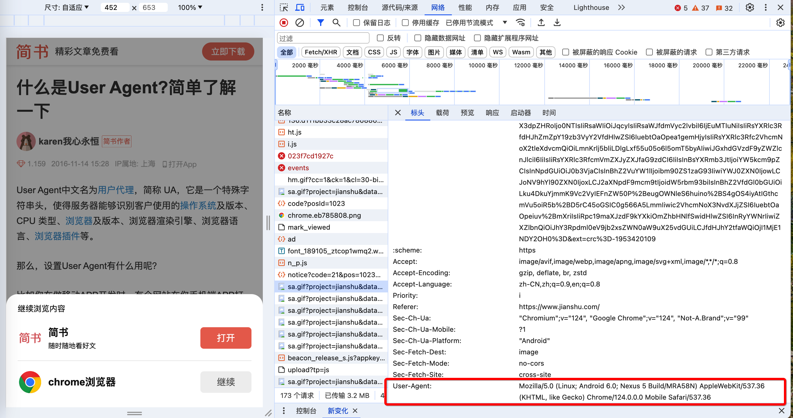

# SEO
- [SEO](#seo)
  - [基本概念.名词解释](#基本概念名词解释)
  - [一些工具](#一些工具)
  - [SEO.原理](#seo原理)
      - [域名和SEO的关系](#域名和seo的关系)
      - [服务器和SEO的关系](#服务器和seo的关系)
  - [SEO.内容](#seo内容)
  - [养网站（蜘蛛池）：](#养网站蜘蛛池)
  - [服务器vs搜索引擎vs访客](#服务器vs搜索引擎vs访客)
    - [判断来源](#判断来源)
  
## 基本概念.名词解释

* IIS，全称是 **I**nternet **I**nformation **S**ervices,是微软公司推出的一种互联网基础服务器

  * 它是运行在Windows NT系列操作系统上的Web服务器。

  * IIS主要特点包括:

    * **Web服务器**：IIS可以作为Web服务器用于托管网站、发布网页以及处理Web应用程序等。
    * **FTP服务器** ：支持FTP服务,用于文件的上传和下载。
    * **SMTP服务器**：可以作为SMTP服务器来发送和传输电子邮件。
    * **NNTP服务器**：支持新闻组服务,作为NNTP服务器使用。
    * **安全性能**：结合了Windows NT/2000的安全认证体系,支持SSL安全连接等多种加密方式。
    * **集成性能**：与Windows NT/2000无缝集成,内置了ASP、ASP.NET等开发技术的支持。
    * **可扩展性**：具有模块化设计,可通过安装组件来扩展服务器的功能。
  * IIS最常见的应用场景是作为企业级Web应用程序的服务器环境，承载ASP.NET、PHP等各种Web程序和服务；
  * 由于与Windows NT/2000系统的深度集成，IIS特别适用于构建基于Windows平台的网站或应用服务器；
  
  虽然IIS曾经存在过一些安全漏洞,但微软一直在不断加强IIS的安全性和可靠性。从IIS 6.0版本开始,IIS的安全性和可用性都有了大幅度的提高。当前最新版本是IIS 10,随着Windows Server 2019一同发布。
  
  总之,IIS作为Web服务器在Windows Server系统中扮演着非常重要的角色,成为构建基于Windows平台Web解决方案的主力产品。
  
* Nginx，是一个高性能的HTTP和反向代理服务器，也是一个IMAP/POP3/SMTP代理服务器；

  * 它是由Igor Sysoev在2004年创建，主要用于解决C10K问题。即，一个允许处理大量高并发连接的服务器。
  * Nginx的主要特点包括:
    * **高并发高性能** Nginx使用异步事件驱动的方式处理请求,在单核CPU的情况下也能够支持大量的并发连接数。官方数据表示能够支持50,000个并发连接数。
    * **低内存消耗** 在3GB内存的服务器上也能可以运行上万个连接,内存消耗非常低。
    * **高度模块化的设计** Nginx支持丰富的模块扩展,包括负载均衡、反向代理、SPDY/HTTP2、HTTPS等功能。
    * **热部署** 支持几乎无中断地重启和升级。
    * **BSD许可协议** Nginx使用BSD许可协议,是一款自由软件,允许修改源码和重新发布。

  * Nginx主要应用场景包括:
    * **反向代理和负载均衡** 作为Web服务器的反向代理服务器,实现负载均衡。
    * **HTTP缓存** 作为缓冲服务器,实现反向代理缓存或前端缓存。
    * **Web服务器** Nginx完全可以直接作为静态资源Web服务器使用。
    * **前端服务器** 与应用服务器对接实现动静分离,提高应用服务器性能。

* Apache，是一个广为人知的开源万维网(World Wide Web)服务器。

  * 它最初由美国伊利诺伊大学厄巴纳-香槟分校(NCSA)编写,后由Apache软件基金会进一步发展和维护。
  * Apache服务器以其稳定性、安全性以及跨平台性著称。
  * Apache服务器的一些主要特点包括:
    * **开源和免费**：Apache是基于开源模式开发的免费软件,不需要支付任何许可费用。
    * **跨平台**：Apache可运行在包括Windows、Unix、Linux、macOS等多种操作系统平台上。
    * **模块化设计**：Apache拥有模块化的设计架构,允许用户根据需求加载不同的模块扩展功能。
    * **稳定性优秀**：Apache以其卓越的稳定性而闻名,能够长期、持续地为大量请求提供服务。
    * **安全性强**：Apache提供了SSL/TLS加密通信、基于主机的多重身份认证等安全功能。
    * **高度可配置**：Apache服务器配置灵活,可以根据需要进行大量的定制配置。
    * **庞大的社区支持**：凭借开源的优势,Apache拥有庞大的社区支持与丰富的第三方模块资源。

  * Apache具有Web服务器、反向代理服务器、邮件代理服务器等多种用途。
  * 它可用于托管网站内容、处理动态网页请求、支持多种脚本语言以及集群服务等。
  * Apache占有很大的网络服务器市场份额,被众多知名网站和应用程序所使用。

* WordPress，是一个流行的开源内容管理系统(CMS)和博客平台。

  * PHP开发的

  * 它最初是为了创建网络日志(博客)而开发的,但现在已经发展成为构建各种类型网站的强大工具,包括博客、新闻门户网站、企业官网、在线商店等。
  * WordPress 具有以下主要特点：
    * **开源免费**：WordPress 基于 GPL 许可证，是一款完全免费且开源的软件，可以免费下载和自定义修改。
    * **主题和插件生态**：WordPress 有着庞大且不断壮大的主题和插件生态，可以轻松扩展网站的功能和定制外观。
    * **编辑器友好**：WordPress 提供了一个所见即所得(WYSIWYG)的编辑器界面，非技术人员也可以方便地编辑和发布内容。
    * **SEO 友好**：WordPress 对搜索引擎优化有着良好的支持,包括可自定义的永久链接结构等。
    * **多用户和权限管理**：支持多用户协作模式，可以为不同的用户分配不同的权限角色。
    * **多媒体支持**：内置了对图像、视频、音频等多媒体文件的上传和嵌入支持。
    * **移动设备支持**：支持自适应式和响应式设计，可以在不同移动设备上获得良好的浏览体验。

  * WordPress 生态系统庞大活跃,有大量的主题和插件提供各种增强功能，从博客、电子商务、论坛、在线课程到企业网站应有尽有。
  * 同时,WordPress 也因其简单易用而备受欢迎,成为构建各类网站的利器。
  * 据统计,约35%的网站使用了 WordPress。

* CMS，是内容管理系统(**C**ontent **M**anagement **S**ystem)的缩写。

  * 它是一种软件应用程序，用于创建、编辑、管理和发布数字内容，如：文本、图像、视频等。
  * CMS为网站和应用程序的内容创建、编辑和发布提供了统一的解决方案,大大简化了管理流程,提高了工作效率
  * CMS 的主要特点和优势包括：
    * **集中管理**：CMS提供了一个集中的界面和存储库,可以方便地管理和组织网站或应用程序的所有内容。
    * **版本控制**：CMS会记录内容的变更历史,方便回滚或比较版本差异。
    * **工作流程**：CMS支持设置工作流程,如审核、审批等,确保内容质量。
    * **模板系统** ：CMS通常包含模板系统,允许在不修改底层代码的情况下定制页面布局和样式。
    * **权限管理**：CMS提供了基于角色的权限控制,不同用户拥有不同的访问和操作权限。
    * **扩展性**：大多数CMS支持通过插件或模块扩展更多功能。
    * **易用性**：CMS为非技术人员提供了友好的可视化界面,降低了发布内容的门槛。
  * [**常见的CMS包括**](# https://blog.csdn.net/qq_29073921/article/details/104820162)：
    * 企业建站系统：**MetInfo(米拓)**、**蝉知**、**SiteServer CMS**等；
    * B2C商城系统：**商派shopex**、**ecshop**、**hishop**、**xpshop**等；
    * 门户建站系统：**DedeCMS(织梦)**、**帝国CMS**（漏洞比较少，一般黑客很难破）、**PHPCMS**、**动易**、**cmstop**等；
    * 博客系统：**wordpress**、**Z-Blog**等；
      * **WordPress**: 最流行的开源CMS,主要用于博客和网站构建。
    * 论坛社区：**discuz**、**phpwind**、**wecenter**等；
    * 问答系统：**Tipask**、**whatsns**等；
    * 知识百科系统：**HDwiki**；
    * B2B门户系统：**destoon**、**B2Bbuilder**、**友邻B2B**等；
    * 人才招聘网站系统：**骑士CMS**、**PHP云人才管理系统**；
    * 房产网站系统：**FangCms**等；
    * 在线教育建站系统：**kesion(科汛)**、**EduSoho网校**；
    * 电影网站系统：**苹果cms**、**ctcms**、**movcms**等；
    * 小说文学建站系统：**JIEQI CMS**；
    * 其他
      * **dedeCMS**：
      * **Adobe Experience Manager**： 是一款商业CMS,适用于大型企业营销网站。
      * **Drupal**： 功能强大的免费开源CMS,适用于构建复杂网站。
      * **Joomla**： 另一种流行的开源CMS,拥有活跃社区和大量扩展。
  * CMS加内链的方法
    * 用户通过浏览器打开页面，当运行到某js文件或者代码的时候，再从后台服务器拉取数据（比如：网站上访问量最高的一些文章）**对SEO不是很友 好**
    * 后端直接生成这些内容，通过html传送到用户这里 （推荐）

* 域名

  * 域名注册商

    * [**GoDaddy**](# https://www.domain.com/)：**域名**、托管、网站安全
    * [**阿里云**](# https://www.alibabacloud.com/)：全站
    * [**西部数码**](# https://www.west.cn/)：域名、主机、云服务器、企业邮箱、云建站、小程序
    * [**GName**](# https://www.gname.com/)：**域名**、网站防护、云服务器、企业邮箱
    * [**Goodkvm**](# https://www.goodkvm.com/)：**主机、云服务器**（<font color="red">可充值USDT</font>）
  
  * 顶级域名（Top-Level Domain,TLD）：获取顶级域名的使用权需要向相应机构或注册商缴纳费用。顶级域名的数量和种类还在不断扩展中。
  
    * 通用顶级域名(Generic TLDs, gTLDs) 这些是可供全球任何人或组织注册使用的域名。如：
      * com(商业机构)
      * .net(网络组织)
      * .org(非营利组织)
      * .edu(教育机构)
      * .gov(政府机构)
      * .info(信息网站)，等
    * 国家代码顶级域名(Country Code TLDs, ccTLDs)，这些域名根据ISO 3166标准，对应不同的国家或地区。如：
      * cn(中国)
      * .us(美国)
      * .uk(英国)
      * .jp(日本)
      * .de(德国)，等
    * 新通用顶级域名(New gTLDs) **自2012年开始**，ICANN陆续开放了**上千个**新的通用顶级域名供注册使用,如.xyz、.top、.club、.live等。
    * 基础架构域名(Arpa) 专门用于互联网基础设施的反向域名。如：arpa
  
  * 子域名(Subdomain)是一种将主域名进行进一步细分划分的技术手段。
  
    * 通过使用子域名，可以在一个主域名下创建多个独立的、有层次的子域名区域，以用于不同的目的或场景。
    * 子域名的格式是：`子域名前缀`.`主域名`。例如：
  
      * 主域名是 example.com
      * 那么 blog.example.com 就是一个子域名
      * mail.example.com 是另一个子域名
      * app.services.example.com 也是一个子域名。它是 services 子域名的子级
    * 子域名主要有以下作用:
      * **分类组织内容**：通过为不同类别的内容分配不同的子域名,可以更好地组织和管理网站内容和服务。
      * **独立的服务环境**：子域名可以用于为单独的产品、服务或内部系统分配独立的运行环境。
      * **个性化体验**：不同的子域名可以提供不同的个性化内容或功能体验。
      * **网站地理分布**：针对特定区域设置相应的子域名,可以提供本地化的网站内容和服务。
      * **多语言支持**：使用子域名来区分不同语言版本的网站内容。
      * **测试和过渡**：临时子域名可用于测试目的,也可作为新版本系统的过渡环境。
  
    * 在配置DNS和Web服务器时，需要正确设置子域名的指向和解析。管理和使用子域名有助于更好的组织和管控网站架构和服务。
  
  * **Whois**是一个查询工具和TCP基于文本的查询/响应协议，用于查询已注册的互联网资源。如：域名、IP地址块等的注册信息。Whois数据库包含了已注册互联网资源的一些重要信息。例如：
    
    * 域名注册信息
      * 域名注册人(个人或组织)
      * 域名注册人联系方式-域名注册机构
      * 域名创建、过期和更新日期等
    * IP地址分配信息
      * IP地址块所有者 
      * IP地址分配组织
      * IP地址使用范围-联系人信息
    * 自治系统(AS)信息
       * AS号码
       * AS名称和描述
       * AS管理员联系信息
    
    这些信息对于**域名所有权确认**、**联络注册人**、**IP规划和反垃圾邮件**等具有重要意义。大多数顶级域名注册管理机构都提供了公共Whois服务。<font color="red">任何人都可以查询</font>。Whois查询协议和相关政策仍在持续完善，以满足新出现的需求。
    
    *Whois查询通常通过命令行或在线Whois网站进行。比如在命令行下输入:*
    
    ```
    whois example.com
    ```
    
    *即可查询example.com域名的Whois信息*
    
  * 域名备案：将域名的**真实单位**和**使用者信息**提交给管理机构进行登记和审核备案的过程。在中国大陆,所有需要在互联网上使用域名的单位和个人，必须依法向相关主管部门备案，**取得备案编号后才能正常使用域名访问网站**。主要目的是方便管理机构监管网络信息,维护网络安全。
  
    * 域名备案的基本流程是：
      * 选择备案服务机构 可以通过域名注册商、云服务商等备案服务机构进行操作。
      * 准备所需资料 主要包括备案单位真实信息、网站前台页面、备案人员信息等材料。
      * 提交备案申请 通过服务机构的管理系统提交备案信息和资料。
      * 等待审核备案 备案信息会先由服务机构审核,通过后再提交给省通信管理局最终审核。
      * 取得备案密码 审核通过后会获得备案密码,作为备案有效凭证。
      * 解析域名生效 域名需配置备案密码后才能正常解析访问网站。
  
    未经备案的域名网站,将无法在中国大陆地区正常访问和使用。及时履行备案义务对于合法合规运营网站至关重要。
  
    **备案周期一般为3-5年**，到期需重新续期备案。
  
    * 如果一个域名没有进行备案，那么在中国大陆地区是通不过防火墙的，网站将无法被正常访问。原因如下：
      * **互联网管理措施** 根据中国的相关法规,所有在中国境内运行的网站，必须向所在地区的通信管理局办理备案。这是对互联网信息服务的一种监管措施。
      * **DNS解析屏蔽** 对于未备案的域名，**中国的防火墙系统会从DNS根服务器级别屏蔽该域名的解析请求**，使其无法解析到正确的IP地址。
      * **IP层面阻断** 即使能成功解析出IP地址，防火墙也会在IP层面对未备案网站的IP地址进行阻断,阻止网站的访问请求。
      * **URL访问拦截** 部分防火墙还会对网站URL本身进行检查,直接拦截未备案网站的链接访问。
    * 如果国内可以顺利访问外国网站
      * 一般情况下是做了防火墙白名单（加白）；
      * 或者选用跳板机访问（VPN）；
  
  * 防火墙.端口（<font color="red">对网络数据流量进行监控和控制时</font>）
  
    * **80端口 (HTTP)** 这是Web浏览器用于访问网站的标准端口。防火墙会检查和过滤80端口上的HTTP流量。
    * **443端口 (HTTPS)** 这是网站SSL/TLS加密连接使用的端口。防火墙需要监控并验证443端口上的HTTPS加密通信。
    * **21端口 (FTP)** FTP文件传输协议使用21端口,防火墙可通过此端口控制FTP数据传输。
    * **22端口 (SSH)** SSH远程连接使用22端口,防火墙需监控此端口以控制SSH访问。
    * **25端口 (SMTP)** SMTP简单邮件传输协议使用25端口发送电子邮件,防火墙可在此端口过滤垃圾邮件。
    * **53端口 (DNS)** DNS服务使用53端口,防火墙需监控并过滤DNS流量。
    * 除此之外,防火墙还可能过滤其他常用端口如Telnet(23)、IMAP(143)、POP3(110)等通信端口的流量。
    
  * 根服务器(Root Server)，是互联网域名系统(DNS)的最高层级的服务器集合。它们负责响应对所有顶级域(如.com、.org、.cn等)的DNS查询请求。
    
    * 根服务器的主要作用包括:
    
      * **存储IP地址** 根服务器维护着顶级域名服务器的IP地址,为下一级域名服务器查询提供入口。
    
      * **负载均衡** 由于查询压力巨大,根服务器会将查询请求分发到多台冗余服务器上,实现负载均衡。
    
      * **权威性保证** 根服务器由互联网社群共同监管,具有权威性,确保DNS查询结果的正确性。
    
      * **层级分级** 根服务器处于DNS层级结构的最顶层,所有DNS查询都必须从根开始查询。
    
      * **互联网基础设施** 根服务器是构建全球互联网基础设施不可或缺的关键组成部分。
    * 目前全球仅有**13**组根服务器，分布在多个不同的地理位置，由不同的组织机构负责运营和维护，分布于3个不同的大陆，这种分散部署使得根服务器能够具有很高的冗余性和容错能力，保证了整个DNS系统的高可用性。**每组服务器都包含主服务器和全球分布的多台镜像服务器**。这些镜像服务器可快速响应本地区的DNS查询请求。
      * A根 - 美国**马里兰州**的维吉尼亚大学
      * B根 - 美国<font color="red">加利福尼亚州</font>的USC Information Sciences Institute
      * C根 - 美国**马里兰州**的Cogent Communications
      * D根 - 美国**马里兰州**的马里兰大学
      * E根 - 美国<font color="red">加利福尼亚州</font>的NASA Ames研究中心
      * F根 - 美国<font color="red">加利福尼亚州</font>的Internet Systems Consortium, Inc.
      * G根 - 美国马萨诸塞州的美国国防部网络情报系统组织
      * H根 - 美国**马里兰州**的美军网络指挥部
      * I根 - 瑞典斯德哥尔摩的尼尔斯·奥尔网络信息中心
      * J根 - 美国<font color="red">加利福尼亚州</font>的RIPE NCC
      * K根 - 英国伦敦的RIPE NCC
      * L根 - 美国<font color="red">加利福尼亚州</font>洛杉矶的ICANN
      * M根 - 日本东京的WIDE Project
    * 根服务器工作在7*24小时不间断运行，任何一台瘫痪也不会影响全球DNS系统的正常运作。它们以高可用性和稳定性维系着整个互联网的运转。保护好根服务器对互联网的健康运行至关重要。
    
  * DNS，全称是**D**omain **N**ame **S**ystem == 用来管理，一个域名 ： 一个IP地址，的系统（一一对应，互相映射，数据库 ）
  
    * DNS系统的主要作用包括：
  
      * 域名解析：DNS最基本的功能就是将域名解析为对应的IP地址，使人们可以通过易记的域名访问网站，而不需要记住复杂的IP地址数串。
  
      * 负载均衡：DNS服务器可以将一个域名解析为多个不同的IP地址，从而实现服务器的负载均衡和高可用性。
  
      * 邮件服务：通过MX记录的指定,DNS还负责发现用于发送电子邮件的邮件服务器。
  
      * 其他应用：DNS也可以用于存储和查找与域名有关的其他信息,如地理位置、服务记录等。
    * DNS系统是一个层级的结构，包括：
      * 根域名服务器
      * 顶级域名服务器(如.com/.net/.cn)
      * 权威域名服务器(管理具体域名)
      * 递归DNS服务器(为终端用户提供解析服务)
    
    DNS通过客户端与服务器之间的查询请求与响应过程，将人类可读的域名与IP地址进行映射。
  
    这种分布式分层设计使得DNS有很好的扩展性和容错能力，成为了互联网的重要基础设施之一。
  
  * CDN，是内容分发网络(**C**ontent **D**elivery **N**etwork 或 **C**ontent **D**istribution **N**etwork) 的英文缩写。
  
    CDN是一种通过互联网互相连接的服务器网络系统。它可以更高效地向终端用户分发各种 Web 内容，包括 Web 代码、图像、视频、应用程序等。
  
    * CDN 的主要作用和优势包括：
      * 缓存内容：CDN在离终端用户更近的节点服务器上缓存内容的副本，终端用户直接**从离自己最近的节点获取**所需内容,降低延迟,提升响应速度。
      * 减轻源站压力：用户的访问请求被CDN分担和分流，源站(Origin Server)的负载得到减轻。
      * 降低带宽成本：内容在CDN节点分发，降低了从源站直接传输数据的带宽成本。
      * 提升可用性：通过在不同地区部署多个节点服务器，CDN可以提高冗余性,从而提高系统的可用性和容错能力。
      * 防御攻击：**CDN可以更好的防御常见的网络攻击**，如DDoS攻击。
  
    * CDN的工作原理是：
      * CDN服务提供商在全球多个运营商的骨干网络部署了大量的节点服务器。
      * 用户访问CDN分发的内容时，DNS服务器会自动根据用户的网络位置，将用户请求指引到最佳CDN节点。
      * 用户从该节点服务器上获取所需内容,减少了从源站下载内容的距离和开销。
  
    CDN已广泛应用于各种网站、视频流媒体、云存储服务、大型软件下载等场景，成为了现代互联网内容分发的关键基础设施。
  
* C段IP：指IP地址中的C类地址段。

  * IP地址是用来唯一标识Internet上的主机的一串数字标识。

  * IP地址通常由4个无符号的8位二进制整数组成。每个二进制整数取值范围为0-255，组成的IP地址范围是0.0.0.0到255.255.255.255。
  
  * 根据IP地址的不同范围，IP地址被划分为A、B、C、D、E五类：
  
    - A类地址：第一个字节范围为0-127。如：10.0.0.0
    - B类地址：第一个字节范围为128-191。如：172.16.0.0
    - C类地址：第一个字节范围为192-223。如：192.168.0.0
    - D类地址：为多播地址。如：224.0.0.0-239.255.255.255
    - E类地址：为保留地址。如：240.0.0.0-255.255.255.255
  
    C类地址最常见于局域网络中使用,如192.168.1.1等。它们不能直接在因特网上使用,需要通过网络地址转换(NAT)等方式连接因特网。
  
* SEO的内链和外链

  * 内链(Internal Link)：
    - 指的是一个网站中从一个页面链接到同一网站中的另一个页面。
    - 内链可以帮助搜索引擎爬虫更好地探索和索引你的网站内容。
    - 好的内链结构有助于网站导航、传递页面权重,提高用户体验。
  * 外链(External Link)：
    - 指的是从你的网站链接到其他不同域名下的外部网站。
    - 外链可以向外部网站传递部分页面权重和链接权重。
    - 来自优质、相关和权威网站的外链被认为对SEO很有价值,可以提升你网站在搜索引擎中的排名。
  * 针对SEO的策略：
    * 内链建议创建合理且有层次的网站结构，让重要页面获得更多内链支持。
    * 外链建议获取相关、优质外部网站的链入，但要避免过度外链和不相关的外链。
    * 注意内链和外链的铺设质量和相关性,过度或不当使用都可能对SEO产生负面影响。
    * 持续优化内链和积极获取高质量外链，有助于提高网站在搜索引擎中的权重和排名。
  
* 网络爬虫（Web Crawler），也被称为网络蜘蛛、网页追逐者或者机器人。是一种自动获取万维网信息的程序。

  * 网络爬虫主要有以下作用和特点：

    * 自动抓取网页内容 它可以自动在互联网上游走并下载网页,获取想要的数据和信息。
  
    * 持续循环工作 爬虫一般是不间断持续工作的,周期性地重复抓取已有网页,发现网页变化并更新本地数据库。
  
    * 有crawler算法规则 它通过网页链接层级关系,以及设定的crawler算法规则,有计划有步骤地抓取网页。
  
    * 支持搜索引擎工作 爬虫是搜索引擎获取网页数据的主要工具,为建立索引服务。
  
    * 可用于数据挖掘等应用 除搜索引擎外,爬虫也被应用于数据挖掘、市场分析等领域,帮助获取所需结构化数据。
  
    * 主流爬虫算法通常包括**广度优先**、**深度优先**、**最佳优先等策略**。
  
      * 实际应用中,不同的网络爬虫任务可采用不同的策略组合：
        * 一些搜索引擎爬虫结合使用广度和深度策略
        * 一些数据采集任务使用最佳优先策略抓取高优先级目标网页
  
      * 广度优先(Breadth-First)
        * 从种子网页开始，先将同层级的所有链接加入队列，依次获取
        * 获取方式是从队列头部获取,获取完后队列尾部加入新的同层级链接
        * 这种方式可以先horizon的抓取同层级链接，**但可能耗费较多内存**
      * 深度优先(Depth-First)
        * 从种子网页开始，沿着一条链接往下抓取，直到最大深度或不可访问为止
        * 然后回溯到上一层链接，获取新的下层链接继续往下抓取
        * **这种方式抓取更深层网页较快，但也可能进入死循环或无限深度陷阱**
      * 最佳优先(Best-First)
        * 根据预先设定的评价函数，计算每个网页的优先级得分
        * 每次从待抓取列表中选取得分最高的网页进行获取
        * 这种方式可确保抓取高质量重要网页，但需要合理设计评价函数并付出更多计算开销
  
    * 常用编程语言如Python、Java等都提供了相关的爬虫框架，方便开发。
  
    * 需注意爬虫的使用要遵守相关法律法规和**robots.txt**协议。
  
* 站群对SEO的意义

  * **提高关键词覆盖率**：每个网站可以针对性优化特定的关键词组合，通过站群的方式就能覆盖更多**长尾关键词**。
  * **获取更多外部链接**：站群中的网站可以互相链接传递权重，同时也更容易吸引外部网站链接，提升整体网站权重。
  * **降低被搜索引擎惩罚风险**：如果一个网站被降权，站群中其他网站可以缓冲部分流量损失，降低整体风险。
  * **进行内容试验和测试**：站群可以作为测试平台，在不同网站上测试内容策略、布局等，找到最佳实践方案。
  * **拓展受众人群 **：每个网站以不同角度呈现内容，可以覆盖不同人群和需求，最大化曝光机会。
  * **提升品牌影响力**：多个优质相关网站能增强品牌的专业性和权威性，提高在行业内的影响力。
  * **增加收入来源**：通过多个网站发布相关广告或产品，可以拓展收入渠道。

* 长尾关键词(Long Tail Keywords)，指的是搜索量较低、但更具体、更专门化的关键词组合。与热门短语关键词相比,它们具有以下特点：

  * **搜索量低**：单个长尾关键词的搜索量较低，通常每月只有几十到几百次查询。但这些长尾词累积起来占据了绝大部分搜索流量。
  * **词语更长**：长尾关键词通常由3个及以上单词组成，描述得更加具体、细化,如"东京旅游攻略夏季"。
  * **转化率更高**：长尾关键词往往反映了用户更明确、更有购买意向的搜索需求，因此潜在转化率更高。
  * **竞争度更低**：与头部流量关键词相比，长尾词的竞争较小，更容易在搜索引擎上获得好的排名。
  * **定位更准确**：长尾词能够更精准地匹配用户的查询意图，帮助企业触达真正感兴趣的目标受众群体。

* 热门短语关键词(Hot Phrase Keywords)，指的是搜索量很高、竞争激烈的短关键词组合。通常有以下特点：

  * **搜索量大 **：这类热门关键词每月被大量用户搜索，搜索量通常在数万到数百万次以上。
  * **词语较短**：通常由1-3个单词构成,如"旅游攻略"、"夏季服装"等。
  * **竞争非常激烈**：由于搜索量大且具有商业价值，导致这些词在搜索引擎上的竞争非常激烈。
  * **转化率不确定**：热门搜索短语较为笼统，用户的确切需求不明确，因此整体转化率较长尾词低一些。
  * **覆盖范围广**：短语关键词表达的意图比较广泛，覆盖面更大。

* On-Page优化(网页内部优化) ，指的是在网页**内容和源代码层面**进行的优化工作，目的是改善页面对搜索引擎的友好度和相关性匹配。包括：

  * 优化页面标题、描述等元素

  - 优化页面内容质量和关键词密度
  - 优化网页结构、层级和Url结构
  - 优化页面加载速度和移动端体验
  - 添加alt图片描述、结构化数据等
  - 设置robots.txt、sitemap等

* Off-Page优化(网站外部优化) ，指的是在**网站内容之外**进行的各种优化推广活动，目的是提高网站的外部可见度、权威度和推荐度。包括：

  * 链接建设(获取高质量外部链接)
  * 社交媒体营销推广
  * 网站品牌推广和广告宣传
  * 论坛、博客等线上活动
  * 本地化营销上线建设
  * 内容营销推广(如高质量原创内容)

* TDK（(**T**itle.**D**escription.**K**eywords）

  * Title(标题)，指的是HTML页面头部的<title>标题</title>部分。标题对用户和搜索引擎都很重要，它是页面最主要的内容描述，也是搜索结果中显示的超链接字样。
  * Description(描述) ，指的是HTML头部的<meta name="description" content="...">部分。这段文字是搜索引擎在结果页中显示的页面摘要描述，对吸引用户点击很关键。
  * Keywords(关键词) ，指的是HTML头部的<meta name="keywords" content="...">部分。这里列出的是页面主旨相关的一些关键词，**过去对搜索引擎很重要，但现在意义已不太大**。

## 一些工具

[**Sav.com**](# https://www.sav.com/)，是一个域名注册和管理平台，它让用户可以**购买、注册 和管理域名**

[**DyaDot**](# https://www.dynadot.com/)， 是一个提供域名注册和管理服务的平台。它类似于 Sav.com，允许用户购买、注册和管理域名。

[**tld-list**](# https://tld-list.com/)，对比域名价格的网站

## SEO.原理

#### 域名和SEO的关系

* 价格越贵的域名，搜索引擎给的排名可能会更高一些 

* 做批量注册的时候，`.com`应该是最好的

* 有些域名注册和管理服务的平台的Api，看下是否方便我们写脚本进行注册；

  * *Python 脚本示例：使用 Sav.com 的 API 进行域名注册*

  ```python
  import requests
  
  # 设置 API 访问凭证
  api_key = 'YOUR_API_KEY'
  
  # 设置 API 端点
  api_endpoint = 'https://api.sav.com/v1'
  
  # 准备注册信息
  domain_name = 'example.com'
  registrant_email = 'example@example.com'
  registrant_name = 'John Doe'
  registrant_address = '123 Main Street'
  registrant_city = 'Anytown'
  registrant_state = 'CA'
  registrant_postal_code = '12345'
  registrant_country = 'US'
  
  # 构建注册请求
  register_data = {
      'name': domain_name,
      'registrant': {
          'email': registrant_email,
          'name': registrant_name,
          'address': registrant_address,
          'city': registrant_city,
          'state': registrant_state,
          'postal_code': registrant_postal_code,
          'country': registrant_country
      }
  }
  
  # 发送注册请求
  response = requests.post(f'{api_endpoint}/domains', headers={'Authorization': f'Bearer {api_key}'}, json=register_data)
  
  # 处理注册响应
  if response.status_code == 200:
      print('域名注册成功！')
  else:
      print('域名注册失败:', response.json())
  ```

  * *Python 脚本示例：脚本续费*
  
  ```python
  import requests
  
  # 设置 API 访问凭证
  api_key = 'YOUR_API_KEY'
  
  # 设置 API 端点
  api_endpoint = 'https://api.sav.com/v1'
  
  # 准备续费信息
  domain_name = 'example.com'
  years_to_renew = 1  # 续费时长，单位为年
  
  # 构建续费请求
  renew_data = {
      'name': domain_name,
      'years': years_to_renew
  }
  
  # 发送续费请求
  response = requests.post(f'{api_endpoint}/domains/renew', headers={'Authorization': f'Bearer {api_key}'}, json=renew_data)
  
  # 处理续费响应
  if response.status_code == 200:
      print('域名续费成功！')
  else:
      print('域名续费失败:', response.json())
  ```
  
  * *Python 脚本示例：脚本解析域名* **解析域名通常是指查询域名的 DNS 记录，以获取与该域名相关联的 IP 地址或其他记录**
  
  ```python
  import requests
  
  # 设置 API 访问凭证
  api_key = 'YOUR_API_KEY'
  
  # 设置 API 端点
  api_endpoint = 'https://api.sav.com/v1'
  
  # 准备要解析的域名
  domain_name = 'example.com'
  
  # 构建解析请求
  lookup_data = {
      'name': domain_name
  }
  
  # 发送解析请求
  response = requests.post(f'{api_endpoint}/domains/lookup', headers={'Authorization': f'Bearer {api_key}'}, json=lookup_data)
  
  # 处理解析响应
  if response.status_code == 200:
      dns_records = response.json()['records']
      if dns_records:
          print(f"域名 '{domain_name}' 的 DNS 记录如下：")
          for record in dns_records:
              print(f"类型: {record['type']}, 记录: {record['name']}, 值: {record['value']}")
      else:
          print(f"域名 '{domain_name}' 没有找到任何 DNS 记录。")
  else:
      print('域名解析失败:', response.json())
  ```
  
* 做站群的时候，选用老域名，有很多外链，更容易被搜索引擎收录，之后的排名可能会更好

* 不要用中国大陆的域名平台去做一些敏感的事情

* 找老域名：

  * 采集全网域名
  * 查询是否能注册（过期但是没有续费）
  * archive.org [**查询建站历史**](# archive.org)
  * 拿到可以注册的域名，再来查他的互联网快照
  * 获得这些域名，上一次做网站的标题
  * 列出来以后，再手工的筛选一下
  * 最后，才得到非常好的可以注册的老域名

#### 服务器和SEO的关系

* 一些工具

  * [**Microsoft Remote Desktop**](# https://go.microsoft.com/fwlink/?linkid=868963)
  * [**Mobaxterm**](# https://mobaxterm.mobatek.net/download-home-edition.html)
  * 网站统计 
  * 云办公服务器：AWS ==>产品==>计算==>Amazon Lightsail（虚拟专用服务器）
  *  普通服务器（存放网站代码）：Azure、谷歌云、阿里云==>一般用centOS 

    * 不折腾：比较稳定，不需要经常换IP，不需要经常换服务器
  * 多IP服务器（进阶SEO用到 ）。一般都是华人接触。针对中文搜索引擎去做SEO可以用站群的方式有一定效果，但是做Google就效果差。
  * [**egihosting.com**](#  ) 是一家提供虚拟主机、VPS、专用服务器等网站托管服务的公司，为企业和个人开发者提供多种网站托管解决方案。

    - 成立于2003年，总部位于荷兰阿姆斯特丹。

    - 提供共享主机、VPS、云服务器、专用服务器等多种主机方案。

    - 拥有自己的数据中心，服务器分布在荷兰、美国等多个国家。

    - 提供Linux和Windows两种操作系统选择。

    - 支持多种网站构建工具，如：WordPress、Joomla、Drupal等。

    - 提供简单管理面板,并提供24/7的技术支持。

    - 提供域名注册和SSL证书服务。

    - 主打高性能、高可用性、**安全性较高**。

    - **收费相对市场中等偏下**，有多种优惠促销活动。
  * 拨号换IP的服务器：一种特殊的代理服务器，能够频繁切换自己的出口IP地址。针对某些网站进行**采集**的时候，会限制IP的操作次数。也可以写脚本； 
  
    * 具体来说,拨号换IP服务器的工作原理是：
  
      * 这种服务器**会拥有大量来自不同网络运营商的拨号宽带帐号资源**
      * 服务器会**定期自动拨号上网**，获取一个**新的临时公网IP地址**。
      * 当需要代理上网时，用户请求会先进入这个服务器，由服务器使用当前获取的IP地址代理访问目标网站。
      * 过一段时间后,服务器会再次拨号获取新IP，切换出口IP。
      * 这样就实现了对外IP地址的频繁循环切换。
    * 使用拨号换IP服务器的目的主要有：
      * 防止被网站识别为同一个固定IP，从而被限制或封禁访问。
      * 避开地理位置锁定,绕过一些网站的区域访问限制。
      * 提高匿名性，隐藏真实地理位置和网络环境。
      * 有些特殊需求如数据采集等，需要不断切换IP才能持续运行。
  * 局域网服务器（用于本地测试，模拟服务器）
  
## SEO.内容

  * 页面内容有原创性，关键词密度合理

  * 内容质量高，能留住人。通过停留时间来反应内容质量
  
  * 页面上的内容，要做到主题明确，有逻辑性。目前的搜索引擎可以拿到内容，做语义分析。如果分析出来的内容和标题对不上，以及关键字不匹配。那么就会降权 

  * 堆砌关键词：语义基本不通，内容瞎写， 内容里面的各种词语替换成我们的关键词（**这种做法现在已经完全没有可行性**）

## 养网站（蜘蛛池）：

  * 怎么去填充里面的内容
    * 采集新闻（以前可以，现在效果不好 ）
    * **宝藏资源.案例**：教育系统博客，做任务，师生投稿（全新原创文章），没有流量压力，屏蔽了搜索引擎 
    * 带指数的关键词 
    * 利用AI工具：比如，[**tensorflow**](# https://www.tensorflow.org/?hl=zh-cn)来写文章
  * 找屏蔽了搜索引擎的网站。信息孤岛，比如：小红书的内容不暴露在搜索引擎下
  * <font color="red">**做爬虫要非常小心，因为很敏感！！！**</font>

## 服务器vs搜索引擎vs访客

### 判断来源

* 指标/参数（用于判断是搜索引擎还是用户来访问我们的服务器）
  * UA = **U**ser **A**gent = 用户代理，是一个特殊字符串头，使得服务器能够识别客户使用的操作系统及版本、CPU 类型、浏览器及版本、浏览器渲染引擎、浏览器语言、浏览器插件等。**不同搜索引擎，拥有不同的UA**
  
  
  * IP 
  * Referrer
  * 时间
  
* 判断位置
  * 前端JS
  * 服务器层面，比如：NGinx、IIS、Apache，在这里面写代码
  * 最后端的代码，比如： php代码、各种CMS 
