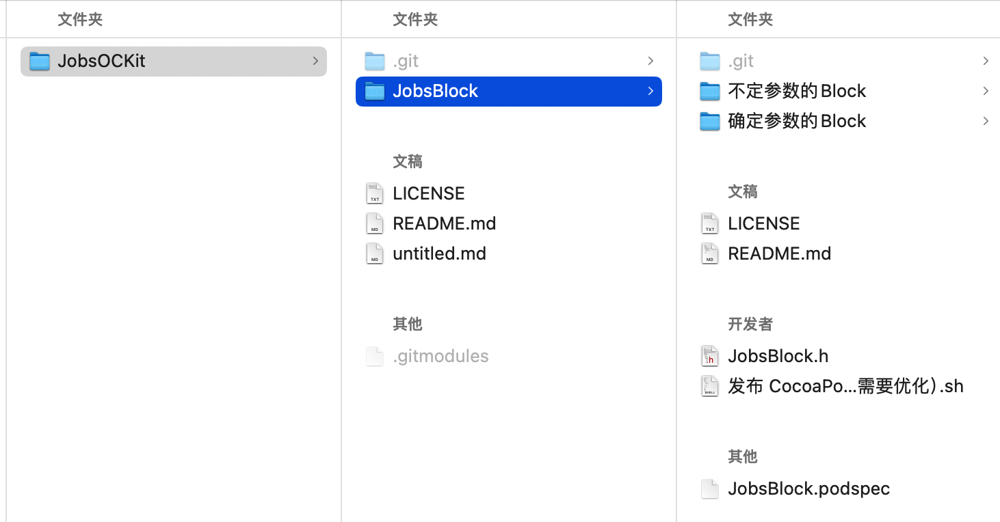
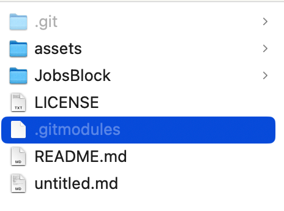

# Git 子模块使用



```bash
➜  JobsOCKit git init               
提示：使用 'master' 作为初始分支的名称。这个默认分支名称可能会更改。要在新仓库中
提示：配置使用初始分支名，并消除这条警告，请执行：
提示：
提示：	git config --global init.defaultBranch <名称>
提示：
提示：除了 'master' 之外，通常选定的名字有 'main'、'trunk' 和 'development'。
提示：可以通过以下命令重命名刚创建的分支：
提示：
提示：	git branch -m <name>
已初始化空的 Git 仓库于 /Users/jobs/Documents/GitHub/JobsOCKit/.git/
➜  JobsOCKit git:(master) ✗ git submodule add https://github.com/295060456/JobsBlock ./JobsBlock
向索引中添加位于 'JobsBlock' 的已存在的仓库
➜  JobsOCKit git:(master) ✗ git remote add origin git@github.com:295060456/JobsOCKit.git
➜  JobsOCKit git:(master) git branch -M main
➜  JobsOCKit git:(main) git push -u origin main
枚举对象中: 5, 完成.
对象计数中: 100% (5/5), 完成.
使用 8 个线程进行压缩
压缩对象中: 100% (4/4), 完成.
写入对象中: 100% (5/5), 1.01 KiB | 1.01 MiB/s, 完成.
总共 5（差异 0），复用 0（差异 0），包复用 0
To github.com:295060456/JobsOCKit.git
 * [new branch]      main -> main
分支 'main' 设置为跟踪 'origin/main'。
➜  JobsOCKit git:(main) 
```

* 先对用Git管理的文件夹创建远程仓库

* ```
  git submodule add <repository_URL> <path_to_submodule>
  ```

  * 先对内层的子文件夹进行Git约束（和远程仓库建立同步映射关系），得到`repository_URL`。这里是`https://github.com/295060456/JobsBlock`
  
  * `path_to_submodule` 是相对外层Git文件的路径。这里是`./JobsBlock`
  
  * 此时会在最外层目录，生成一个名为`.gitmodules`的隐藏文件



* 最后，对最外层的Git管理的文件（夹），进行同步处理。成功完成！！！