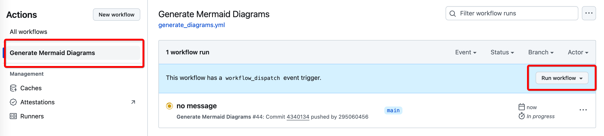

# GitHub.workflow（工作流）的使用

[toc]

## 1、介绍 **GitHub.workflow**

* 通俗一点来讲，就是**GitHub**不仅提供存放代码的服务，还提供了一个虚拟机环境

  * 运行**GitHub.workflow**需要在这台远程的**GitHub**虚拟机上安装必要的环境

* **GitHub Actions** 是 **GitHub** 提供的一项服务，它允许您在 **GitHub** 仓库中定义和执行自动化工作流

* 这些工作流由事件触发，可以执行各种任务，例如持续集成（CI）、持续交付（CD）、测试、构建、部署等

* 工作流文件位于仓库的 `.github/workflows` 目录下

* 可以在本地测试**工作流**是否正常工作

  ```shell
  brew install act
  ```

* 名词解释：

  * **工作流 (Workflow)**：工作流是由 **YAML** 文件定义的一系列自动化任务
  * **事件 (Event)**：事件是触发工作流的条件，例如代码推送（push）、创建 Pull Request、计划任务等
  * **作业 (Job)**：作业是工作流中可并行运行的一组步骤，每个作业在一个新的虚拟机中运行
  * **步骤 (Step)**：步骤是作业中的单个任务，可以执行脚本或使用 GitHub Actions 社区提供的预定义动作
  * **运行器 (Runner)**：运行器是执行作业的服务器。GitHub 提供托管的运行器，用户也可以自托管运行器

* 参考资源

  * [**GitHub Actions 官方文档**](https://docs.github.com/en/actions)
  * [**GitHub Actions 入门教程**](https://docs.github.com/en/actions/learn-github-actions)
  * [**GitHub Actions 市场**](https://github.com/marketplace?type=actions)

## 2、工作方式

* 本地环境配置

  * ```shell
    brew install npm
    brew install chromium
    ```
  
  * 全局使用
  
    ```shell
    npm install -g @mermaid-js/mermaid-cli
    ```
  
    在特定的项目中使用。定位项目根目录
  
    ```shell
    npm install @mermaid-js/mermaid-cli
    ```
  
  * ```shell
    ➜  JobsOCBaseConfigDemo git:(main) ✗  npx mmdc -i README.md -o diagram.png
    Found 2 mermaid charts in Markdown input
    [@zenuml/core] Store is a function and is not initiated in 1 second.
    [@zenuml/core] Store is a function and is not initiated in 1 second.
     ✅ ./diagram-1.png
     ✅ ./diagram-2.png
    ```
  
* 在项目根目录建立**`.github`**→**`workflows`**→**`generate_diagrams.yml`**

  * `generate_diagrams.yml`。<font color=blue>**对于目前这个工作流脚本，需要保证在对应的`*.md`文件里面有对应的`mermaid`标签，否则运行会失败**</font>

    ```yml
    name: Generate Mermaid Diagrams
    
    on:
      push:
        branches:
          - main
      pull_request:
        branches:
          - main
      workflow_dispatch: # 允许手动触发
    
    jobs:
      build:
        runs-on: ubuntu-latest
        permissions:
          contents: write # 对当前github仓库具有写的权限
    
        steps:
        - name: Checkout repository
          uses: actions/checkout@v2
          with:
            token: ${{ secrets.PAT }} # 计划稍后使用自己的 PAT `git push` 对不同的存储库执行操作
    
        - name: Setup Node.js
          uses: actions/setup-node@v3
          with:
            node-version: '20'  # 使用最新版本的 Node.js
            
        - name: Install dependencies
          run: |
            sudo apt-get update
            sudo apt-get install -y chromium-browser
            npm install -g @mermaid-js/mermaid-cli
    
        - name: Generate Diagrams
          run: |
            npx mmdc -i README.md -o diagram.png
            ls -la # 列出当前目录中的文件
    
        - name: Show current directory structure
          run: ls -R
            
        - name: Commit and push diagrams
          if: success()
          run: |
            git config --global user.name 'github-actions'
            git config --global user.email 'github-actions@github.com'
            git add diagram-*.png
            git commit -m 'Auto-Generate Mermaid diagrams'
            git push https://${{ github.actor }}:${{ secrets.PAT }}@github.com/${{ github.repository }}.git HEAD:main
    ```
  
* 只会在**Github**云上执行，而不是本地机器执行。最后将执行结果`git pull`下来

  ```shell
  ➜  JobsOCBaseConfigDemo git:(main) git add .github/workflows/generate_diagrams.yml
  git commit -m "Update GitHub Actions workflow to use PAT for pushing changes"
  git push origin main
  
  [main 148dab7] Update GitHub Actions workflow to use PAT for pushing changes
   1 file changed, 2 insertions(+), 3 deletions(-)
  Enumerating objects: 9, done.
  Counting objects: 100% (9/9), done.
  Delta compression using up to 8 threads
  Compressing objects: 100% (3/3), done.
  Writing objects: 100% (5/5), 494 bytes | 494.00 KiB/s, done.
  Total 5 (delta 2), reused 0 (delta 0), pack-reused 0
  remote: Resolving deltas: 100% (2/2), completed with 2 local objects.
  To github.com:295060456/JobsOCBaseConfigDemo.git
     79dd87d..148dab7  main -> main
  ```
  
* 获得与本机相关联的私钥
  
  * `https://github.com/settings/profile`→`https://github.com/settings/apps`→`https://github.com/settings/tokens`
  
  * workflow选项打钩✅
  
    
  
  * <font color=red>**得到私钥（牢记，不得外泄）**</font>
  
      

* 在Github云中，具体的项目里面进行配置。点按`New repository secret`按钮

  

* 填写`Actions secrets`。**Git Actions**机器人需要有操作权限
  
  
  * `Name`中填写`ACTIONS_PAT`;
  * `Secret`中填写秘钥
  
  ## 手动启动
  
  


