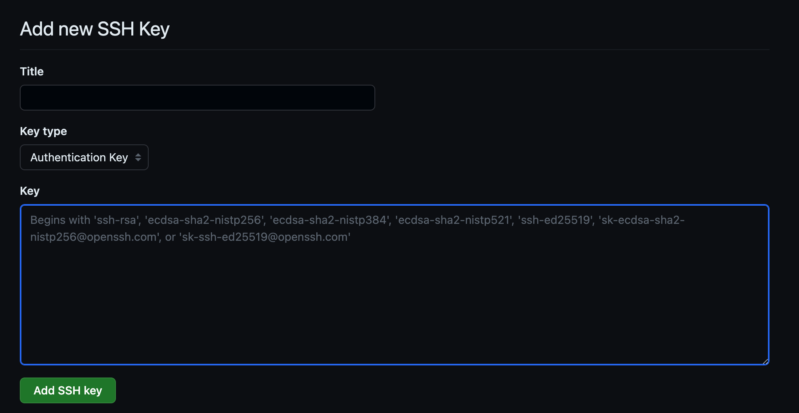
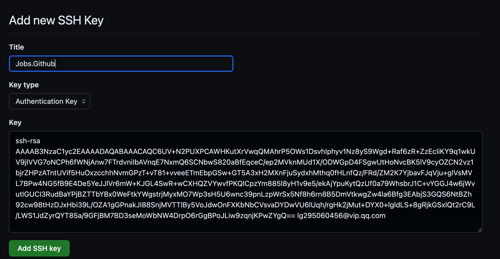
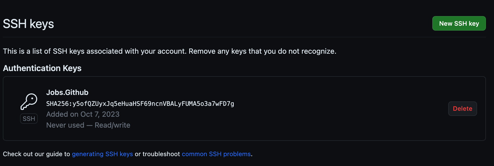
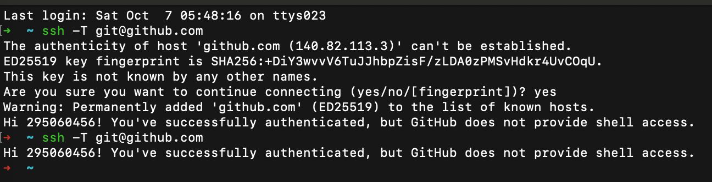

# 通过SSH连接到GitHub

[toc]

## 1、生成SSH密钥（尚未在本地计算机上生成SSH密钥对）

```bash
ssh-keygen -t rsa -b 4096 -C "your_email@example.com"
```

```bash
➜  ~ ssh-keygen -t rsa -b 4096 -C "lg295060456@vip.qq.com"
Generating public/private rsa key pair.
Enter file in which to save the key (/Users/jobs/.ssh/id_rsa): 
Enter passphrase (empty for no passphrase): 
Enter same passphrase again: 
Your identification has been saved in /Users/jobs/.ssh/id_rsa
Your public key has been saved in /Users/jobs/.ssh/id_rsa.pub
The key fingerprint is:
SHA256:y5ofQZUyxJq5eHuaHSF69ncnVBALyFUMA5o3a7wFD7g lg295060456@vip.qq.com
The key's randomart image is:
+---[RSA 4096]----+
|       +o+*=o.   |
|       +*..oo.   |
|      ++*o  ..   |
|      += *    .  |
|     .E.S o  .   |
|    ..o+ *  .    |
|    ..o.*  .     |
|     o.*.o. o .  |
|      =++. . o   |
+----[SHA256]-----+
```

## 2、添加SSH密钥到SSH代理

* 运行以下命令来将生成的SSH密钥添加到SSH代理，以便您可以在不重复输入密码的情况下使用它：

```bash
eval "$(ssh-agent -s)"
ssh-add ~/.ssh/id_rsa
```

```bash
➜  ~ eval "$(ssh-agent -s)"
ssh-add ~/.ssh/id_rsa
Agent pid 84601
Identity added: /Users/jobs/.ssh/id_rsa (lg295060456@vip.qq.com)
```

## 3、将公钥添加到GitHub

```
1、打开~/.ssh/id_rsa.pub文件并复制其中的内容
2、然后登录到 https://github.com/settings/ssh/new
3、转到您的帐户设置，点击"SSH and GPG keys"，
4、然后点击"New SSH key"。
5、将复制的公钥内容粘贴到"Key"字段中，并为该密钥提供一个标题。
```

```bash
➜  ~ cat ~/.ssh/id_rsa.pub                                       
ssh-rsa AAAAB3NzaC1yc2EAAAADAQABAAACAQC6UV+N2PUXPCAWHKutXrVwqQMAhrP5OWs1DsvhIphyv1Nz8yS9Wgd+Raf6zR+ZzEcIiKY9q1wkUV9jIVVG7oNCPh6fWNjAnw7FTrdvniIbAVnqE7NxmQ6SCNbwS820aBfEqceC/ep2MVknMUd1X/ODWGpD4FSgwUtHoNvcBK5lV9cyOZCN2vz1bjrZHPzATntUVif5HuOxzcchhNvmGPzT+vT81+vveeETmEbpGSw+GT5A3xH2MXnFjuSydxhMthq0fHLnfQz/FRd/ZM2K7YjbavFJqVju+glVsMVL7BPw4NG5fB9E4De5YeJJlVr6mW+KJGL4SwR+wCXHQZVYwvfPKQlCpzYm885l8yH1v9e5/ekAjYpuKytQzUf0a79WhsbrJ1C+vYGGJ4w6jWvutIGUCI3RudBaYPjBZTTbYBx0WeFtkYWgstrjMyxMO7Wp3sH5U6wnc39pnLzpWrSx5Nf8h6rn8B5DmVtkwgZw4la6Bfg3EAbjS3GQS6NtBZh92cw98tHzDJxHbi39L/OZA1gGPnakJI88SnjMVTTlBy5VoJdwOnFXKbNbCVsvaDYDwVU6lUqh/rgHk2jMut+DYX0+lgldLS+8gRjkGSxlQt2rC9L/LWS1JdZyrQYT85a/9GFjBM7BD3seMoWbNW4DrpO6rGgBPoJLiw9zqnjKPwZYgQ== lg295060456@vip.qq.com
```

```bash
open https://github.com/settings/ssh/new
```







## 4、测试SSH连接

* 运行以下命令来测试SSH连接是否正常

```bash
ssh -T git@github.com
```



