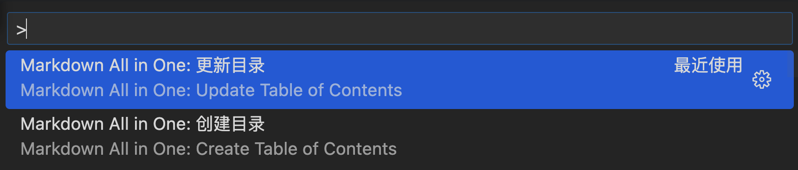

# `*.md`文件的编辑技巧

* 常用编辑工具：`Typora`、`vscode`结合使用

* 生成/更新目录可以用工具。比如vscode.`command+shift+p`：**Markdown All In One**

  * 但是工具可能对标签的支持性不是很好。

  * 目录仅仅是一个超链接（内链/外链）

    * 外链的写法：

      * *`#`后面（<font color=red>不加空格</font>）直接跟url*
        
        ```markdown
        [外链的写法.点击这里进行跳转](#www.baidu.com)
        ```
  
    * <font color=red>**内链的写法：**</font>

      * 跳标题
    
        * *需要跳转到的地方* **下面的写法都可以，只需要<u>该行是标题</u>**
      
        ```markdown
          # 内链的写法.跳转到这里
          ## 内链的写法.跳转到这里
          ### 内链的写法.跳转到这里
          #### 内链的写法.跳转到这里
          
          # 和 标题内容之间必须空格
        ```
      
        * *`#`后面可以跟带有`#`标识的具体标题*。**`#`后面没有空格**
      
        ```markdown
          ## [内链的写法.点击这里进行跳转](#内链的写法.跳转到这里)
        ```
        
      * 跳自定义的ID
        
        * *`#`后面可以跟id* **id不能单独使用，必须结合html标签**
        
        * *👇🏻下面是跳转链接的写法。**`#`后面没有空格**
        
          ```markdown
          ## [内链的写法.点击这里进行跳转](#ID内链的写法)
          ```
        
        * *👇🏻下面是需要最后跳转到的地方的写法*
        
          ```markdown
          <font color="red" id="ID内链的写法">**内链的写法.跳转到这里**</font>
          ```
    
  * 如果要对一个目录进行一些格式化操作。举例：[<font color=red>***运行Dart.Flutter工程***</font>](#运行dartflutter工程)

