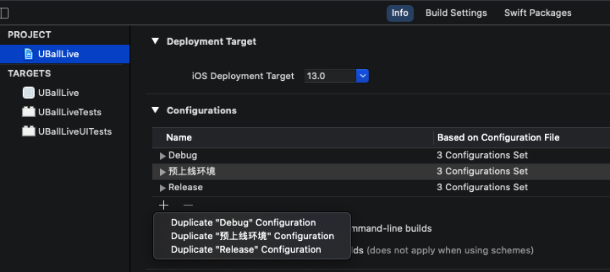
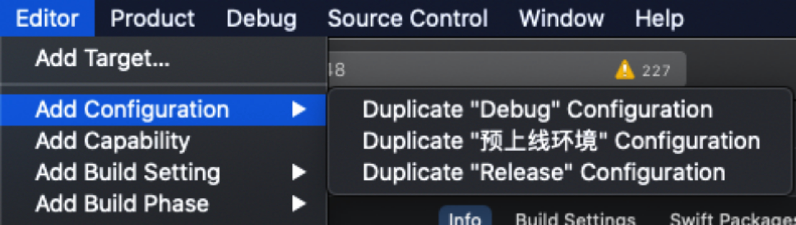
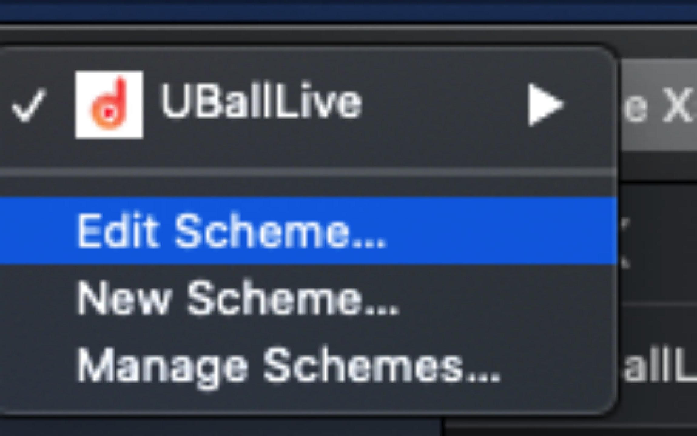
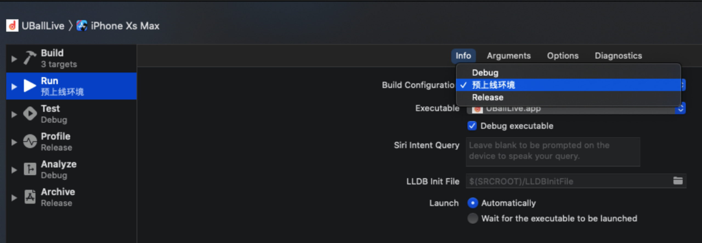
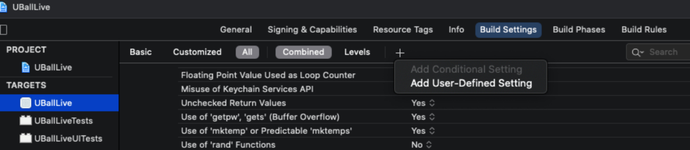
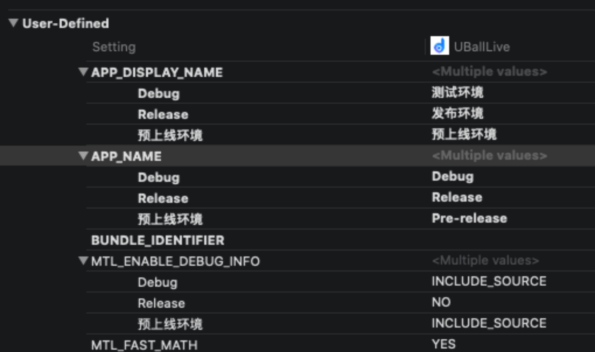
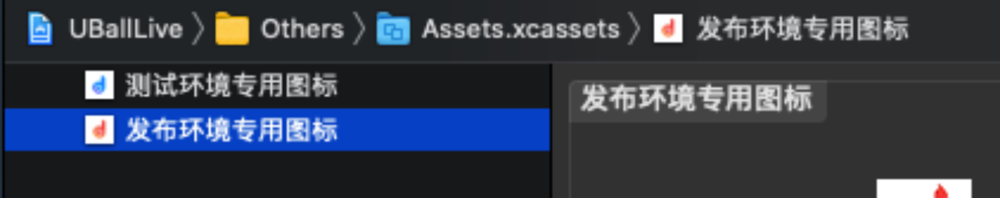
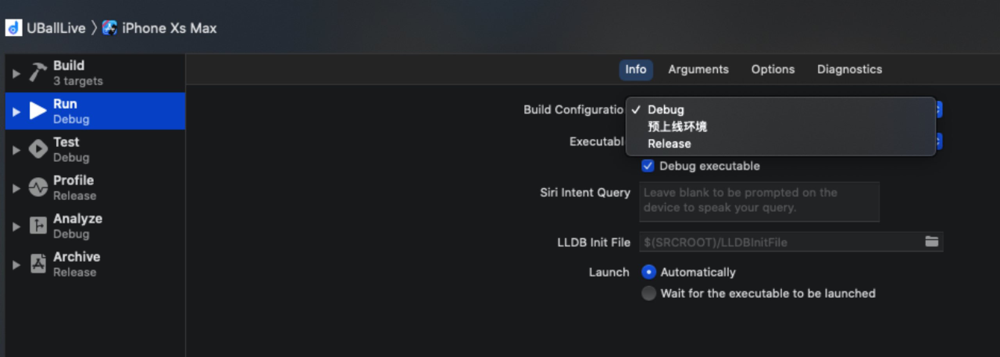
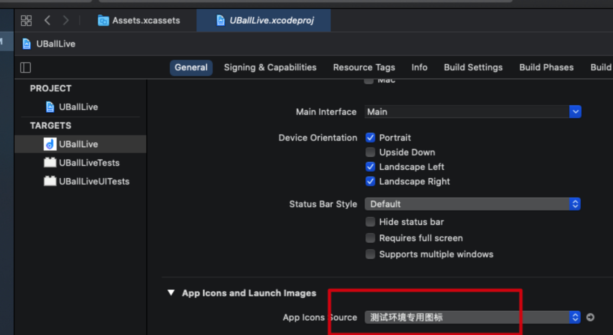

# 同一应用，设置不同图标和名称

[toc]

## 一、产生背景

* 根据生产和开发经验，App拥有至少下列几种环境，而每种环境亦可细分为很多小环境
  * 本地测试环境
  * **UAT**预上线环境
  * 线上生产环境：可能存在的来自不同渠道的生产环境**这种情况多发于包网**
* **GUI**图形化界面的一个优势就是对其进行区分，加快效率和过滤中间繁琐环节

## 二、先决理论知识

* xcode在建立一个工程的时候，默认给出了`debug`和`release`两种模式，实际上程序员可以根据实际条件进行自定义
* 然后进行关联。如果你不关联你的配置文件就进不去
* [**iOS动态修改App图标icon**](https://www.jianshu.com/p/69313970d0e7)

## 三、具体的操作实践

* 在xcode里面选中`工程名.xcodeproj`，右边菜单栏选择**Project**→**info**

## 方法一

## 方法二

* 选择一个 **duplicate** 。此时在工程的

  

  

  * 这里面将出现您上一步**duplicate**的东西
  * 自定义一些配置文件

* 选择**Targets**，主工程（而不是测试工程），点击右边➕，如下图所示

  

* 新增的自定义文件将出现在此页面最下部

  * 比如我新增字段为**APP_DISPLAY_NAME**、**APP_NAME**
  * 这些字段仿佛是自己定义的，而非系统的全局字段，如果不小心写错需要删除直接按键盘的del键进行删除。
* 对这些字段进行取值固定的写法为：例如上面我们定义的**APP_DISPLAY_NAME**、**APP_NAME**
  
  
  * 
    ${APP_DISPLAY_NAME} 和 ${APP_NAME}。并在里面填入不同环境的不同包名
  
  

* icon图标用Assets.xcassests 进行管理，支持中文定义

  

* 配置好了以后，下次进行发布的时候，急着改两个地方，以实现不同环境下同一个App不同icon和包名

  

  

