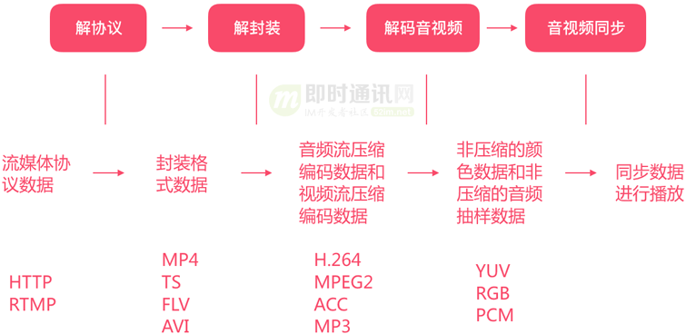
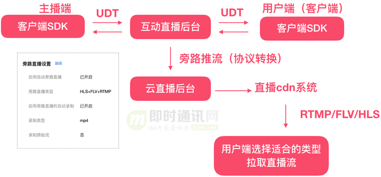
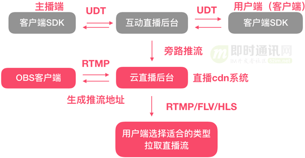
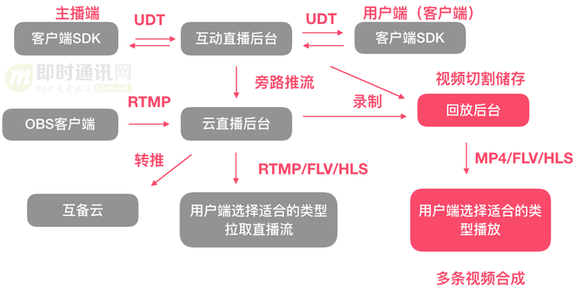

# 音视频

[toc]

## 1、相关协议

### 1.1、<font id=TCP/IP>`TCP/IP` 协议簇</font>

* 用于网络通信的协议族，是互联网的核心协议；（本质是数据的加密和解密）
* 定义了计算机如何通过网络相互通信；
* `TCP/IP` 的常见应用场景：
  * **文件传输**：通过 FTP 协议上传和下载文件；
  * **网页浏览**：通过 HTTP/HTTPS 协议访问网站；
  * **远程登录**：通过 SSH 访问远程服务器；
  * **电子邮件**：通过 SMTP、POP3、IMAP 收发邮件；
  * **实时通信**：通过 UDP 实现视频通话或在线游戏；
* `TCP/IP` 的优点：
  * **跨平台**：可用于不同的硬件和操作系统；
  * **扩展性强**：支持不同规模的网络；
  * **灵活性高**：可以与多种底层网络技术结合；
  * **标准化**：广泛被全球互联网采用；

#### 1.1.1、TCP/IP 的分层模型（ **四个层次**，从下往上）；

* **网络接口层**（Network Interface Layer）：

    * **作用**：负责在物理网络上传输数据包；
    * **协议**：包括以太网（Ethernet）、Wi-Fi、PPP 等协议；
    * **功能**：定义硬件设备如何传输数据 + 通过 MAC 地址找到同一网络中的设备；
    
* **互联网层**（Internet Layer）：

    * **作用**：负责实现主机间的通信，并将数据从一个网络传输到另一个网络；
    * 核心协议：
    
      * **IP（Internet Protocol）**：
    
        * 提供不可靠、无连接的数据包传递服务；
        * 定义了 IP 地址，支持路由选择；
      * **ICMP（Internet Control Message Protocol）**：用于传递错误报告和网络状态信息（如 ping）；
      * **ARP（Address Resolution Protocol）**：用于将 IP 地址解析为 MAC 地址；
      * **RARP（Reverse ARP）**：反向解析 MAC 地址为 IP 地址（较少使用）；
    * **功能**：数据分组和路由 + 确保数据到达目标网络；
    
* **传输层**（Transport Layer）：

    * **作用**：为应用程序提供可靠或不可靠的数据传输服务。

      **核心协议**：

      * TCP（Transmission Control Protocol）：

        * 提供面向连接的、可靠的传输服务；
        * 特点：三次握手、四次挥手、超时重传、流量控制；
      * UDP（User Datagram Protocol）：提供无连接的、不可靠的传输服务；
      
      * 特点：速度快、开销低，常用于实时应用（如视频流、在线游戏）；
       * **功能**：数据分段和重组 + 端口号管理（区分不同应用）；
      
    
* **应用层**（Application Layer）

    - **作用**：直接面向用户，为各种应用提供服务；

    - 核心协议：

      - **HTTP/HTTPS**：用于网页浏览；
      - **FTP**：文件传输协议；
      - **SMTP/POP3/IMAP**：电子邮件协议；
      - **DNS**：域名解析协议；
      - **Telnet/SSH**：远程登录协议；
      
    - 功能：数据格式化、传输和显示 + 支持不同的应用程序和服务；

#### 1.1.2、TCP/IP 的核心协议特点：

|  协议   |      特点      |                             描述                             |
| :-----: | :------------: | :----------------------------------------------------------: |
| **TCP** |   **可靠性**   | 数据传输前建立连接（三次握手），数据包丢失时自动重传，数据按序到达，避免乱序问题。 |
|         |  **流量控制**  | 使用滑动窗口机制，防止发送方发送过多数据导致接收方缓存溢出。 |
|         |  **拥塞控制**  |               动态调整传输速度以应对网络拥塞。               |
|         | **面向字节流** |            数据被看作连续字节流，不区分报文边界。            |
| **UDP** |   **无连接**   |                  不建立连接，数据直接发送。                  |
|         |   **速度快**   |                没有可靠性机制，无需等待确认。                |
|         |  **应用场景**  |      适合对实时性要求高的场景，如直播、在线游戏、VoIP。      |

#### 1.1.3、TCP/IP 数据传输的完整流程：

* 数据封装：
  * 应用层将数据封装为消息；
  * 传输层将消息分段并添加端口号（如 TCP 段）；
  * 网络层将段封装为数据包并添加 IP 地址；
  * 网络接口层将数据包封装为帧，添加 MAC 地址并发送；
* 数据解封装：
  * 接收端按照相反顺序逐层解析数据，最终交付给应用层；

### 1.2、<font id=HTTP>`HTTP` 协议簇</font>

* **HTTP**（**H**yper**t**ext **T**ransfer **P**rotocol）/ **HTTPS**（HTTP **S**ecure）：均基于 **TCP**（**T**ransmission **C**ontrol **P**rotocol） 的传输协议；

* **HTTP/1.1**：适合简单网页，但性能和扩展性有限，已逐步被淘汰；

* **HTTP/2**：主流标准，解决了 `HTTP/1.1` 的队头阻塞问题，多路复用提升了并发能力；

* **HTTP/3** 是 HTTP 协议的最新版本

  * 它基于 **QUIC**（**Q**uick **U**DP **I**nternet **C**onnections）协议，并使用 **UDP** 作为传输层，而不是传统的 **TCP**；

  * <font color=red>HTTP/3 的目标是解决前几代 HTTP（尤其是 HTTP/2）在高延迟和不稳定网络环境中的性能问题，同时提升传输的安全性和效率</font>

  * HTTP/3 代表着互联网协议的未来，但由于需要广泛的网络设备支持，目前还在推广阶段；

    * 主流浏览器（如 Chrome、Firefox、Edge）已支持 HTTP/3；
    * Nginx、Apache 等服务器已经开始支持 HTTP/3，但需要手动配置；

  * HTTP/3 的工作流程

    ```
    1、连接建立
    客户端通过 UDP 发送初始数据包，同时完成 QUIC 的连接和 TLS 1.3 的握手；
    服务端返回握手确认，连接建立完成后直接开始传输数据；
    
    2、数据传输
    数据被分成多个流（Stream），每个流独立传输；
    丢包时，仅重新传输受影响的流，其他流继续传输；
    
    3、连接迁移
    如果设备切换网络（如从 Wi-Fi 切换到蜂窝网络），QUIC 通过连接 ID 保持会话连续性，无需重新建立连接；
    ```

* `HTTP/1.1`vs`HTTP/2` vs `HTTP/3` 

  |     特性     |                     HTTP/1.1                     |                        HTTP/2                        |                       HTTP/3                        |
  | :----------: | :----------------------------------------------: | :--------------------------------------------------: | :-------------------------------------------------: |
  | 底层传输协议 |                     基于 TCP                     |                       基于 TCP                       |             基于 UDP（使用 QUIC 协议）              |
  |   连接机制   |   每个请求需要单独的 TCP 连接（连接复用有限）    |              单个 TCP 连接支持多路复用               |              单个 UDP 连接支持多路复用              |
  |   多路复用   |                      不支持                      |       支持（多流并发传输，共用一个 TCP 连接）        |         支持（独立的流，避免 TCP 队头阻塞）         |
  |   队头阻塞   |        存在（每个请求必须等待前一个完成）        |          存在（TCP 队头阻塞可能影响所有流）          |         无队头阻塞（QUIC 中每个流独立传输）         |
  |   加密支持   |     可选（通过 HTTPS 开启加密，TLS 1.2/1.3）     |         默认加密（使用 HTTPS，TLS 1.2/1.3）          |     默认加密（内置 TLS 1.3，加密传输是强制的）      |
  | 连接建立延迟 |       较高：TCP 三次握手 + 可选的 TLS 握手       |            较高：TCP 三次握手 + TLS 握手             | 较低：QUIC 将连接建立和 TLS 握手合并，仅需 1 个 RTT |
  |   性能表现   |              请求阻塞，适合简单页面              |            多路复用提升性能，适合复杂页面            |         高效传输，更适合高延迟或不稳定网络          |
  |   连接迁移   |         不支持（IP 地址变化会中断连接）          |           不支持（TCP 连接与 IP 地址绑定）           |       支持（QUIC 的连接 ID 允许快速迁移连接）       |
  |   压缩机制   |                      不支持                      |                支持头部压缩（HPACK）                 |             支持改进的头部压缩（QPACK）             |
  |    扩展性    |              较差（难以添加新特性）              |      较好（增加了二进制帧结构，便于扩展新功能）      |        更好（QUIC 的灵活性使其支持未来扩展）        |
  |   典型问题   | - 队头阻塞严重<br>- 每个请求需要单独连接，效率低 | - 队头阻塞仍存在<br>- TCP 的丢包问题影响多路复用性能 |    - 需要支持 UDP 的网络设备<br>- 初期普及率较低    |
  |   典型场景   |            早期简单网站，低复杂度请求            |             现代网站，需处理大量并发请求             |        视频流媒体、实时通信、高延迟网络环境         |
  |   使用场景   |              已较少使用，逐步被淘汰              |             主流标准，广泛应用于现代 Web             |             新兴标准，适合未来网络需求              |
  
* `HTTP/1.1`、`HTTP/2` 和 `HTTP/3` 的关键技术对比

  |    技术点     |       HTTP/1.1       |         HTTP/2          |              HTTP/3              |
  | :-----------: | :------------------: | :---------------------: | :------------------------------: |
  | 请求/响应格式 |        纯文本        |       二进制格式        |            二进制格式            |
  |   头部压缩    |        不支持        |   支持（HPACK 算法）    | 支持（QPACK 算法，适应 QUIC 流） |
  |   传输方式    | 每个请求独占一个连接 | 多路复用，共用一个连接  |      多路复用，每流独立传输      |
  |   加密协议    | 可选（TLS 1.2/1.3）  | 默认加密（TLS 1.2/1.3） |     强制加密（TLS 1.3 内置）     |
  |  优先级控制   |       基本支持       | 强大支持（流的优先级）  |          改进优先级控制          |
  |   丢包处理    | 受 TCP 队头阻塞影响  |   受 TCP 队头阻塞影响   |   每个流独立处理，不影响其他流   |
  
* `HTTP/1.1`、`HTTP/2` 和 `HTTP/3` 的适用场景
  
  |      场景       |              HTTP/1.1              |       HTTP/2       |                            HTTP/3                            |
  | :-------------: | :--------------------------------: | :----------------: | :----------------------------------------------------------: |
  |    简单网站     | 合适（例如低流量、简单请求的页面） |       更高效       |               不适合小型场景，性能优势无从发挥               |
  |  复杂 Web 应用  |              性能有限              | 广泛使用，性能优越 |             理想选择，进一步提升复杂页面加载性能             |
  |    移动设备     |       表现一般（连接迁移差）       |        较好        | 表现最佳（支持快速连接迁移，适合网络切换）<br/>在网络频繁切换（如 Wi-Fi 到蜂窝网络）时，保持流畅的用户体验。 |
  |    实时通信     |  表现较差（高延迟、丢包问题明显）  |        可用        |            理想选择，流畅支持实时传输和低延迟通信            |
  |   流媒体服务    |         缓冲时间长、体验差         | 提升了一定的稳定性 |                    最高效，优化流媒体传输                    |
  | 高延迟/弱网环境 |              表现较差              |      性能一般      | 性能最佳，适应弱网和高延迟环境<br/>适合跨国通信或卫星网络等延迟较高的环境 |

### 1.3、HTML协议簇

* HTML（最初版本发布于 1991 年） 和 HTML5（ 2014 年成为 W3C 标准） **并不是严格意义上的继承关系**，更确切地说，HTML5 是 **HTML（超文本标记语言的总称） 的一个版本**，是对 HTML 的升级和扩展。它们之间的关系更像是 **迭代** 和 **升级** 的关系，并非继承；

* HTML5 是向下兼容的，这意味着以前版本的 HTML 标签在 HTML5 中大多仍然可以使用（尽管部分标签被废弃或不推荐）；

* 在继承 HTML 基本功能的基础上，HTML5 增加了许多新特性。特别是在多媒体、语义化和移动端适配方面；

  * HTML5 增删了许多语义化标签，提升了网页内容的可读性和结构化
    
    * HTML5 删除标签对比：
    
      |    标签名    |             描述             |              替代方案              |
      | :----------: | :--------------------------: | :--------------------------------: |
      | `<acronym>`  |       表示首字母缩略词       |         使用 `<abbr>` 代替         |
      |  `<applet>`  |    定义 Java Applet 嵌入     |    使用 `<object>` 或 `<embed>`    |
      | `<basefont>` |       定义基准字体大小       |           使用 CSS 代替            |
      |   `<big>`    |         定义大号字体         |    使用 CSS 的 `font-size` 代替    |
      |  `<center>`  |       定义内容居中对齐       |   使用 CSS 的 `text-align` 代替    |
      |   `<dir>`    |         定义目录列表         |          使用 `<ul>` 代替          |
      |   `<font>`   |       定义字体相关样式       |    使用 CSS 的字体样式属性代替     |
      |  `<frame>`   |           定义框架           |  使用 `<iframe>` 或 CSS 布局代替   |
      | `<frameset>` |          定义框架集          |         使用 CSS 布局代替          |
      | `<isindex>`  |  定义单行文本输入（已废弃）  |       使用 `<form>` 元素代替       |
      | `<noframes>` | 为不支持框架的浏览器定义内容 |             已不再需要             |
      |    `<s>`     |      定义加删除线的文本      | 使用 CSS 的 `text-decoration` 代替 |
      |  `<strike>`  |  和 `<s>` 类似，表示删除线   | 使用 CSS 的 `text-decoration` 代替 |
      |    `<tt>`    |      定义打字机样式文本      |   使用 CSS 的 `font-family` 代替   |
      |    `<u>`     |        表示下划线文本        | 使用 CSS 的 `text-decoration` 代替 |
      |   `<xmp>`    |       定义预格式化文本       |         使用 `<pre>` 代替          |
    
    * HTML5 新增标签对比：
    
      |       类别       |       标签名        |                   描述                    |
      | :--------------: | :-----------------: | :---------------------------------------: |
      |  **语义化标签**  |     `<article>`     |   表示独立的内容块，如新闻、博客文章等    |
      |                  |      `<aside>`      | 表示与主要内容相关性较小的内容，如侧边栏  |
      |                  |     `<details>`     |    创建交互式控件，用于显示或隐藏内容     |
      |                  |   `<figcaption>`    |          定义 `<figure>` 的标题           |
      |                  |     `<figure>`      |       用于分组图像或图表等独立内容        |
      |                  |     `<footer>`      |         表示文档或部分内容的页脚          |
      |                  |     `<header>`      |         表示文档或部分内容的页头          |
      |                  |      `<main>`       |          定义文档的主要内容部分           |
      |                  |      `<mark>`       |        表示需要高亮显示的重要文本         |
      |                  |       `<nav>`       |            表示页面的导航部分             |
      |                  |     `<section>`     |         表示文档中一个主题的分区          |
      |  **多媒体标签**  |      `<audio>`      |               定义音频内容                |
      |                  |      `<video>`      |               定义视频内容                |
      |                  |     `<source>`      |    定义媒体资源 `<audio>` 或 `<video>`    |
      |                  |      `<track>`      |          为媒体提供字幕或元数据           |
      | **图形相关标签** |     `<canvas>`      |         用于绘制图像和图形的画布          |
      |   **表单增强**   |    `<datalist>`     |          定义输入控件的选项列表           |
      |                  | `<keygen>` *(废弃)* | 定义密钥生成控件（为 Web 表单提供安全性） |
      |                  |     `<output>`      |           显示计算或脚本的结果            |
      |   **交互控件**   |    `<progress>`     |               定义任务进度                |
      |                  |      `<meter>`      |            定义范围内的度量值             |
      |     **其他**     |      `<time>`       |                 表示时间                  |
      |                  |       `<wbr>`       |          定义可添加换行符的位置           |
    
  *  多媒体支持：HTML5 原生支持音视频播放，无需额外插件（如 Flash）
    
    * `<audio>` 和 `<video>` 标签，用于嵌入音频和视频内容。
    
    * ```html
      <audio controls>
          <source src="example.mp3" type="audio/mpeg">
          您的浏览器不支持 audio 标签。
      </audio>
      
      <video controls>
          <source src="example.mp4" type="video/mp4">
          您的浏览器不支持 video 标签。
      </video>
      ```
    
  * 表单功能增强

    * `<input type="email">`、`<input type="date">`、`<input type="range">`、`<input type="color">` 等；
    * 表单验证 ：原生支持表单验证，无需 JavaScript；

  * HTML5 提供了用于绘图和图像处理的新特性：Canvas（用于绘制 2D 图形和动画） 和 SVG（支持矢量图形的定义和操作） 

    * ```html
      <canvas id="myCanvas" width="200" height="100"></canvas>
      <script>
          const canvas = document.getElementById("myCanvas");
          const ctx = canvas.getContext("2d");
          ctx.fillStyle = "red";
          ctx.fillRect(10, 10, 150, 80);
      </script>
      ```

  * HTML5 提供了新的客户端存储方式，**替代传统的 Cookie**：

    * **LocalStorage**：数据保存在本地浏览器中，永久有效，直到主动清除；
    * **SessionStorage**：数据在会话结束后清除；

  * HTML5 针对移动设备进行了优化，支持响应式设计和触摸屏：

    * 支持 `<meta>` 标签，用于移动设备的 viewport 配置

      ```html
      <meta name="viewport" content="width=device-width, initial-scale=1.0">
      ```

  * HTML5 提供了多线程的 Web Worker 和更高效的 API：

    * **Web Worker**：允许在后台运行 JavaScript 代码而不阻塞主线程；
    * **Geolocation API**：支持定位功能，适用于移动端开发；

### 1.4、RTMP = <font color=red>R</font>eal-<font color=red>T</font>ime <font color=red>M</font>essaging <font color=red>P</font>rotocol

* 即：实时消息传输协议。是一个**基于[TCP](TCP/IP)的协议**

* RTMP 是一种在整个直播过程中维护播放器和服务器之间持久的[TCP](#TCP/IP)连接的流协议

* 在 RTMP 中，直播被分成了两个流：一个视频流和一个音频流

  ```
  这些流被分解成了 4KB 的区块，这些块可以在 TCP 连接中被多路复用，即视频和音频块被交叉存取。
  当视频比特率达到 500Kbps 时，和每个 HLS 段的 3 秒时长相比，每个块只有 64ms，它让穿过所有组件的流都更加顺畅。
  只要编码了 64ms 的视频数据，直播者就可以发送数据；转码服务器可以处理这个区块并且生成多种输出比特率。
  区块随后通过代理被转递出去，直到到达播放器。
  ```

* RTMP是由 **Adobe** 开发的一种用于音视频、数据传输的应用层协议；

  * 最初用于与 Adobe Flash Player 通信（历史上曾经是强绑定关系，但是其协议本身是独立于 Flash 的）；
  * RTMP 是一种低延迟的流媒体传输协议，广泛应用于直播、点播、互动等实时音视频领域；
  * **Flash Player 的作用**： 在浏览器端，Flash Player 一直是 RTMP 流的默认播放载体。用户通过网页播放器即可直接接收和播放 RTMP 流；
  * 最原始的RTMP缺乏原生的加密机制。相关扩充协议（RTMPS）普及度和适配度不及 HTTPS、WebRTC 等现代协议；

* RTMP的扩展协议：

  * **RTMPS**（RTMP over TLS/SSL）：RTMP 的安全版本，通过 SSL/TLS 加密传输，保障数据安全性；

  - **RTMPT**：在 HTTP 之上封装的 RTMP，用于穿透防火墙；

  - **RTMP-Chunk**：将数据块分割成更小的单元，提高传输效率；

* 替代协议：

  * **HLS**（**H**TTP **L**ive **S**treaming）：

    * 由 **Apple** 推出的基于 HTTP 的流媒体协议，可以直接在 HTML5 环境下使用，且兼容性广；
    * 它已成为主流，特别是在点播和直播中大幅取代了 RTMP；

  * WebRTC：实时通信协议，基于 UDP 实现超低延迟传输，支持点对点连接，特别适合互动性强的场景（如视频会议、远程教育）；

  * **DASH**（**D**ynamic **A**daptive **S**treaming over **H**TTP）：另一种基于 HTTP 的流媒体协议，与 HLS 类似，用于适配不同网络环境的多码率播放；

  * |  协议  |          特点          |        使用场景        |
    | :----: | :--------------------: | :--------------------: |
    |  RTMP  |    低延迟、成熟稳定    |       直播、点播       |
    |  HLS   |   高兼容性、延迟较高   | 点播、延迟不敏感的直播 |
    | WebRTC |   超低延迟、基于 UDP   |   实时互动、视频会议   |
    |  SRT   | 安全性高、抗丢包能力强 |  跨国直播、高质量传输  |

* 随着 Flash 的逐步淘汰，RTMP 的使用场景也受到一定限制：

  * **Flash Player 的退役**： 2020 年底，**Adobe**  停止了对 Flash Player 的支持，各大浏览器（如 Chrome、Firefox、Edge）也完全禁用 Flash Player（可能的安全问题）；
  * 失去这一主流接收端后，RTMP 在浏览器端的应用基本被取代（现代浏览器并不直接支持 RTMP 播放）；
  * 带来的限制：
    * 额外依赖播放器：如果需要使用 RTMP 流，客户端必须通过第三方播放器（如 VLC、FFmpeg）或专用 SDK 播放，而无法直接在浏览器中无缝集成；
    * 开发成本增加：开发者需要引入额外的工具或技术栈（如将 RTMP 转码为 HLS 或 WebRTC）以兼容主流平台；
  * 随着网络环境的发展，对传输协议的安全性要求提高，而原始的 RTMP 协议缺乏原生的加密机制。虽然有 **RTMPS（RTMP over TLS/SSL）** 来弥补，但它的普及度和适配度不及 HTTPS、WebRTC 等现代协议；
  * 内容分发与 CDN 的适配问题：
    * 现代内容分发网络（CDN）更倾向支持基于 HTTP 的协议（如 HLS 和 DASH），因为它们可以直接利用 HTTP 缓存机制和现有的基础设施；
    * RTMP 作为专用协议，与这些现代 CDN 的优化机制不完全兼容，使用成本较高；
  
### 1.5、HLS = <font color=red>H</font>TTP <font color=red>L</font>ive <font color=red>S</font>treaming

* 由 **Apple** 开发的流媒体传输协议，<u>**基于 HTTP/HTTPS**</u>，与现代网络基础设施（如 CDN）无缝集成；
* 使用分段视频文件（TS 或 fMP4 ）和索引文件（<font color=red>`.m3u8`</font>）实现视频点播和直播功能。视频以小文件传输，丢包率低，即使网络不稳定也能平稳播放；
* 是事实上的行业标准，广泛支持于各种设备和平台；
* 内容保护：支持 AES-128 加密和防盗链技术；
* 核心是将视频内容切分为小段文件（通常 2~10 秒的 TS 或 fMP4 文件）并生成索引文件（<font color=red>`.m3u8`</font>），然后通过 HTTP 分发；
* 优势：兼容性强、稳定性高，适合大规模视频分发和点播；
* 缺势：延迟较高，不适合实时场景；
* 应用场景：
  * 视频点播（如 YouTube、Netflix）；
  * 高并发直播（如体育赛事转播）；
  * 需要多设备兼容性的直播平台；
  * 延迟要求不高的场景，如新闻直播
### 1.6、<font id=WebRTC>**WebRTC**</font> = <font color=red>Web</font> <font color=red>R</font>eal-<font color=red>T</font>ime <font color=red>C</font>ommunication

* 开源技术，能够通过简单的 API，允许浏览器↔️移动设备，通过点对点的方式进行实时音频、视频和数据传输，无需安装插件；
  
* WebRTC 是基于 [**RTP**](#RTP) 的高层封装，专注于提供完整的实时通信解决方案，适合快速开发和部署点对点通信功能。
  
* 由 W3C 和 IETF 推动，其 API 已被大多数现代浏览器（Chrome、Safari、Firefox 等）支持；
  
* 使用 P2P（Peer-to-Peer）连接进行数据传输。关键步骤：
  
  * **信令（Signaling）**：用于交换通信元数据，包括 **SDP**（**S**ession **D**escription **P**rotocol）和 ICE（**I**nteractive **C**onnectivity **E**stablishment）；
  * NAT 穿透：使用 **STUN** 和 **TURN** 技术解决 NAT（网络地址转换）问题，建立设备间的直接连接；
  * 实时数据传输：
    * 使用 [**SRTP（Secure Real-time Transport Protocol）**](#SRTP)传输音频和视频；
    * 使用 **RTCDataChannel** 传输文本和二进制数据。
  
* 对服务器的信令和 NAT 穿透有较高要求，复杂度较高；
  
* 优势：低延迟（50ms - 500ms）、实时性强，适合视频会议、实时互动直播等场景；
  
* 劣势：对服务器的信令和 NAT 穿透有较高要求，复杂度较高；
  
* 应用场景：
  
  * 视频会议（如 Zoom、Google Meet）
  * 在线教育（如 ClassIn）
  * 互动直播（低延迟要求）
  * 远程协作（屏幕共享、文件传输等）
  * 物联网设备通信（例如智能摄像头的实时视频传输）
  
* **HLS** vs **WebRTC**
  
  |     特性     |             WebRTC             |              HLS               |
  | :----------: | :----------------------------: | :----------------------------: |
  | **传输方式** |         点对点（P2P）          |     基于 HTTP 的流媒体分发     |
  |   **延迟**   |      极低（50ms - 500ms）      |        较高（5-30 秒）         |
  | **应用场景** |       实时通信、互动直播       |      视频点播、大规模直播      |
  |  **兼容性**  |    浏览器原生支持，适配性高    |     各种设备和平台广泛支持     |
  |  **安全性**  |   使用 DTLS 和 SRTP 加密传输   |   支持 HTTPS 和 AES-128 加密   |
  | **技术架构** |  复杂（需要信令、NAT 穿透等）  |       简单（基于 HTTP）        |
  | **适配 CDN** | 不支持（点对点传输，无法缓存） | 完美支持（利用 HTTP 分发内容） |

### 1.7、<font id=SRT>**SRT**</font>= <font color=red>S</font>ecure <font color=red>R</font>eliable <font color=red>T</font>ransport

* SRT 是由 **Haivision** 公司开发的一种基于 UDP 的流媒体传输协议，专为**低延迟、可靠性和安全性**而设计；
* 它常用于视频直播和远程内容分发；
* 安全拓展：<font id=SRTP>**SRTP**（**S**ecure **R**eal-time **T**ransport **P**rotocol，安全实时传输协议）</font>
  * 用于对音视频流的实时传输提供加密、完整性保护和防重放攻击等安全功能；
  * 主要目标是增强 RTP 的安全性，特别是在实时音视频通信场景下的安全需求，比如 VoIP（语音通信）、视频会议和 WebRTC；
* SRT 的核心特点：

  * <font color=red>**基于 UDP：** </font> SRT 以 UDP 为基础，但通过在应用层实现自己的可靠性控制，弥补了 UDP 的无连接性和数据丢包问题；
  * **低延迟：** SRT 提供一种叫做 ARQ（Automatic Repeat reQuest，自动重传请求）的机制，在网络丢包时进行智能重传，同时允许用户配置延迟时间窗口来平衡延迟和质量；
  * **高可靠性：** 使用 FEC（前向纠错）和 ARQ，SRT 能有效应对丢包、网络抖动和带宽波动等问题；
  * **安全性：** SRT 支持 AES-128/256 加密，确保传输过程中数据的安全性；
  * **穿越防火墙：** SRT 能在复杂网络环境下穿越 NAT 和防火墙，方便在公共互联网上使用；
* SRT 的应用场景：
  
  * 视频直播和远程制作（Broadcast and Remote Production）；
  * 内容分发和转码；
  * 视频监控和远程视频传输；
* SRT 的工作原理：
  * **Handshake：** SRT 在建立连接时使用 UDP 协议完成握手；
    * **数据传输：** SRT 在应用层实现数据的重传和排序，确保接收端接收完整的数据流；
    * **时间窗口：** SRT 引入了发送端和接收端的缓冲区时间窗口，以平衡延迟和传输质量；
### 1.8、<font id=RTP>**RTP**</font> = <font color=red>R</font>eal-time <font color=red>T</font>ransport <font color=red>P</font>rotocol

* RTP 是一种**实时传输协议**，专为实时音视频传输设计，**通常与 RTP 控制协议（[RTCP](#RTCP)）一起使用**，用于音视频的同步和质量监控；

* RTP 是 IETF 定义的协议（RFC 3550），广泛用于实时通信、会议系统和 VoIP（如 WebRTC）；

* RTP 的核心特点

  * <font color=red>**基于 UDP：** </font>RTP 使用 UDP 提供快速、低延迟的传输，不保证数据可靠性（如无重传），适用于实时应用；
  
  * **实时性：** RTP 提供时间戳和序列号，帮助接收端按正确顺序重建音视频流并同步播放；
  * **灵活性：** RTP 不定义具体的编解码器，可以与 `H.264`、`H.265`、`AAC` 等多种音视频格式配合使用；
  * **扩展性：** RTP 支持自定义扩展头部，便于在特定应用场景中添加功能（如视频方向信息）；
  
* <font color=red id=RTCP>**RTCP**</font>（**R**eal-**T**ime **C**ontrol **P**rotocol）是 RTP 的控制协议，其作用：

  * 主要用于监控数据传输质量并提供反馈。典型功能包括：
    * 统计信息报告（如丢包率、延迟、抖动等）；
    * 接收端反馈给发送端，调整传输速率或其他参数；
  
* RTP 的应用场景：

  - **视频会议**（如 Zoom、Teams 等）
  - **实时语音通话**（如 VoIP 和 SIP）
  - **实时视频流**（如：[**WebRTC**](#WebRTC)）
  
* RTP 的工作原理：
  * **数据封装：** RTP 将音视频数据封装到 RTP 数据包中，附带时间戳和序列号。
  
  * **同步与播放：** 接收端通过时间戳和序列号重建音视频流。
  
  * **与 RTCP 配合：** RTCP 提供质量监控和同步控制。
  
  * [**WebRTC**](#WebRTC) vs **RTP** 
  
    |     对比维度     |                            WebRTC                            |                             RTP                              |
    | :--------------: | :----------------------------------------------------------: | :----------------------------------------------------------: |
    |   是否独立工作   |                提供完整通信框架，适合直接使用                |             仅提供传输功能，需与其他协议配合使用             |
    | 是否支持数据通道 |          支持额外的 Data Channel，用于任意数据传输           |                      仅支持音视频流传输                      |
    |   NAT 穿越支持   |                 内置支持，能穿越防火墙和 NAT                 |                无内置支持，需借助额外协议实现                |
    |   开发者友好性   |                    高：封装较多，开发简单                    |               较低：需要自行实现信令、安全性等               |
    |   典型使用场景   | 如果需要快速实现点对点的实时通信功能（如视频聊天、屏幕共享），<br/>＋ 需要在复杂网络环境中运行，<br/>WebRTC 是首选 | 如果你需要更灵活、底层的实时传输功能，<br/>比如实现定制化的流媒体传输、VoIP 系统或广播应用，可以使用 RTP。<br/>配合 SRTP 和其他协议（如 SIP 或 HLS），<br/>RTP 可实现高度定制化的实时传输系统 |
  
  *  [**SRT**](#SRT) vs **RTP** 
  
    |   特性   |                             SRT                              |                  RTP                   |
    | :------: | :----------------------------------------------------------: | :------------------------------------: |
    | 底层协议 |                           基于 UDP                           |                基于 UDP                |
    |  可靠性  |               高：支持重传（ARQ）和纠错（FEC）               |    较低：无内建重传，依赖更高层协议    |
    |  安全性  |                        支持 AES 加密                         | 无内置加密机制（需配合 SRTP 实现加密） |
    |   延迟   |                     较低：可配置延迟窗口                     |           极低：适合实时应用           |
    |  复杂度  |                 较高：额外实现可靠性和安全性                 |           较低：更接近裸 UDP           |
    | 典型应用 |                      视频直播、远程传输                      |         视频会议、VoIP、WebRTC         |
    |   备注   | 需要高可靠性、强安全性以及在复杂网络环境下的稳定性<br/>（如公网直播） | 追求极低延迟并能容忍一定程度的数据丢失 |
  

### 1.9、MQTT = <font color=red>M</font>essage <font color=red>Q</font>ueuing <font color=red>T</font>elemetry <font color=red>T</font>ransport

* <u>轻量级</u>的**发布/订阅**消息传输协议；

* **协议版本**：目前主流版本是 MQTT 3.1.1 和 MQTT 5.0（后者提供了更多特性，如消息过期、增强的错误处理等）；

* **通信层**：基于 [TCP](#TCP/IP)，但也支持 [WebSocket](#WebSocket)；

* **加密与安全**：可以通过 TLS/SSL 提供传输层加密；支持认证机制（用户名/密码或基于证书）；

* 专为资源受限设备和网络设计。MQTT 的协议头非常小，非常适合低带宽、不稳定的网络环境，比如无线网络；

* 它通常用于物联网（IoT）领域，支持设备之间的高效通信；

* 架构异于传统点对点通信：
  * 发布者将消息发送到主题（Topic），订阅者订阅某个主题，通过 Broker 转发接收消息；
  * **持久化会话**：支持客户端和 Broker 之间的会话持久化（Clean Session 标志），以便在客户端断开后重新连接时恢复订阅关系；
  * **保留消息（Retained Message）**：Broker 可以保留某个主题的最后一条消息，新订阅者可以立刻收到该消息；
  * **遗嘱消息（Last Will and Testament, LWT）**：客户端可以设置遗嘱消息，当它意外断开时，Broker 会将遗嘱消息发送到指定的主题，通知其他订阅者；
  
* **质量保证（QoS）**：
  * **QoS 0**：至多一次（At most once），不保证消息到达；
  * **QoS 1**：至少一次（At least once），确保消息至少到达一次，但可能重复；
  * **QoS 2**：仅一次（Exactly once），确保消息只到达一次，适合高可靠性场景；
  
* 基本架构：（使用客户端-服务器架构）
  
  * **Broker（消息代理）**
  
    * 充当消息的中间人，负责接收客户端发布的消息，并将消息转发给订阅了相应主题的客户端；
    * 例子：Eclipse Mosquitto、HiveMQ、EMQX；
    
  * **Publisher（发布者）**：负责将消息发布到某个主题的客户端；
  
  * **Subscriber（订阅者）**：订阅一个或多个主题，接收与之匹配的消息；
  
   * **主题（Topic）**：类似一个消息的分类标签，发布者将消息发布到一个主题上，订阅者根据主题接收消息；
  
* 工作流程：
  * **连接**：客户端向 Broker 发起连接请求（通过 [TCP/IP](TCP/IP) 或 WebSocket），并进行身份验证（用户名/密码）；
  * **订阅主题**：客户端向 Broker 提交订阅请求，指定感兴趣的主题；
  * **发布消息**：客户端向 Broker 发布消息，指定目标主题；
  * **转发消息**：Broker 根据订阅关系将消息转发给相应的订阅者；
  * **断开连接**：客户端断开连接，Broker 清理相关的会话或触发遗嘱消息；
  
* 常见应用场景
  * **物联网**：智能家居（如灯光、温湿度传感器控制）、工业设备监控（如设备状态和故障报警）；
  * **实时消息系统**：移动聊天系统、实时位置跟踪；
  * **远程监控**：停车场设备、交通设施状态监控；
  
  |   特性   |       MQTT       |     HTTP     |          CoAP          |
  | :------: | :--------------: | :----------: | :--------------------: |
  | 通信模型 |    发布/订阅     |  请求/响应   | 请求/响应（支持订阅）  |
  | 带宽消耗 |        低        |      高      |         非常低         |
  |  实时性  |        高        |     较低     |           高           |
  | 适用场景 | 物联网、实时消息 | 静态资源访问 | 嵌入式设备、低功耗环境 |

### 1.10、<font id=WebSocket>WebSocket</font>

* WebSocket 是一种**全双工通信协议**，允许客户端和服务器在单个 [TCP](TCP/IP) 连接上进行实时、双向的数据交换；

* 它解决了传统 HTTP 协议在实时通信场景下的高延迟和高开销问题，广泛应用于即时通讯、实时通知、多人协作等场景；

* [`HTTP`](#HTTP) vs `WebSocket`

  |    **特性**    |          **HTTP**          |       **WebSocket**        |
  | :------------: | :------------------------: | :------------------------: |
  |  **通信模式**  |     单向（请求-响应）      |       双向（全双工）       |
  |  **连接方式**  |      每次请求新建连接      |    一次握手建立持久连接    |
  |  **适用场景**  |   静态数据请求、资源加载   |    实时通信、低延迟场景    |
  | **数据头大小** |  较大（HTTP 头部字段多）   | 小（WebSocket 头部更轻量） |
  |  **资源消耗**  | 较高（频繁创建和销毁连接） |      较低（持久连接）      |

* 核心特点

  * **全双工通信**：客户端和服务器可以同时发送和接收数据，不需要像 HTTP 那样每次请求都等待响应；
  * **持久化连接**：WebSocket 建立后会保持长连接，不需要像 HTTP 那样频繁建立和关闭连接，降低了资源消耗；
  * **低延迟**：WebSocket 消息头部非常小（仅 2~14 字节），相比 HTTP 减少了通信开销，适合实时场景；
  * **基于事件驱动**：WebSocket 的通信通过事件（如 `open`、`message`、`close`、`error`）来处理数据流，便于编程；
  * **基于 [TCP](TCP/IP)**：使用 [TCP](TCP/IP) 协议传输数据，可靠性高，并且支持加密（TLS/SSL）；

* 工作流程：

  * **握手阶段**：

    * WebSocket 使用 HTTP 协议进行初始握手，客户端向服务器发送一个 `Upgrade` 请求，要求将协议升级为 WebSocket；
    * 如果服务器支持 WebSocket，会返回 `101 Switching Protocols` 状态码，表示连接升级成功；
   * **数据传输**：握手成功后，客户端和服务器可以通过 WebSocket 通道进行实时数据交换；
   * **关闭连接**：任意一方都可以通过 `close` 操作主动断开连接；
  
* 握手请求示例

  客户端请求：

  ```http
  GET /chat HTTP/1.1
  Host: server.example.com
  Upgrade: websocket
  Connection: Upgrade
  Sec-WebSocket-Key: dGhlIHNhbXBsZSBub25jZQ==
  Sec-WebSocket-Version: 13
  ```
  
  服务器响应：
  
  ```http
  HTTP/1.1 101 Switching Protocols
  Upgrade: websocket
  Connection: Upgrade
  Sec-WebSocket-Accept: s3pPLMBiTxaQ9kYGzzhZRbK+xOo=
  ```
  
### 1.11、<font id=SIP>SIP</font> = <font color=red>S</font>ession <font color=red>I</font>nitiation <font color=red>P</font>rotocol

* 用于建立、管理和终止 VoIP 呼叫的信令协议；

* 功能：负责建立、修改和终止会话；

* 特点：

  * 基于文本（类似 HTTP），易于调试；
  * 支持用户注册、呼叫转移、呼叫保持等功能；

* 流程：

  * **INVITE**：客户端发送呼叫邀请；
  * **ACK**：确认会话建立；
  * **BYE**：终止会话；

### 1.12、<font id=H323>H.323</font>

* 一种传统的 [VoIP](#VoIP) 信令协议，适用于视频会议和语音通信；
* 功能：早期的 [VoIP](#VoIP) 信令协议，主要用于视频会议；
* 特点：
  - 比 [SIP](#SIP) 更复杂，但兼容性好；
  - 包括呼叫控制、媒体传输、信令管理等功能；

### 1.13、<font id=VoIP>VoIP</font> = <font color=red>V</font>oice <font color=red>o</font>ver <font color=red>I</font>nternet <font color=red>P</font>rotocol

* 互联网语音协议，VoIP 也被称为 IP 语音或网络电话技术；
* 将模拟信号（如声音）转换为数字信号，通过网络传输到对端，实现通话功能；
* <font color=blue>某些宗教信仰国家或者地区（比如Dubai）会封锁VoIP协议。具体做法就是强制性的要求在该区域内使用的软件不得包含VoIP的实现；所以不能在软件（如：Skype、Zoom、Google Meet）上打电话只能发语音条</font>；
* **VoIP 技术颠覆了传统电话通信的模式，通过互联网实现低成本、高灵活性的实时语音和视频通信**。尽管在安全性和网络依赖性方面存在挑战，但通过引入编解码器优化、加密技术以及协议改进，VoIP 技术已广泛应用于企业通信、个人通话、智能设备等领域，成为现代通信的核心技术之一。
* 核心原理：
  * **语音采集与编码**：
    * 通过麦克风采集模拟语音信号；
    * 使用编解码器（Codec）将语音信号转换为数字信号，并进行压缩以减少传输数据量；
  * **分组传输**：将压缩后的数字信号切分成多个数据包（Packet），通过 IP 网络进行传输；
  * **解码与播放**：数据包到达接收端后，解码器将数字信号还原为模拟信号，通过扬声器播放；
  * **通信协议**：使用专门的 VoIP 协议（如 [SIP](#SIP)、[H.323](#H323)、[RTP](#RTP)）管理呼叫建立、数据传输和终止；
  * **VoIP 网关**：负责在传统电话网络（PSTN）和 IP 网络之间进行转换；
  * **PBX 系统**：基于 IP 的专用交换系统，管理内部呼叫和外部通信；
* 工作流程：
  * **呼叫建立**：用户通过 VoIP 客户端发起呼叫，客户端向服务器发送请求（SIP INVITE）；
  * **信令交换**：VoIP 服务器（如 [SIP](#SIP) 服务器）负责协商呼叫的媒体格式、IP 地址和端口；
  * **数据传输**：通话双方通过 [RTP](#RTP) 协议直接传输语音数据包；
  * **呼叫终止**：一方挂断电话，[SIP](#SIP) 服务器释放会话资源；


* 编解码器（Codec）是 VoIP 的核心技术，用于将语音信号编码成数据流；

  | **编解码器** | **采样率** |    **带宽消耗**    |          **特点**          |
  | :----------: | :--------: | :----------------: | :------------------------: |
  |  **G.711**   |   8 kHz    |      64 kbps       | 无压缩，高音质，网络消耗高 |
  |  **G.729**   |   8 kHz    |       8 kbps       |  压缩率高，适合低带宽网络  |
  |   **OPUS**   |  8-48 kHz  | 动态（6-510 kbps） |    高效，支持语音和音乐    |
  |   **AMR**    |   8 kHz    |   4.75-12.2 kbps   | 适合移动网络，支持降级策略 |

  

## 2、视频直播数据流解封装原理



* 解协议；
* 解封装；
* 解码音视频；
* 音视频同步播放；

## 3、FFMPEG

* 多媒体处理工具，它是一个开源项目，支持几乎所有的音视频格式和编解码器；

* 核心组件：

  * **ffmpeg 命令行工具**：用于音视频处理的命令行工具；
  * **ffprobe 命令行工具**：用于分析多媒体文件的工具；
  * **libavcodec**：负责音视频编解码的核心库；
  * **libavformat**：处理多媒体文件格式的库（如 MP4、MKV 等）；
  * **libavfilter**：提供音视频滤镜功能的库；
  * **libswscale**：用于图像缩放和像素格式转换；
  * **libswresample**：用于音频采样率转换和格式转换；
  * **libavdevice**：支持输入输出设备的库；

* 核心功能：

  * **转码 (Transcoding)**：
    - 重新编码音视频文件，例如将 AVI 转为 MP4；
    - 支持多种编解码器，如 H.264、HEVC、AAC 等；
  * **格式转换 (Container Conversion)**：
    - 转换文件的封装格式而不重新编码；
    - 示例：从 MKV 转为 MP4，只改变封装格式，速度快；
  * **剪切与合并**：
    - 可以精确地剪切音视频片段；
    - 支持将多个音视频文件合并为一个文件；
  * **滤镜处理 (Filters)**：
    - 添加特效或修改音视频，比如旋转、裁剪、叠加文字、调节音量等；
  * **多媒体流处理**：
    - 录制、推流、接收实时音视频流；
    - 可用于直播场景，支持 RTMP、HLS 等协议；
  * **音视频信息分析**：
    - 使用 `ffprobe` 查看音视频文件的详细信息，包括比特率、分辨率、编解码器等；

* 常用命令

  ```cmd
  # 查看文件信息（文件的编解码器、比特率、分辨率等详细信息）
  ffprobe input.mp4
  
  # 转换文件格式：将 AVI 文件转换为 MP4 文件
  ffmpeg -i input.avi output.mp4
  
  # 指定编解码器进行转码
  # -c:v：指定视频编解码器为 H.264
  # -c:a：指定音频编解码器为 AAC
  ffmpeg -i input.mp4 -c:v libx264 -c:a aac output.mp4
  
  # 裁剪视频
  # -ss：指定起始时间
  # -to：指定结束时间
  # -c copy：不重新编码，直接裁剪
  ffmpeg -i input.mp4 -ss 00:01:00 -to 00:02:00 -c copy output.mp4
  
  # 合并视频
  ffmpeg -f concat -safe 0 -i file_list.txt -c copy output.mp4
  
  file_list.txt 内容示例
  file 'video1.mp4'
  file 'video2.mp4'
  
  # 添加水印
  # overlay=10:10：将水印放在视频的左上角，距离边缘 10 像素
  ffmpeg -i input.mp4 -i watermark.png -filter_complex "overlay=10:10" output.mp4
  
  # 调整分辨率
  # scale=1280:720：将视频分辨率调整为 1280x720
  ffmpeg -i input.mp4 -vf scale=1280:720 output.mp4
  
  # 视频转图片序列
  # 每帧导出为一张图片
  ffmpeg -i input.mp4 frame_%04d.png
  
  # 图片序列转视频
  # -framerate 30：设置帧率为 30
  ffmpeg -framerate 30 -i frame_%04d.png -c:v libx264 -pix_fmt yuv420p output.mp4
  
  # 推送流媒体
  # 推送到 RTMP 服务器。
  ffmpeg -re -i input.mp4 -c copy -f flv rtmp://your.server/live/streamkey
  ```

## 4、推拉流

* **推流**：指将本地的音视频数据通过网络协议发送到服务器或其他客户端。常用于主播将视频内容推送到直播服务器。
* **拉流**：指客户端从服务器或其他数据源获取音视频数据并进行解码播放。观众通过拉流观看主播的直播内容。
* 传统推拉流的工作原理：
  * **基于CDN（内容分发网络）**：
    * 主播推流到CDN服务器；
    * 观众从CDN拉取直播流；
    * 优点：稳定性高，支持大规模分发；
    * 缺点：带宽成本高，存在一定延迟；
  * **基于MCU/ SFU**：
    * MCU（多点控制单元）：集中处理音视频流，例如混音、转码后再分发；
    * SFU（选择性转发单元）：直接转发音视频流给多端，不进行转码处理；
    * 缺点：MCU处理能力有限，SFU虽然降低了服务器压力，但仍依赖中心化服务器；

### 4.1、P2P（Peer-to-Peer，点对点）技术

* 分布式网络架构，其特点是网络中的每个节点（设备或计算机）既可以作为客户端，也可以作为服务器；
* P2P技术通过去中心化的方式实现资源共享、数据传输和协作。广泛应用于文件共享、即时通讯、区块链等领域；
* **P2P音视频传输的实现通常依赖以下技术**：
  * [**WebRTC**](#WebRTC)
    * **STUN（用于获取客户端的公网IP，协助建立点对点连接）/ TURN（当P2P直连失败时，充当中继服务器进行数据转发）**；
    * **ICE（交互式连接建立）**：综合**`STUN`**/**`TURN`**技术，动态选择最佳传输路径；
    * **DTLS + SRTP**：保证数据传输的安全性和实时性；
  * 分片与组播
    * **分片**：将大流分割成小片段，通过多个P2P节点分发，类似于BitTorrent的工作原理；
    * **组播**：在多观众场景中，节点可以充当中继，帮助转发音视频数据给周围观众；
  * 节点角色分配
    * **种子节点**：主要负责初始数据流的分发（例如主播）；
    * **中继节点**：既拉取数据又负责将数据转发给其他节点；
    * **叶子节点**：只负责接收数据并播放，不再转发；
* P2P推拉流的应用场景
  * **小规模实时通信**：点对点视频通话、视频会议
  * **大规模互动直播**：互动直播间（如教育、游戏直播）、连麦场景
  * **文件或视频分发**：通过P2P加速点播视频的下载或播放
* P2P推拉流的挑战：
  * **网络穿透**：NAT穿透对P2P连接至关重要，部分网络环境下P2P连接可能失败；
  * **带宽与延迟**：若某个中继节点带宽不足，会影响其他节点的观看体验；
  * **可靠性与稳定性**：节点的不可靠性（掉线、弱网）会导致数据丢失或传输中断；
  * **安全性**：P2P通信需要严格的数据加密机制，防止数据被篡改或窃取；
* P2P与CDN结合：
  * **混合模式**：大多数实际应用中，会结合P2P和CDN以保证流畅性和稳定性
    * **高并发场景**：观众通过P2P分发，缓解CDN压力；
    * **弱网环境**：通过CDN作为兜底保障，避免因P2P连接失败而导致观看失败；
* P2P推拉流的优势：
  - **去中心化**：主播和观众之间直接连接，不依赖中心服务器；
  - **低延迟**：由于数据传输路径短，延迟明显降低；
  - **带宽节省**：使用节点间的闲置带宽，减轻中心服务器的压力；
  - **扩展性强**：支持大量观众之间的直接连接；
* P2P技术的核心特点：

  * **去中心化**：没有固定的中心服务器，所有节点地位平等，能够独立发起和响应请求；
  * **资源共享**：每个节点既是资源的提供者，也是资源的使用者，可以共享存储、带宽、计算能力等；
  * **自组织**：网络能够根据节点的加入或退出动态调整，保持网络的连通性和效率；
  * **高扩展性**：网络的性能和容量随着节点的增加而提升；
  * **容错性强**：单个节点的故障不会影响整个网络的运行；
* P2P技术的工作原理：

  * **节点发现**：节点需要找到其他节点以建立连接，常用的方法包括中心服务器引导、分布式哈希表（DHT）以及广播；
  * **资源定位**：通过分布式索引（如DHT）或搜索算法定位需要的资源，避免集中存储；
  * **数据传输**：使用分块传输技术（如BitTorrent）提高传输效率，支持多点下载和上传；
  * **网络维护**：P2P网络会定期检查节点的可用性，并移除离线节点以保证网络的稳定性；
* P2P技术的优势：

  * **高效利用资源**：利用每个节点的计算能力和带宽，实现资源的高效共享；
  * **抗中心化攻击**：无中心服务器，网络更具弹性，不容易因单点故障或攻击而瘫痪；
  * **成本低**：不依赖大型服务器，运营成本较低；
  * **扩展性强**：随着节点的增加，系统的性能和能力也能动态提升；
* P2P技术的挑战：

  * **安全性问题**：缺乏中心控制，容易受到恶意节点的攻击，如数据篡改、欺诈行为等；
  * **带宽压力**：部分节点可能成为流量热点，导致带宽负载过重；
  * **资源不可控性**：节点可能随时离线，导致资源分布和获取的不确定性；
  * **版权问题**：在文件共享领域，P2P技术容易引发侵权争议；
* P2P技术的应用场景：

  * **文件共享**：经典案例：BitTorrent、eMule，用于大规模文件分发；
  * **即时通讯**：早期的Skype使用P2P技术实现高效通信；
  * **流媒体分发**：P2P直播平台通过节点间的共享分发直播内容，缓解中心服务器的压力；
  * **区块链**：比特币、以太坊等区块链系统是基于P2P网络构建的，支持去中心化账本；
  * **分布式存储**：IPFS（星际文件系统）通过P2P技术构建高效的分布式存储网络；
  * **分布式计算**：SETI@home、Folding@home等利用P2P技术进行大规模的科学计算；

### 4.2、架构

* 厂商SDK推拉流

 

* 旁路推流



* RTMP推流
  
  
  * RTMP推流的优势和劣势
  
    | 优势             | 描述                                                         |
    | ---------------- | ------------------------------------------------------------ |
    | 支持专业设备接入 | 可以接入专业的直播摄像头、麦克风，直播的整体效果明显优于手机开播。 |
    | OBS插件丰富      | OBS已有许多成熟插件，如蘑菇街主播常用的YY助手，可用于美颜处理。<br/>此外，OBS本身支持滤镜、绿幕、多路视频合成等功能，功能比手机端强大。 |
  
    | 劣势     | 描述                                                         |
    | -------- | ------------------------------------------------------------ |
    | 配置复杂 | OBS本身配置较复杂，需要专业设备支持，对主播的要求更高，通常需要一个固定场地进行直播。 |
    | 延时较长 | RTMP需要云端转码，本地上传时也需在OBS中配置GOP和缓冲，导致延时相对较长。 |
  
* 云互备（高可用架构方案）：业务发展到一定阶段后，我们对于业务的稳定性也会有更高的要求

  
  
## 5、相关文件格式

### 5.1、FLV

* FLV 是一种轻量级、高效的流媒体容器格式，具有低延迟和实时性的优点，用于存储音频、视频以及元数据，广泛应用于早期的流媒体点播和直播系统中；虽然其主流地位已经被更现代的格式（如 [MP4](#MP4) 和 [HLS](#HLS)）取代，但在特定领域（如 [RTMP](#RTMP) 直播）仍然有着不可忽视的应用价值；

* 它通过简单的结构设计，确保可以快速解析和实时流传输；

  |   **特性**   |      **FLV**       | **MP4** |     **HLS**      |
  | :----------: | :----------------: | :-----: | :--------------: |
  |  **实时性**  |         高         |  一般   |       较低       |
  |   **延迟**   |  低（RTMP 推流）   |  较高   | 高（切片时间长） |
  | **文件大小** |         小         |  较大   |       中等       |
  |  **兼容性**  | 较低（依赖 Flash） |   高    |        高        |

* 基本结构：

  * Header（文件头）

    * 用于标记文件类型和版本信息；

    * 通常为固定长度的 9 字节；

      | **偏移位置** | **长度** |    **字段**    |       **说明**       |
      | :----------: | :------: | :------------: | :------------------: |
      |      0       |    3     | 文件标志 "FLV" |    FLV 文件标识符    |
      |      3       |    1     |     版本号     |       通常为 1       |
      |      4       |    1     |   文件标志位   |    音频/视频标识     |
      |     5-8      |    4     |  Header 长度   | 文件头长度（9 字节） |

  * Previous Tag Size（上一个 Tag 的大小）

    * 标记上一个数据块的大小，固定为 4 字节；
    * 第一个块的值为 0；

  * Tag（数据块）

    * FLV 的主体部分，由一系列 Tag 组成；

    * 每个 Tag 存储一个音频帧、视频帧或元数据信息；

    * Tag 类型

      - **音频 Tag（Type=8）：**
        - 存储音频数据；
        - 支持格式：AAC、MP3、SPEEX 等；
      - **视频 Tag（Type=9）：**
        - 存储视频帧数据；
        - 支持格式：H.263、H.264、VP6 等；
      - **元数据 Tag（Type=18）：**
        - 包含文件的元数据信息（如分辨率、码率、时长等）；

    * Tag 的结构：

      | **字节偏移** | **长度** |       **内容**        |       **说明**       |
      | :----------: | :------: | :-------------------: | :------------------: |
      |      0       |    1     |       Tag 类型        |   音频/视频/元数据   |
      |     1-3      |    3     |       数据大小        |      数据的大小      |
      |     4-7      |    4     |    时间戳（毫秒）     |    数据包的时间戳    |
      |     8-10     |    3     |      扩展时间戳       | 扩展时间戳（高精度） |
      |    11-...    |    N     | 数据载荷（音频/视频） |    实际的数据内容    |

### 5.2、TS

### 5.3、<font id=HLS>MP4</font>

### 5.4、<font id=HLS>HLS</font>


## 资料来源

  [**视频直播技术干货(十)：一文读懂主流视频直播系统的推拉流架构、传输协议等**](#http://www.52im.net/thread-3922-1-1.html)

  

  

  
